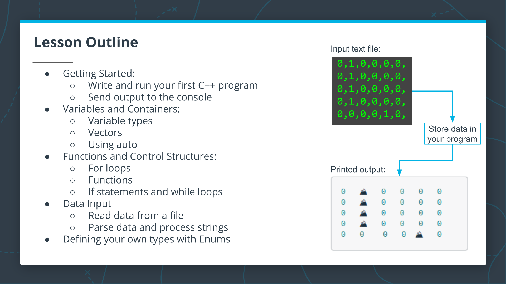
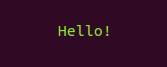
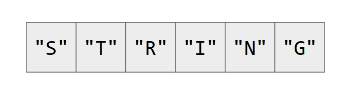
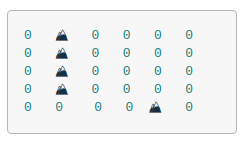

# 1. Intro

Lesson outline  



---

# 2. CODE: Write and Run Your First C++ Program

## Write and Run Your First C++ Program

Now that you have a sense of what you will be building in this lesson, you can learn about the tools that you will use. To get started, it helps to know a little bit about the C++ programming language. C++ is a compiled language; there is a separate program - the compiler - that converts your code to an executable program that the computer can run. This means that running a new C++ program is normally a two step process:

Compile your code with a compiler.
Run the executable file that the compiler outputs.

### C++ `main()` function

In C++, every program contains a `main` function which is executed automatically when the program is run. Every part of a C++ program is run directly or indirectly from `main` , and the most basic program that will compile in C++ is just a `main` function with nothing else.

`main()` should return an integer (an `int` in C++), which indicates if the program exited successfully. This is specified in code by writing the return type, followed by the `main` function name, followed by empty arguments:

```{.cpp .numberLines}
int main()
```

The body of the `main()`, which comes after the `main` function name and arguments, is enclosed in curly brackets: `{` and `}`. In this exercise, you will write the smallest possible C++ program, which is a main function with empty body. If you have trouble, have a look at the `solution.cpp` file in the workspace below.  

Remember that you can compile and run your program with the following:  
- To compile, use the following command: `g++ main.cpp`
- To run, use: `./a.out`

### To Complete This Exercise:  

- Write a `main` function in the `main.cpp` file below, and then compile and run the program. The program will not have any output, but it should compile and run without errors.

### Solution

<details>
<summary>Reveal</summary>

`main.cpp`

```{.cpp .numberLines}
int main() {}
```

</details>

---

# 3. Compiled Languages vs Scripted Languages

In the previous exercise, you compiled your C++ program before running it. If this is the first time you've worked with a compiled language, you might be wondering why one might use a compiled language. What are the advantages and disadvantages?

In the next couple of videos, Bjarne compares compiled and scripted languages and discusses some of the advantages and disadvantages of each.

## Advantages and Disadvantages of Compiled Languages

[](https://youtu.be/lLdYFFIyc60)  
**Notes**:  
* Compiler is your best friend because 
  + It catches errors systematically and early
  + The last bug is a an old joke!
  + The code will never run if it's not following the language rules and your own rule
  + It generates a much better code that runs 10-50 times faster than alternatives  

## Advantages of a Dynamically Scripted Language

[](https://youtu.be/DedCGNJAZQY)  
**Notes**:
* Advantages
  + Interactive
  + You don't have to wait for the compilation
* JavaScript (scripting language) engine is written in C++
* Big systems don't use one language and professionals know more than a language (3-5) and pick the right one for the task  

---

# 4. C++ Output and Language Basics

## First Code Example

The next is the first example of code that might be included in a typical C++ program. Hover your cursor over each line of the code and then click play to hear an explanation, or have a look at the **Review** section below.  
 `main.cpp`

```cpp
#include <iostream>
using std::cout;

int main() {
    cout << "Hello!" << "\n";   
}
```  

To run the code:

```bash
$ g++ main.cpp
$ ./a.out

```

## Review

 `#include <iostream>`

* The `#include` is a preprocessor command which is executed before the code is compiled. It searches for the `iostream` header file and pastes its contents into the program. `iostream` contains the declarations for the input/output stream objects.

 `using std::cout;`

* Namespaces are a way in C++ to group identifiers (names) together. They provide context for identifiers to avoid naming collisions. The `std` namespace is the namespace used for the standard library.
* The `using` command adds `std::cout` to the global scope of the program. This way you can use `cout` in your code instead of having to write `std::cout`.
* `cout` is an output stream you will use to send output to the **notebook** or to a terminal, if you are using one.
* Note that the second two lines in the example end with a semicolon `;`. Coding statements end with a semicolon in C++. The `#include` statement is a preprocessor command, so it doesn't need one.

 `cout << "Hello!" << "\n";`

* In this line, the code is using cout to send output to the **notebook**. The `<<` operator is the stream insertion operator, and it writes what's on the right side of the operator to the left side. So in this case,  `"Message here"` is written to the output stream `cout`.
# 5. Send Output to the Console  



  

Previously, you wrote the most basic program that will compile in C++: a simple `main()` . In this exercise, you will modify that program to print output to the terminal. Don't forget that you can compile and run your program with the following two steps from the command line:

```bash
$ g++ main.cpp
$ ./a.out
```

## To Complete This Exercise:

Add code to the `main.cpp` file below to print "Hello!" using `cout` .

## Solution

<details>
  <summary>Reveal</summary>

 `main.cpp`

```cpp .numberLines
#include <iostream>
using std::cout;

int main() {
  // TODO: Add your co<iostream>
	cout << "Hello" << std::endl;
}
```

</details>

---

# 6. How to Store Data


In the next few **notebooks**, you will learn how to store data in your program, including basic variables with primitive types and vector containers.

---

# 7. Bjarne Introduces C++ Types  

C++ uses variables, just as in nearly every other programming language. Unlike some other languages, however, in C++ each variable has a fixed type. When a new variable is "declared", or introduced in a program, the program author must (usually) specify the variable type in the declaration.

In this next video, Bjarne discusses types for C++.

[](https://youtu.be/2tuTBl584ow)  

---

# 8. Primitive Variable Types  
In the **notebook** below, you will learn about some of the fundamental types in C++.

## Primitive Variable Types

C++ has several "primitive" variable types, which are things like `int`s (integers), `string`s, `float`s, and others. These should be similar to variable types in other programming languages you have used. 

**Note:** In the cells below, variables will be declared and values assigned. In C++, once a variable has been declared, it can not be redeclared in the same scope. This means that if you try to declare a variable twice in the same function, you will see an error.  
```cpp .numberLines
#include <iostream>
#include <string>
using std::cout;
int main() {
    // Declaring and initializing an int variable.
    int a = 9;
    
    // Declaring a string variable without initializing right away.
    std::string b;
    
    // Initializing the string b.
    b = "Here is a string";
    
    cout << a << "\n";
    cout << b << "\n";
}
```
<details>
<summary>Output</summary>

```txt
9
Here is a string
```

</details>

### Practice

Practice declaring an `int` with the name `j` in the cell below and assing the value `10` to `j`.  

```cpp .numberLines
#include <iostream>
#include <string>
using std::cout;

int main() {
    // Declare and initialize j here.
}
```

### Solution

<details>
<summary>Reveal</summary>

```cpp .numberLines
#include <iostream>
#include <string>
using std::cout;

int main() {
    int j = 10;
    cout << j << "\n";
}
```
Output  
```txt
10
```

</details>

---

# 9. What is a Vector?  
[](https://youtu.be/AfwagT0JJO0)  

- The default data structure in C++
- Vector is a linear sequence of contiguously allocated memory

---

# 10. C++ Vectors  

In the previous concept, you learned about some of the primitive types that C++ offers, including strings and ints, and you learned how to store these types in your program. In this concept, you will learn about one of the most common data structures in C++: the `vector`.

In the **notebook** below, you will learn how to declare and store a vector containing primitive types, and you will also get some practice with 2D vectors, which you will be using in A* search.

## Vector Containers

### 1D Vectors

C++ also has several container types that can be used for storing data. We will start with `vector`s, as these will be used throughout this lesson, but we will also introduce other container types as needed.

Vectors are a sequence of elements of a single type, and have useful methods for getting the size, testing if the vector is empty, and adding elements to the vector.

```cpp .numberLines
#include <iostream>
#include <vector>
using std::vector;
using std::cout;

int main() {
    // Three ways of declaring and initializing vectors.
    vector<int> v_1{0, 1, 2};   // preferred
    vector<int> v_2 = {3, 4, 5};
    vector<int> v_3;
    v_3 = {6};
    cout << "Everything worked!" << "\n";
}
```

### 2D Vectors
Unfortunately, there isn't a built-in way to print vectors in C++ using `cout`. You will learn how to access vector elements and you will write your own function to print vectors later. For now, you can see how vectors are created and stored. Below, you can see how to nest vectors to create 2D containers.

```cpp .numberLines
#include <iostream>
#include <vector>
using std::vector;
using std::cout;

int main() {
    // Creating a 2D vector.
    vector<vector<int>> v {{1,2}, {3,4}};
    cout << "Great! A 2D vector has been created." << "\n";
}
```

### Practice

Practice declaring a `vector<int>` in the cell below, and assign the value `{6, 7, 8}`.

### Solution

<details>
<summary>Reveal</summary>

```cpp .numberLines
#include <iostream>
#include <vector>
using std::vector;
using std::cout;

int main() {
    // Declare and initialize a vector v here.
    vector<int> v{6, 7, 8};
}
```

</details>

---

# 11. C++ Comments

[](https://youtu.be/KU2GjMbxnXo)  

You may have noticed comments in some of the code up until this point. C++ provides two kinds of comments:

```cpp .numberLines
// You can use two forward slashes for single line comments.

/*
For longer comments, you can enclose the text with an opening
slash-star and closing star-slash.
*/ 
```

---

# 12. Using Auto

You have now seen how to store basic types and vectors containing those types. As you practiced declaring variables, in each case you indicated the type of the variable. It is possible for C++ to do automatic type inference, using the `auto` keyword.

Have a look at the **notebook** below to see how this works.

## Using `auto`

In your previous code, the type for each variable was explicitly declared. In general, this is not necessary, and the compiler can determine the type based on the value being assigned. To have the type automatically determined, use the `auto` keyword. You can test this by executing the cell below:  

```cpp .numberLines
#include <iostream>
#include <vector>
using std::vector;
using std::cout;

int main() {
    auto i = 5;
    auto v_6 = {1, 2, 3};
    cout << "Variables declared and initialized without explicitly stating type!" << "\n";
}
```
<details>
<summary>Output</summary>

```txt
Variables declared and initialized without explicitly stating type!
```
</details>

**Note**: It is helpful to manually declare the type of a variable if you want the variable type to be clear for reader of your code, or if you want to be explicit about the number precision being used; C++ has several number types with different levels of precision, and this precision might not be clear from the value being assigned.

### Practice

Practice using `auto` to declare and initialize a vector `v` with the value `{7, 8, 9, 10}`. If you have trouble, **click here** for help.

### Solution

<details>
<summary>Reveal</summary>

```cpp .numberLines
#include <iostream>
#include <vector>
using std::vector;
using std::cout;

int main() {
    // Declare and initialize v using auto here.
    auto v = {7, 8, 9, 10};
}
```
</details>

## On to an Exercise
Now that you have seen some exposure to variables and containers, test your knowledge in the next exercise! Before you go, be sure to have a careful look at the 2D vector example back in Storing Vectors, as you'll need this for the exercise.

---

# 13. Store a Grid in Your Program
  

In order to write the A* search algorithm, you will need a grid or "board" to search through. We'll be working with this board throughout the remaining exercises, and we'll start by storing a hard-coded board in the `main` function. In later exercises, you will write code to read the board from a file.

## To Complete This Exercise:
1. In the `main` function, declare a variable `board` as a vector of vectors of ints: `vector<vector<int>>`.
2. Assign this data to the `board` variable:
    ```txt
    {{0, 1, 0, 0, 0, 0},
     {0, 1, 0, 0, 0, 0},
     {0, 1, 0, 0, 0, 0},
     {0, 1, 0, 0, 0, 0},
     {0, 0, 0, 0, 1, 0}}
    ```

**Note**: you will need to include the `vector` library, just as iostream is included. You will also need to use the namespace `std::vector` if you want to write `vector` rather than `std::vector` in your code.

## Solution

<details>
<summary>Reveal</summary>

`main.cpp`

```cpp .numberLines
#include <iostream>
#include <vector>
using std::cout;
using std::vector;

int main() {
  // TODO: Declare a "board" variable here, and store
  // the data provided above.
  vector<vector<int>> board = {{0, 1, 0, 0, 0, 0}, \
	                       {0, 1, 0, 0, 0, 0}, \
	                       {0, 1, 0, 0, 0, 0}, \
	                       {0, 1, 0, 0, 0, 0}, \
	                       {0, 0, 0, 0, 1, 0}};
  cout << "Hello!" << "\n";
}
```
</details>

---

# 14. Getting Ready for Printing
  

Excellent work! In the next part of the mini-project, you will write a function to print out the board that you have stored. Before you can do that, you will need to learn more about several important parts of the C++ language.

In the next exercises, you will learn how to access elements in the vectors you stored previously. Additionally, you will learn to write loops in C++. Finally, you will learn how to write C++ functions so you can begin expanding your project.

---

# 15. Working with Vectors

You declared and initialized vectors in a previous **notebook**, but in order for the vector to be useful, you will need to be able to retrieve the vector elements. You will learn about vector access in this **notebook**, along with some other useful vector features.

## 1D Vector Access

To begin, it is helpful to know how to access vector elements of an existing vector. Execute the cells below to see how this can be done:

```cpp .numberLines
#include <iostream>
#include <vector>
using std::vector;
using std::cout;

int main() {
    vector<int> a = {0, 1, 2, 3, 4};
    cout << a[0] << ", ";
    cout << a[1] << ", ";
    cout << a[2];
    cout << "\n";
}
```
<details>
<summary>Output</summary>

```txt
0, 1, 2
```
</details>

Great! Now try accessing some of the elements of vector `a` yourself  

If you tried to access the elements of `a` using an out-of-bound index, you might have noticed that there is no error or exception thrown. If you haven't seen this already, try the following code in the cell above to see what happens:  
`cout << a[10];`

<details>
<summary>Output</summary>

```txt
0
```
</details>

In this case, *the behavior is undefined*, so you can not depend on a certain value to be returned. Be careful about this!  

In a later lesson where you will learn about exceptions, we will discuss other ways to access vector elements that don't fail silently with out-of-range indices.

## 2D Vector Access

In the previous exercise, you stored a 2D vector - a `vector<vector<int>>`. The syntax for accessing elements of a 2D vector is very similar to accessing in a 1D vector. In the second cell below, try accessing an element of `b`.  

```cpp .numberLines
#include <iostream>
#include <vector>
using std::vector;
using std::cout;

int main() {
    vector<vector<int>> b = {{1, 1, 2, 3},
                             {2, 1, 2, 3},
                             {3, 1, 2, 3}};
    cout << b[0][0] << "\n";cout << b[0][1] << "\n";cout << b[0][2] << "\n";cout << b[2][0] << "\n";
    cout << b[2][2] << "\n";
    cout << b[2][3] << "\n";
}
```
<details>
<summary>Output</summary>

```txt
1
1
2
3
2
3
```
</details>

## Getting a Vector's Length

### 1D Vector Length

One method of a `vector` object that will be useful in the next code exercise is the `.size()` method. This returns the length of the vector. Execute the cell below to see how this can be used:

```cpp .numberLines
#include <iostream>
#include <vector>
using std::vector;
using std::cout;

int main() {
    vector<int> a = {0, 1, 2, 3, 4};
    
    // Print the length of vector a to the console.
    cout << a.size() << "\n";
}
```
<details>
<summary>Output</summary>

```txt
5
```
</details>

### 2D Vector Length

For the `vector<vector<int>>` `b` defined above, try to get the size of one of the inner vectors - this should be 4. If you have trouble, click the button below for some help.

```cpp .numberLines
#include <iostream>
#include <vector>
using std::vector;
using std::cout;

int main() {

    vector<vector<int>> b = {{1, 1, 2, 3},
                             {2, 1, 2, 3},
                             {3, 1, 2, 3}};
    // Print the length of an inner vector of b here.
    cout << b[0].size() << "\n";
}
```
<details>
<summary>Output</summary>

```txt
4
```
</details>

Nice work! You now know a little more about C++ vectors. After learning about for loops, you should be well prepared for the upcoming code exercises.

---

# 16. For Loops
Just as in other languages you've worked with, C++ has both `for` loops and `while` loops. You will learn about `for` loops in the **notebook** below, and you will see `while` loops later in the course.

## For Loop with an Index Variable

A simple `for` loop using an index variable has the following syntax. Click the button below for an explanation of the different parts.  

```cpp .numberLines
#include <iostream>
using std::cout;

int main() {
    for (int i=0; i < 5; i++) {
      cout << i << "\n";
    }
}
```
<details>
<summary>Output</summary>

```txt
0
1
2
3
4
```
</details>

### The Increment Operator

If you haven't seen the `++` operator before, this is the *post-increment operator*, and it is where the `++` in the name "C++" comes from. The operator increments the value of `i`. 

There is also a *pre-increment operator* which is used before a variable, as well as *pre* and *post decrement* operators: `--`. The difference between *pre* and *post* lies in what value is returned by the operator when it is used.

You will only use the *post-increment operator* `i++` for now, but if you are curious, click below for an explanation of the code:  

```cpp .numberLines
#include <iostream>
using std::cout;

int main() {
    auto i = 1;

    // Post-increment assigns i to c and then increments i.
    auto c = i++;

    cout << "Post-increment example:" << "\n";
    cout << "The value of c is: " << c << "\n";
    cout << "The value of i is: " << i << "\n";
    cout << "\n";

    // Reset i to 1.
    i = 1;

    // Pre-increment increments i, then assigns to c.
    c = ++i;

    cout << "Pre-increment example:" << "\n";
    cout << "The value of c is: " << c << "\n";
    cout << "The value of i is: " << i << "\n";
    cout << "\n";

    // Decrement i;
    i--;
    cout << "Decrement example:" << "\n";
    cout << "The value of i is: " << i << "\n";
}
```

<details>
<summary>Output</summary>

```txt
Post-increment example:
The value of c is: 1
The value of i is: 2

Pre-increment example:
The value of c is: 2
The value of i is: 2

Decrement example:
The value of i is: 1
```
</details>

### Practice
Before you learn how to write a `for` loop using an iterator, practice writing a for loop that prints values from `-3` through `10` in the cell below. Don't forget to assign an initial value (like 0) to your index variable!  

```cpp .numberLines
#include <iostream>
using std::cout;

int main() {
    // Add your code here.
}
```

<details>
<summary>Solution</summary>

```cpp .numberLines
#include <iostream>
using std::cout;

int main() {
    // Add your code here.
    for (int i = -3; i < 11; i++)
    {
        cout << i << "\n";
    }
}
```

<details>
<summary>Output</summary>

```txt
-3
-2
-1
0
1
2
3
4
5
6
7
8
9
10
```
</details>
</details>

## For Loop with a Container

C++ offers several ways to iterate over containers. One way is to use an index-based loop as above. Another way is using a "range-based loop", which you will see frequently in the rest of this course. See the following code for an example of how this works:  

```cpp .numberLines
#include <iostream>
#include <vector>
using std::cout;
using std::vector;

int main() {
    // Add your code here.
    vector<int> a {1, 2, 3, 4, 5};
    for (int i: a) {
        cout << i << "\n";
    }
}
```

<details>
<summary>Output</summary>

```txt
1
2
3
4
5
```
</details>

### Challenge

In the next cell, try to write a double range-based for loop that prints all of the entries of the 2D vector `b`. If you get stuck, click on the solution button for an explanation.  

```cpp .numberLines
#include <iostream>
#include <vector>
using std::cout;
using std::vector;

int main() {
    // Add your code here.
    vector<vector<int>> b {{1, 2},
                           {3, 4},
                           {5, 6}};

    // Write your double loop here.
}
```

<details>
<summary>Solution</summary>

```cpp .numberLines
#include <iostream>
#include <vector>
using std::cout;
using std::vector;

int main() {
    // Add your code here.
    vector<vector<int>> b {{1, 2},
                           {3, 4},
                           {5, 6}};

    // Write your double loop here.
    for (auto i: b)
    {
        for (int j: i)
        {
            cout << j << ", ";
        }
        cout << "\n";
    }
}
```

<details>
<summary>Output</summary>

```txt
1, 2, 
3, 4, 
5, 6,
```
</details>
</details>

---

# 17. Functions

The last thing you will need to learn in order to complete the next exercise is how to write a function. Fortunately, you have seen a function before when you wrote `main()`!

When a function is declared and defined in a single C++ file, the basic syntax is as follows:

```cpp .numberLines
return_type FunctionName(parameter_list) {
  // Body of function here.
}
```
See the following **notebook** for examples:

## Functions

In the cell below, there is a simple function to add two numbers and return the result. Test the code below, and click the button for a more in-depth explanation.  

```cpp .numberLines
#include <iostream>
using std::cout;

// Function declared and defined here.
int AdditionFunction(int i, int j) 
{
    return i + j;
}

int main() 
{
    auto d = 3;
    auto f = 7;
    cout << AdditionFunction(d, f) << "\n";
}
```
<details>
<summary>Output</summary>

```txt
10
```
</details>

### Practice

Now that you've seen how to define and call a function, try this yourself in the cell below with a slightly more complicated example. Your function should accept a `vector` of `int`s as its argument and return the sum of all the `int`s in the vector. If you get stuck, click the solution button for help.

```cpp .numberLines
#include <iostream>
#include <vector>
using std::cout;
using std::vector;

// Define a function "AdditionFunction" here.
// Instead of just two ints, this function should accept a vector<int> 
// as the argument, and it should return the sum of all the ints in the vector.

int main() 
{
    vector<int> v {1, 2, 3};
    
    // Uncomment the following line to call your function:
    // cout << "AdditionFunction  = " << AdditionFunction(v) << "\n";
}
```

<details>
<summary>Solution</summary>

```cpp .numberLines
#include <iostream>
#include <vector>
using std::cout;
using std::vector;

// Define a function "AdditionFunction" here.
// Instead of just two ints, this function should accept a vector<int> 
// as the argument, and it should return the sum of all the ints in the vector.

int AdditionFunction(vector<int> v)
{
    int sum = 0;
    for(int i: v)
        sum += i;
    return sum;
}

// add const to protect the input, add & to pass the vector itself instead of passing a copy
int AdditionFunction1(const vector<int> &v) 
{
    int sum = 0;
    // i is a const reference to the current value of v
    for(const int &i: v)
        sum += i;
    return sum;
}

// iterate throught the vector using v.size()
int AdditionFunction2(const vector<int> &v)
{
    int sum = 0;
    for(int i = 0; i < v.size(); ++i)
        sum += v[i];
    return sum;
}

// use iterators v.begin() and v.end()
int AdditionFunction3(const vector<int> &v)
{
    int sum = 0;
    for(auto i = v.begin(); i != v.end(); ++i) 
        // dereference the iterator to get the value to which it point in the vector
        sum += *i;
    return sum;
}

#include <numeric>
// use accumulate function from numeric library and do it in 1 line !!!
int AdditionFunction4(const vector<int> &v)
{
    return std::accumulate(v.begin(), v.end(), 0);
}

int main() 
{
    vector<int> v {1, 2, 3};
    
    // Uncomment the following line to call your function:
    cout << "AdditionFunction  = " << AdditionFunction(v) << "\n";
    cout << "AdditionFunction1 = " << AdditionFunction1(v) << "\n";
    cout << "AdditionFunction2 = " << AdditionFunction2(v) << "\n";
    cout << "AdditionFunction3 = " << AdditionFunction3(v) << "\n";
    cout << "AdditionFunction4 = " << AdditionFunction4(v) << "\n";
}
```

<details>
<summary>Output</summary>

```txt
AdditionFunction  = 6
AdditionFunction1 = 6
AdditionFunction2 = 6
AdditionFunction3 = 6
AdditionFunction4 = 6
```
</details>
</details>

## Void Return Type

Sometimes a function doesn't need to return anything. For example, a function might simply modify an object that is passed into it, or it might just print to the terminal. If a function doesn't need to return a value, the `void` type can be used for the return type. Using the function syntax provided above, write a function `PrintStrings` that takes two strings as arguments and prints both of them. If you are having trouble, click the solution button for help.

```cpp .numberLines
#include <iostream>
#include <string>
using std::cout;
using std::string;

// Write the PrintStrings function here.

int main() 
{
    string s1 = "C++ is ";
    string s2 = "super awesome.";
    
    // Uncomment the following line to call your function:
    // PrintStrings(s1, s2);
}
```

<details>
<summary>Solution</summary>

```cpp .numberLines
#include <iostream>
#include <string>
using std::cout;
using std::string;

// Write the PrintStrings function here.
void PrintStrings(const string &s1, const string &s2)
{
    cout << s1 << s2 << "\n";
}

int main() 
{
    string s1 = "C++ is ";
    string s2 = "super awesome.";
    
    // Uncomment the following line to call your function:
    PrintStrings(s1, s2);
}
```

<details>
<summary>Output</summary>

```txt
C++ is super awesome.
```
</details>
</details>

## On to the Exercise
Excellent work! You have learned quite a lot in the last few concepts, including:  
- Accessing elements of a vector and getting the vector's size.
- How `for` loops work in C++, using iterators and range-based loops.
- Increment (and decrement) operators.
- How to write your own functions.  

In the next exercise, you will write two `for` loops to print the contents of a 2D vector so you will be able to print the grid in your project!

---

# 18. Print the Board  

Now that you have a board stored in your program, you'll need a way to print it out so you can display the results of your project. In this exercise, you will add a `PrintBoard` function to print the board one row at a time. When you are done, the printed output should look like:

```txt
010000
010000
010000
010000
000010
```

## To Complete This Exercise:
- Write a `void PrintBoard` function. The function should accept the board as an argument. The function should print each row of the board with a newline `"\n"`.
- When you have written your `PrintBoard` function, call it from within `main()` to print the board.

```cpp .numberLines
#include <iostream>
#include <vector>
using std::cout;
using std::vector;

// TODO: Add PrintBoard function here.

int main() {
  vector<vector<int>> board{{0, 1, 0, 0, 0, 0},
                            {0, 1, 0, 0, 0, 0},
                            {0, 1, 0, 0, 0, 0},
                            {0, 1, 0, 0, 0, 0},
                            {0, 0, 0, 0, 1, 0}};
  // TODO: Call PrintBoard function here.
}
```

<details>
<summary>Solution</summary>

```cpp .numberLines
#include <iostream>
#include <vector>
using std::cout;
using std::vector;

// TODO: Add PrintBoard function here.
void PrintBoard(const vector<vector<int>> &board)
{
  for (const auto &row: board)
  {
    for (const int &col: row)
      cout << col;
    cout << "\n";
  }
}

int main() {
  vector<vector<int>> board{{0, 1, 0, 0, 0, 0},
                            {0, 1, 0, 0, 0, 0},
                            {0, 1, 0, 0, 0, 0},
                            {0, 1, 0, 0, 0, 0},
                            {0, 0, 0, 0, 1, 0}};
  // TODO: Call PrintBoard function here.
  PrintBoard(board);
}
```

<details>
<summary>Output</summary>

```txt
010000
010000
010000
010000
000010
```
</details>
</details>

---

# 19. If Statements and While Loops

Now that you are able to print the board in your program, you will make the program more flexible by reading the board from a file. This will allow you to run your program with different board files to see the results.

Before you can read the contents of a file into your program, you'll need to learn the syntax for just a couple more parts of the C++ language: `if` statements and `while` loops.

**Notebook**

## If Statements

C++ `if` statements work very similarly to if statements in other languages. In C++, the boolean condition is contained in parentheses `(` and `)`, and the body of the statement is enclosed in curly brackets `{` and `}`. 

Try executing the cell below. Once you have done that, initialize the variable `a` to `true` and execute the cell again:

```cpp .numberLines
#include <iostream>
using std::cout;

int main() 
{

    // Set a equal to true here.
    bool a = false;
    bool b = true;

    if (a) {
      cout << "Hooray! You made it into the A if statement!" << "\n";
    }
    if (b) {
      cout << "Hooray! You made it into the B if statement!" << "\n";
    }
}
```
<details>
<summary>Output</summary>

```txt
Hooray! You made it into the B if statement!
```
</details>

## While Loops

The syntax for a `while` loop looks very similar to the syntax for the `if` statement: 

```cpp .numberLines
#include <iostream>
using std::cout;

int main() 
{
    auto i = 0;

    while (i < 5) {
      cout << i << "\n";
      i++;
    }
}
```
<details>
<summary>Output</summary>

```txt
0
1
2
3
4
```
</details>

## Practice

In the following code cell, you will combine a `while` loop with an `if` statement to print every other number. Write a while loop to iterate over the integers from 1 to 10. If the integer is even, print it out. 

**Hint**: you can tell if an integer is even by looking at its remainder after dividing by two. In C++, the remainder operator is `%`. In other words, for a given `int i`, you have `remainder = i % 2`. If `remainder` equals 0, the number is even. 

```cpp .numberLines
#include <iostream>
using std::cout;

int main() 
{
    // Write your code here.

}
```

<details>
<summary>Solution</summary>

```cpp .numberLines
include <iostream>
using std::cout;

int main() 
{
    // Write your code here.
    auto i = 1;

    while (i <= 10) {
      if (!(i % 2))
        cout << i << "\n";
      i++;
    }
}
```

<details>
<summary>Output</summary>

```txt
2
4
6
8
10
```
</details>
</details>

---

# 20. Reading from a File


Great! Now that you have some practice with `if` and `while` statements, you are ready to read data from a file into your C++ program. In the following **notebook** and the next exercise, you are going to write code to read a file, line by line. Have a look below for step-by-step instructions on how to do this.

**Notebook**  

## File Input Streams

### Creating an Input Stream Object

In C++, you can use the `std::ifstream` object to handle input file streams. To do this, you will need to include the header file that provides the file streaming classes: `<fstream>`. 

Once the `<fstream>` header is included, a new input stream object can be declared and initialized using a file path `path`:
```cpp .numberLines
...
std::ifstream my_file;
my_file.open(path);
...
```
Alternatively, the declaration and initialization can be done in a single line as follows:
```cpp .numberLines
...
std::ifstream my_file(path);
...
```
C++ `ifstream` objects can also be used as a boolean to check if the stream has been created successfully. If the stream were to initialize successfully, then the `ifstream` object would evaluate to `true`. 

If there were to be an error opening the file or some other error creating the stream, then the `ifstream` object would evaluate to `false`.

The following cell creates an input stream from the file `"files/1.board"`:

```cpp .numberLines
#include <fstream>
#include <iostream>
#include <string>

int main()
{
    std::ifstream my_file;
    my_file.open("files/1.board");
    if (my_file) {
      std::cout << "The file stream has been created!" << "\n";
    }    
}
```
<details>
<summary>Output</summary>

```txt
The file stream has been created!
```
</details>

### Reading Data from the Stream

If the input file stream object has been successfully created, the lines of the input stream can be read using the `getline` method. In the cell below, a while loop has been added to the previous example to get each line from the stream and print it to the console.  

### `getline` Method
- The `getline` method takes two inputs: 
  - `ifstream` object; and
  - `string` to write the line to
- `getline` returns a boolean `false` if there are no more lines in the stream to write to the `string` and returns `true` otherwise.

```cpp numberLines
#include <fstream>
#include <iostream>
#include <string>

int main() {
    std::ifstream my_file;
    my_file.open("files/1.board");
    if (my_file) {
        std::cout << "The file stream has been created!" << "\n";
        std::string line;
        while (getline(my_file, line)) {
            std::cout << line << "\n";
        }
    }
}
```
<details>
<summary>Output</summary>

```txt
0,1,0,0,0,0,
0,1,0,0,0,0,
0,1,0,0,0,0,
0,0,0,0,1,0,
```
</details>

### Recap

That's it! To recap, there are essentially four steps to reading a file:
1. `#include <fstream>`
2. Create a `std::ifstream` object using the path to your file.
3. Evaluate the `std::ifstream` object as a `bool` to ensure that the stream creation did not fail.
4. Use a `while` loop with `getline` to write file lines to a string.


## On to an Exercise

Have a careful look at the code above for reading file lines into the code. In the next exercise, you will write a function to do this in your program.

---

# 21. Reading the Board from a File

Until now, the board has been declared and initialized in the `main()` function. As discussed in the previous notebook, you will need a function to read the board in from another file in order to make the program a little more flexible and user-friendly.

The first step in this process will be to write a `ReadBoardFile` function that reads in the file and prints each line to `cout`. The output should look like the `1.board` file.
`1.board`
```txt
0,1,0,0,0,0,
0,1,0,0,0,0,
0,1,0,0,0,0,
0,1,0,0,0,0,
0,0,0,0,1,0,
```
## To Complete This Exercise:
- Write a function void `ReadBoardFile` which reads lines from a file. 
- Write each line to `cout`, followed by a newline character "\n". 
- The function should accept a string argument, which represents the path to the file. 
- For now, since `ReadBoardFile` does not need to return anything, you can use a void return type.
- Call `ReadBoardFile` from `main` using the argument "`1.board`".  

**Note**: you will need to include the `fstream` class, and you may want to have using `std::ifstream` to use the `ifstream` object without having to write `std::` in the rest of your code.

`main.cpp`
```cpp .numberLines
#include <iostream>
#include <string>
#include <vector>
using std::cout;
using std::string;
using std::vector;

// TODO: Add the ReadBoardFile function here.

// PrintBoard not used in this exercise
void PrintBoard(const vector<vector<int>> board) {
  for (int i = 0; i < board.size(); i++) {
    for (int j = 0; j < board[i].size(); j++) {
      cout << board[i][j];
    }
    cout << "\n";
  }
}


int main() {
  // TODO: Call the ReadBoardFile function here.
  
  // Leave the following line commented out.
  //PrintBoard(board);
}
```   

`1.board`
```txt .numberLines
0,1,0,0,0,0,
0,1,0,0,0,0,
0,1,0,0,0,0,
0,1,0,0,0,0,
0,0,0,0,1,0,
```

<details>
<summary>Solution</summary>

```cpp .numberLines
#include <iostream>
#include <string>
#include <vector>
#include <fstream>

using std::cout;
using std::string;
using std::vector;
using std::ifstream;

// TODO: Add the ReadBoardFile function here.
void ReadBoardFile(const string &filePath)
{
  ifstream file(filePath);
  if (file)
  {
    cout << "Read board file!\n";
    string line;
    while(getline(file, line))
    {
      cout << line << "\n";
    }
  }
}

// PrintBoard not used in this exercise
void PrintBoard(const vector<vector<int>> board) {
  for (int i = 0; i < board.size(); i++) {
    for (int j = 0; j < board[i].size(); j++) {
      cout << board[i][j];
    }
    cout << "\n";
  }
}

int main() {
  // TODO: Call the ReadBoardFile function here.
  ReadBoardFile("1.board");
  // Leave the following line commented out.
  //PrintBoard(board);
}
```

<details>
<summary>Output</summary>

```txt
Read board file!
0,1,0,0,0,0,
0,1,0,0,0,0,
0,1,0,0,0,0,
0,1,0,0,0,0,
0,0,0,0,1,0,
```
</details>
</details>


---

# 22. 



Now that the board is being read into your program line by line, you will want to process each line and store the data, rather than just streaming it to `cout`. There are many ways to do this in C++, but we will focus on `istringstream` from the `<sstream>` header file.

**Notebook**
## Streaming `int`s from a `string` with istringstream

In C++ strings can be streamed into temporary variables, similarly to how files can be streamed into strings. Streaming a string allows us to work with each character individually.

One way to stream a string is to use an input string stream object `istringstream` from the `<sstream>` header. 

Once an `istringstream` object has been created, parts of the string can be streamed and stored using the "extraction operator": `>>`. The extraction operator will read until whitespace is reached or until the stream fails. Execute the following code to see how this works:

```cpp .numberLines
#include <iostream>
#include <sstream>
#include <string>

using std::istringstream;
using std::string;
using std::cout;

int main () 
{
    string a("1 2 3");
    string b("199 2 3");

    istringstream my_streama(a);
    istringstream my_streamb(b);

    int n;
    int m;
    my_streama >> n;
    my_streamb >> m;
    cout << n << "\n";
}
```
<details>
<summary>Output</summary>

```txt
1
199
```
</details>

**Note**
The `istringstream` object can also be used as a boolean to determine if the last extraction operation failed - this happens if there wasn't any more of the string to stream, for example. If the stream still has more characters, you are able to stream again. See the following code for an example of using the `istringstream` this way:

```cpp .numberLines
#include <iostream>
#include <sstream>
#include <string>

using std::istringstream;
using std::string;
using std::cout;

int main() 
{
    string a("1 2 3");

    istringstream my_stream(a);

    int n;
    
    // Testing to see if the stream was successful and printing results.
    while (my_stream) {
        my_stream >> n;
        if (my_stream) {
            cout << "That stream was successful: " << n << "\n";
        }
        else {
            cout << "That stream was NOT successful!" << "\n";            
        }
    }
}
```
<details>
<summary>Output</summary>

```txt
That stream was successful: 1
That stream was successful: 2
That stream was successful: 3
That stream was NOT successful!
```
</details> 
  
**Note**    
The extraction operator `>>` writes the stream to the variable on the right of the operator and returns the `istringstream` object, so the entire expression `my_stream >> n` is an `istringstream` object and can be used as a boolean! Because of this, a common way to use `istringstream` is to use the entire extraction expression in a while loop as follows:

```cpp .numberLines
#include <iostream>
#include <sstream>
#include <string>

using std::istringstream;
using std::string;
using std::cout;

int main () {
    string a("1 2 3");

    istringstream my_stream(a);
    
    int n;
    
    while (my_stream >> n) {
      cout << "That stream was successful: " << n << "\n";
    }
    cout << "The stream has failed." << "\n";
    
}
```
<details>
<summary>Output</summary>

```txt
That stream was successful: 1
That stream was successful: 2
That stream was successful: 3
The stream has failed.
```
</details>

### Strings with Mixed Types

In the stream example above, the string contained only whitespaces and characters which could be converted to `int`s. If the string has mixed types, more care is needed to process the string. In the following example, the type `char` is used, which is a type that can hold only a single ASCII character.

```cpp .numberLines
#include <iostream>
#include <sstream>
#include <string>

using std::istringstream;
using std::string;
using std::cout;

int main() 
{
    string b("1,2,3");

    istringstream my_stream(b);

    char c;
    int n;

    while (my_stream >> n >> c) {
      cout << "That stream was successful:" << n << " " << c << "\n";
    }
    cout << "The stream has failed." << "\n";
}
```
<details>
<summary>Output</summary>

```txt
That stream was successful:1 ,
That stream was successful:2 ,
The stream has failed.
```
</details>

In that example, notice that the `3` was not printed! The expression: 
```cpp
my_stream >> n >> c
``` 
tried to stream an `int` followed by a `char`. Since there was no `char` after the `3`, the stream failed and the `while` loop exited.

---

# 23. Adding Data to a Vector

In the previous exercises, you have declared and initialized vectors, and you have also accessed vector elements. In order to make full use of vectors in your code though, you will need to be able to add additional elements to them. Have a look at the following **notebook** for examples of how to do this.

## Vector `push_back`

Now that you are able to process a string, you may want to store the results of the processing in a convenient container for later use. In the next exercise, you will store the streamed `int`s from each line of the board in a `vector<int>`. To do this, you will add the `int`s to the back of the vector, using the `vector` method `push_back`:

```cpp .numberLines
#include <vector>
#include <iostream>
using std::vector;
using std::cout;

int main() {
    // Initial Vector
    vector v {1, 2, 3};
    
    // Print the contents of the vector
    for (int i=0; i < v.size(); i++) {
      cout << v[i] << "\n";
    }
    
    cout << "--n";
    
    // Push 4 to the back of the vector
    v.push_back(4);

    // Print the contents again
    for (int i=0; i < v.size(); i++) {
      cout << v[i] << "\n";
    }
    
}
```
<details>
<summary>Output</summary>

```txt
1
2
3
--
1
2
3
4
```
The `4` has been added to the end of the vector!
</details>


## On to an Exercise

In this section, you have learned about two useful tools:

- String streams, and
- Vector `push_back` method.

The string streaming objects in C++ are very powerful, and there are many more ways that an `istringstream` can be used. We encourage you to have a look at all of the available functions in [the C++ reference](http://www.cplusplus.com/reference/sstream/istringstream/). However, at this point you are ready for the next exercise. In this exercise, you will parse string lines from the board and store the `int`s in a vector using the `istringstream` and `push_back` methods from above.

---

# 24. Parse Lines from the File

Now that you are able to read a board line by line from a file, you will want to parse these lines and store them in a `vector<int>`. In this exercise, you will focus on a helper function to do this string parsing.

We have included a test in the `main` to ensure that the function is working correctly. If everything works, you should see:

```txt
----------------------------------------------------------
TestParseLine: passed
----------------------------------------------------------
```

## To Complete This Exercise:
1. Write a `vector<int> ParseLine` function which accepts a `string` as an argument.
2. Use `std::istringstream` to parse the line by comma `char`s, and store the `int`s in a `vector<int>`.
3. `ParseLine` should return the vector after parsing.

**Note**: 
1. You will need to `#include <sstream>` to use `istringstream`. 
2. Additionally, you may want to add `using std::istringstream;` to your program.
3. Finally, remember that each line of the board will look something like: `1,0,0,0,0,`, so you may want to stream an `int` and a `char` with each pass through a `while` loop.

`main.cpp`:

```cpp .numberLines
#include <fstream>
#include <iostream>
#include <string>
#include <vector>
using std::cout;
using std::ifstream;
using std::string;
using std::vector;

// TODO: Add the ParseLine function here.

void ReadBoardFile(string path) {
  ifstream myfile (path);
  if (myfile) {
    string line;
    while (getline(myfile, line)) {
      cout << line << "\n";
    }
  }
}

void PrintBoard(const vector<vector<int>> board) {
  for (int i = 0; i < board.size(); i++) {
    for (int j = 0; j < board[i].size(); j++) {
      cout << board[i][j];
    }
    cout << "\n";
  }
}

#include "test.cpp" // For testing.

int main() {
  ReadBoardFile("1.board");
  TestParseLine(); // For testing.
  // Leave commented out.
  // PrintBoard(board);
}
```

`test.cpp`:

```cpp .numberLines
void PrintVector(vector<int> v) {
  cout << "{ ";
  for (auto item : v) {
    cout << item << " ";
  }
  cout << "}" << "\n";
}

void TestParseLine() {
  cout << "----------------------------------------------------------" << "\n";
  cout << "TestParseLine: ";
  string line = "0,1,0,0,0,0,";
  vector<int> solution_vect{0,1,0,0,0,0};
  vector<int> test_vect;
  test_vect = ParseLine(line);
  if (test_vect != solution_vect) {
    cout << "failed" << "\n";
    cout << "\n" << "Test input string: " << line << "\n";
    cout << "Your parsed line: ";
    PrintVector(test_vect);
    cout << "\n";
  } else {
    cout << "passed" << "\n";
  }
  cout << "----------------------------------------------------------" << "\n";
  return;
}
```

`1.board`:

```txt .numberLines
0,1,0,0,0,0,
0,1,0,0,0,0,
0,1,0,0,0,0,
0,1,0,0,0,0,
0,0,0,0,1,0,
```

<details>
<summary>Solution</summary>

```cpp .numberLines
#include <fstream>
#include <iostream>
#include <string>
#include <vector>
#include <sstream>
using std::cout;
using std::ifstream;
using std::string;
using std::vector;
using std::istringstream;

void PrintVector(vector<int> v);

// TODO: Add the ParseLine function here.
vector<int> ParseLine(const string &line)
{
  vector<int> v;
  istringstream istream(line);
  char c; int n;

  while(istream >> n >> c && c == ',')
  {
	v.push_back(n);
  }
  return v;
}

void ReadBoardFile(string path) {
  ifstream myfile (path);
  if (myfile) {
    string line;
    while (getline(myfile, line)) {
      cout << line << "\n";
    }
  }
}

void PrintBoard(const vector<vector<int>> board) {
  for (int i = 0; i < board.size(); i++) {
    for (int j = 0; j < board[i].size(); j++) {
      cout << board[i][j];
    }
    cout << "\n";
  }
}

#include "test.cpp" // For testing.

int main() {
  ReadBoardFile("1.board");
  TestParseLine(); // For testing.
  // Leave commented out.
  // PrintBoard(board);
}
```

<details>
<summary>Output</summary>

```txt
0,1,0,0,0,0,
0,1,0,0,0,0,
0,1,0,0,0,0,
0,1,0,0,0,0,
0,0,0,0,1,0,
----------------------------------------------------------
TestParseLine: passed
----------------------------------------------------------
```

</details>
</details>

---

# 25. Use the ParseLine Function

Great! With the `ParseLine` function complete, you can now use it in the `ReadBoardFile` to process each line of the incoming file. In this exercise, you will do just that: follow the TODOs in the code below, updating both `ReadBoardFile` and the `main` function to finish the processing of an external board file.

To Complete This Exercise:
1. Update `ReadBoardFile` to use `ParseLine` and return the board as a `vector<vector<int>>`. You can read the TODO comments in the code for step by step instructions.
2. Update the `main` function to pass the results of `ReadBoardFile` to the `PrintBoard` function.

`main.cpp`:

```cpp .numberLines
#include <fstream>
#include <iostream>
#include <string>
#include <sstream>
#include <vector>
using std::cout;
using std::ifstream;
using std::istringstream;
using std::string;
using std::vector;

vector<int> ParseLine(string line) {
    istringstream sline(line);
    int n;
    char c;
    vector<int> row;
    while (sline >> n >> c && c == ',') {
      row.push_back(n);
    }
    return row;
}

// TODO: Change the return type of ReadBoardFile.
void ReadBoardFile(string path) {
  ifstream myfile (path);
  // TODO: Declare an empty board variable here with
  // type vector<vector<int>>.
  if (myfile) {
    string line;
    while (getline(myfile, line)) {
      // TODO: Replace the "cout" code with a call to ParseLine for each line and push the results of ParseLine to the back of the board.
      cout << line << "\n";
    }
  }
  // TODO: Return the board variable.
}

void PrintBoard(const vector<vector<int>> board) {
  for (int i = 0; i < board.size(); i++) {
    for (int j = 0; j < board[i].size(); j++) {
      cout << board[i][j];
    }
    cout << "\n";
  }
}

int main() {
   
  // TODO: Store the output of ReadBoardFile in the "board" variable.
  ReadBoardFile("1.board");
  // TODO: Uncomment PrintBoard below to print "board".
  // PrintBoard(board);
}
```

<details>
<summary>Solution</summary>

`main.cpp`:

```cpp .numberLines
#include <fstream>
#include <iostream>
#include <string>
#include <sstream>
#include <vector>
using std::cout;
using std::ifstream;
using std::istringstream;
using std::string;
using std::vector;

vector<int> ParseLine(string line) {
    istringstream sline(line);
    int n;
    char c;
    vector<int> row;
    while (sline >> n >> c && c == ',') {
      row.push_back(n);
    }
    return row;
}

vector<vector<int>> ReadBoardFile(string path) {
  ifstream myfile (path);
  vector<vector<int>> board;
  if (myfile) {
    string line;
    while (getline(myfile, line)) {
      vector<int> v = ParseLine(line);
      board.push_back(v);
    }
  }
  return board;
}

void PrintBoard(const vector<vector<int>> board) {
  for (int i = 0; i < board.size(); i++) {
    for (int j = 0; j < board[i].size(); j++) {
      cout << board[i][j];
    }
    cout << "\n";
  }
}

int main() {
   
  vector<vector<int>> board;
  board = ReadBoardFile("1.board");
  PrintBoard(board);
}
```

<details>
<summary>Output</summary>

```txt
010000
010000
010000
010000
000010
```

</details>
</details>

---

# 26. Formatting the Printed Board



In the previous exercises, you stored and printed the board as a `vector<vector<int>>`, where only two states were used for each cell: `0` and `1`. This is a great way to get started, but as the program becomes more complicated, there will be more than two possible states for each cell. 

Additionally, it would be nice to print the board in a way that clearly indicates open areas and obstacles, just as the board is printed above.

To do this clearly in your code, you will learn about and use something called an `enum`. An `enum`, short for enumerator, is a way to define a type in C++ with values that are restricted to a fixed range. For an explanation and examples, see the **notebook** below.

## Enums

C++ allows you to define a custom type which has values limited to a specific range you list or "enumerate". This custom type is called an "`enum`".

Suppose you were writing a program that stores information about each user's car, including the color. You could define a `Color` `enum` in your program, with a fixed range of all the acceptable values: 
- `white`
- `black`
- `blue`
- `red`

This way, you can be sure that each color is restricted to the acceptable set of values.

Here is an example:

```cpp .numberLines
#include <iostream>
using std::cout;

int main() 
{
    // Create the enum Color with fixed values.
    enum class Color {white, black, blue, red};

    // Create a Color variable and set it to Color::blue.
    Color my_color = Color::blue;

    // Test to see if my car is red.
    if (my_color == Color::red) {
        cout << "The color of my car is red!" << "\n";
    } else {
        cout << "The color of my car is not red." << "\n";
    }
}
```

<details>
<summary>Output</summary>

```txt
The color of my car is not red.
```

</details>

**Note:**
In the example above, the keyword `enum` is followed by the keyword `class` and then the class name `Color`. This creates what are called "scoped" `enum`s. It is also possible, but [not advisable](https://github.com/isocpp/CppCoreGuidelines/blob/master/CppCoreGuidelines.md#Renum-class), to omit the `class` keyword and thus create "unscoped" `enums`. [More information is available at cppreference.com](https://en.cppreference.com/w/cpp/language/enum).

### Example with a switch

Below is another example of an `enum` being used. Here, a custom type `Direction` is created with four possible values: `kUp`, `kDown`, `kLeft`, `kRight`. One of these values is then stored in a variable and used in the switch statement.

```cpp .numberLines
#include <iostream>
using std::cout;

int main()
{
    enum class Direction {kUp, kDown, kLeft, kRight};

    Direction a = Direction::kUp;

    switch (a) {
      case Direction::kUp : cout << "Going up!" << "\n";
        break;
      case Direction::kDown : cout << "Going down!" << "\n";
        break;
      case Direction::kLeft : cout << "Going left!" << "\n";
        break;
      case Direction::kRight : cout << "Going right!" << "\n";
        break;
    }
}
```

<details>
<summary>Output</summary>

```txt
Going up!
```

</details>

When you feel like you have understood the example above, try modifying the code to test different values, or define another `enum`

## On to an Exercise
In the next exercise, you will start the process of storing the board using a custom `enum` type. To get started with this process, you will write some code to convert the custom type values to strings for printing.

---

# 27. Formatting the Printed Board

```txt
0      0   0   0   0
0      0   0   0   0
0      0   0   0   0
0      0   0   0   0
0   0    0   0     0
```

The board will eventually have more than two cell states as the program becomes more complicated, and it would be nice to add formatting to the printed output of the board to ensure readability as the number of board states increases.

To accommodate more board states and facilitate print formatting, we have provided the `State` `enum` with enumerator values `kEmpty` and `kObstacle`. In this exercise, you will write a `CellString` function which converts each `State` to an appropriate string. In the next exercise, we will update the program to use the `enum` values and `CellString` function.

## To Complete This Exercise:
- Write a function `CellString` which accepts a `State` as input and returns the following string:
- "` `" if the input equals a `kObstacle`
- "`0 `" otherwise.

`main.cpp`

```cpp .numberLines
#include <fstream>
#include <iostream>
#include <sstream>
#include <string>
#include <vector>
using std::cout;
using std::ifstream;
using std::istringstream;
using std::string;
using std::vector;

enum class State {kEmpty, kObstacle};

vector<int> ParseLine(string line) {
    istringstream sline(line);
    int n;
    char c;
    vector<int> row;
    while (sline >> n >> c && c == ',') {
      row.push_back(n);
    }
    return row;
}

vector<vector<int>> ReadBoardFile(string path) {
  ifstream myfile (path);
  vector<vector<int>> board{};
  if (myfile) {
    string line;
    while (getline(myfile, line)) {
      vector<int> row = ParseLine(line);
      board.push_back(row);
    }
  }
  return board;
}

// TODO: Create the CellString function here,
// using the following return strings:
// "   "
// "0   "

void PrintBoard(const vector<vector<int>> board) {
  for (int i = 0; i < board.size(); i++) {
    for (int j = 0; j < board[i].size(); j++) {
      cout << board[i][j];
    }
    cout << "\n";
  }
}

int main() {
  auto board = ReadBoardFile("1.board");
  PrintBoard(board);
}
```

<details>
<summary>Solution</summary>

```cpp .numberLines
#include <fstream>
#include <iostream>
#include <sstream>
#include <string>
#include <vector>
using std::cout;
using std::ifstream;
using std::istringstream;
using std::string;
using std::vector;

enum class State {kEmpty, kObstacle};

vector<int> ParseLine(string line) {
    istringstream sline(line);
    int n;
    char c;
    vector<int> row;
    while (sline >> n >> c && c == ',') {
      row.push_back(n);
    }
    return row;
}

vector<vector<int>> ReadBoardFile(string path) {
  ifstream myfile (path);
  vector<vector<int>> board{};
  if (myfile) {
    string line;
    while (getline(myfile, line)) {
      vector<int> row = ParseLine(line);
      board.push_back(row);
    }
  }
  return board;
}

string CellString(const State &state)
{
  switch (state)
  {
	case State::kEmpty:
      return "   ";
	case State::kObstacle:
      return "0 ";
    default:
      return "";
  }
}

void PrintBoard(const vector<vector<int>> board) {
  for (int i = 0; i < board.size(); i++) {
    for (int j = 0; j < board[i].size(); j++) {
      cout << board[i][j];
    }
    cout << "\n";
  }
}

int main() {
  auto board = ReadBoardFile("1.board");
  PrintBoard(board);
}
```

</details>

---

# 28. Store the Board Using the State Enum

```txt
0      0   0   0   0
0      0   0   0   0
0      0   0   0   0
0      0   0   0   0
0   0    0   0     0
```

Fantastic work! Now that you have a way to print the `State` `enum` values, you will be able to modify your program to use `State` values in the board exclusively. To do this, you will need to modify the return types and variable types in several places of the code. Don't worry, as we have clearly marked these with a `TODO` in each part of the code.

After this exercise, you will have completed the first part of this lesson, and you will begin coding the main A* search algorithm!

## To Complete this Exercise:
Follow the `TODO` comments in the `main` file below, and update the program to store a board of `State` variables. When you are done, the board should print as in the image above. Note that you will need to call `CellString` on each object in the board before printing: `CellString(board[i][j])`.

`main.cpp`

```cpp .numberLines
#include <fstream>
#include <iostream>
#include <sstream>
#include <string>
#include <vector>
using std::cout;
using std::ifstream;
using std::istringstream;
using std::string;
using std::vector;

enum class State {kEmpty, kObstacle};

// TODO: Change the return type to use auto or
// explicitly indicate vector<State>
vector<int> ParseLine(string line) {
    istringstream sline(line);
    int n;
    char c;
    // TODO: Change the variable type for row
    // to be a vector<State>
    vector<int> row;
    while (sline >> n >> c && c == ',') {
      // TODO: Modify the line below to push_back
      // a State::kEmpty if n is 0, and push_back
      // a State::kObstacle otherwise.
      row.push_back(n);
    }
    return row;
}

// TODO: Modify the return type here as well. Just
// as above, the board will contain State objects
// instead of ints.
vector<vector<int>> ReadBoardFile(string path) {
  ifstream myfile (path);
  // TODO: Modify the board declarationto store 
  // State objects instead of ints.
  vector<vector<int>> board{};
  if (myfile) {
    string line;
    while (getline(myfile, line)) {
      // TODO: Modify the row type to use State
      // objects instead of ints.
      vector<int> row = ParseLine(line);
      board.push_back(row);
    }
  }
  return board;
}

// TODO: Modify the function signature below to accept
// cells with State type instead of int type.
string CellString(int cell) {
  switch(cell) {
    case State::kObstacle: return "   ";
    default: return "0   "; 
  }
}

void PrintBoard(const vector<vector<State>> board) {
  for (int i = 0; i < board.size(); i++) {
    for (int j = 0; j < board[i].size(); j++) {
      // TODO: Modify the line below to call CellString
      // on each element of the board before streaming to cout.
      cout << board[i][j];
    }
    cout << "\n";
  }
}

int main() {
  auto board = ReadBoardFile("1.board");
  PrintBoard(board);
}
```

<details>
<summary>Solution</summary>

`main.cpp`

```cpp .numberLines
#include <fstream>
#include <iostream>
#include <sstream>
#include <string>
#include <vector>
using std::cout;
using std::ifstream;
using std::istringstream;
using std::string;
using std::vector;

enum class State {kEmpty, kObstacle};

vector<State> ParseLine(string line) {
    istringstream sline(line);
    int n;
    char c;
    vector<State> row;
    while (sline >> n >> c && c == ',') {
      if (!n)
      	row.push_back(State::kEmpty);
      else
      	row.push_back(State::kObstacle);
    }
    return row;
}

vector<vector<State>> ReadBoardFile(string path) {
  ifstream myfile (path);
  vector<vector<State>> board{};
  if (myfile) {
    string line;
    while (getline(myfile, line)) {
      auto row = ParseLine(line);
      board.push_back(row);
    }
  }
  return board;
}

string CellString(State cell) {
  switch(cell) {
    case State::kObstacle: return "   ";
    default: return "0   "; 
  }
}

void PrintBoard(const vector<vector<State>> board) {
  for (int i = 0; i < board.size(); i++) {
    for (int j = 0; j < board[i].size(); j++) {
      string s = CellString(board[i][j]);
      cout << s;
    }
    cout << "\n";
  }
}

int main() {
  auto board = ReadBoardFile("1.board");
  PrintBoard(board);
}
```

<details>
<summary>Output</summary>

```txt
0     0   0   0   0   
0     0   0   0   0   
0     0   0   0   0   
0     0   0   0   0   
0   0   0   0     0   
```

</details>
</details>

---

# 29. Great Work!

[](https://youtu.be/8pdt3E4wsCU)

## Summary
Great work! You now have a C++ program which reads board data, stores the board in your program, and prints the board with nice formatting. You are ready to begin writing the A* search function.

Here is the outline summarizing what you have learned in this lesson:


## Review
At this point, your program should look like the program below. You have built this short program from scratch, so now is great time to review the code to ensure you recall how each part of it works.

```cpp .numberLines
#include <fstream>
#include <iostream>
#include <sstream>
#include <string>
#include <vector>
using std::cout;
using std::ifstream;
using std::istringstream;
using std::string;
using std::vector;

enum class State {kEmpty, kObstacle};

vector<State> ParseLine(string line) {
    istringstream sline(line);
    int n;
    char c;
    vector<State> row;
    while (sline >> n >> c && c == ',') {
      if (n == 0) {
        row.push_back(State::kEmpty);
      } else {
        row.push_back(State::kObstacle);
      }
    }
    return row;
}

vector<vector<State>> ReadBoardFile(string path) {
  ifstream myfile (path);
  vector<vector<State>> board{};
  if (myfile) {
    string line;
    while (getline(myfile, line)) {
      vector<State> row = ParseLine(line);
      board.push_back(row);
    }
  }
  return board;
}

string CellString(State cell) {
  switch(cell) {
    case State::kObstacle: return "   ";
    default: return "0   "; 
  }
}

void PrintBoard(const vector<vector<State>> board) {
  for (int i = 0; i < board.size(); i++) {
    for (int j = 0; j < board[i].size(); j++) {
      cout << CellString(board[i][j]);
    }
    cout << "\n";
  }
}

int main() {
  auto board = ReadBoardFile("1.board");
  PrintBoard(board);
}

```
---

<details>
<summary>Output</summary>

```txt

```
</details>

<details>
<summary>Solution</summary>

```cpp .numberLines

```

<details>
<summary>Output</summary>

```txt

```
</details>
</details>

