# Table of Contents

- [Table of Contents](#table-of-contents)
- [1. Intro](#1-intro)
  - [A\* Search](#a-search)
  - [Lesson Outline](#lesson-outline)
  - [Lesson Goal](#lesson-goal)
- [2. Motion Planning](#2-motion-planning)
- [3. Maze](#3-maze)
- [4. Maze 2](#4-maze-2)
- [5. Coding the Shortest Path Algorithm](#5-coding-the-shortest-path-algorithm)
- [6. A\* Search](#6-a-search)
  - [A\* Overview](#a-overview)
  - [Summary and A\* Pseudocode](#summary-and-a-pseudocode)
  - [Summary](#summary)
- [7. Lesson Code Structure](#7-lesson-code-structure)
  - [Quiz](#quiz)
  - [Summary](#summary-1)
- [8. CODE: Starting A\* Search](#8-code-starting-a-search)
  - [Starting A\* Search](#starting-a-search)
  - [To Complete This Exercise:](#to-complete-this-exercise)
- [9. CODE: Writing the A\* Heuristic](#9-code-writing-the-a-heuristic)
  - [Writing the A\* Heuristic](#writing-the-a-heuristic)
  - [To Complete This Exercise:](#to-complete-this-exercise-1)
- [10. Pass by Reference in C++](#10-pass-by-reference-in-c)
  - [Pass by Reference](#pass-by-reference)
  - [Passing Values](#passing-values)
  - [Passing References](#passing-references)
    - [Practice](#practice)
  - [On to the Exercises!](#on-to-the-exercises)
- [11. CODE: Adding Nodes to the Open Vector](#11-code-adding-nodes-to-the-open-vector)
  - [Adding Nodes to the Open Vector](#adding-nodes-to-the-open-vector)
  - [To Complete This Exercise:](#to-complete-this-exercise-2)
- [12. CODE: Initialize the Open Vector](#12-code-initialize-the-open-vector)
  - [Initialize the Open Vector](#initialize-the-open-vector)
  - [To Complete This Exercise:](#to-complete-this-exercise-3)
- [13. CODE: Create a Comparison Function](#13-code-create-a-comparison-function)
  - [Create a Comparison Function](#create-a-comparison-function)
  - [To Complete This Exercise:](#to-complete-this-exercise-4)
- [14. CODE: Write a While Loop for the A\* Algorithm](#14-code-write-a-while-loop-for-the-a-algorithm)
  - [Write a While Loop for the A\* Algorithm](#write-a-while-loop-for-the-a-algorithm)
  - [To Complete This Exercise:](#to-complete-this-exercise-5)
- [15. CODE: Check for Valid Neighbors](#15-code-check-for-valid-neighbors)
  - [Check for Valid Neighbors](#check-for-valid-neighbors)
  - [To Complete This Exercise:](#to-complete-this-exercise-6)
- [16. Constants](#16-constants)
  - [Constants](#constants)
- [17. CODE: Expand the A\* Search to Neighbors](#17-code-expand-the-a-search-to-neighbors)
  - [Expand the A\* Search to Neighbors](#expand-the-a-search-to-neighbors)
  - [To Complete This Exercise:](#to-complete-this-exercise-7)
- [18. Arrays](#18-arrays)
- [19. CODE: Adding a Start and End to the Board](#19-code-adding-a-start-and-end-to-the-board)
  - [To Complete This Exercise:](#to-complete-this-exercise-8)
- [20. Congratulations!!](#20-congratulations)
- [21. How to Become More Proficient at C++](#21-how-to-become-more-proficient-at-c)

---

# 1. Intro

## A* Search

[](https://youtu.be/XlEVpwKHkMY)

## Lesson Outline

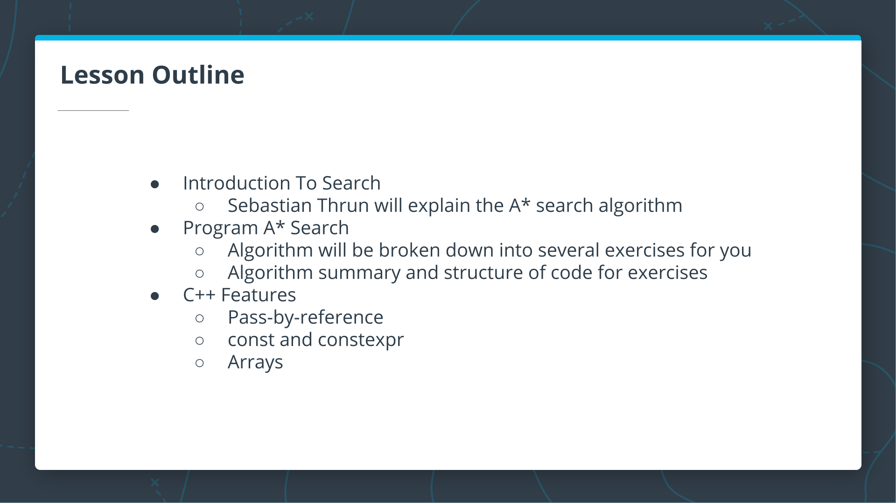

## Lesson Goal

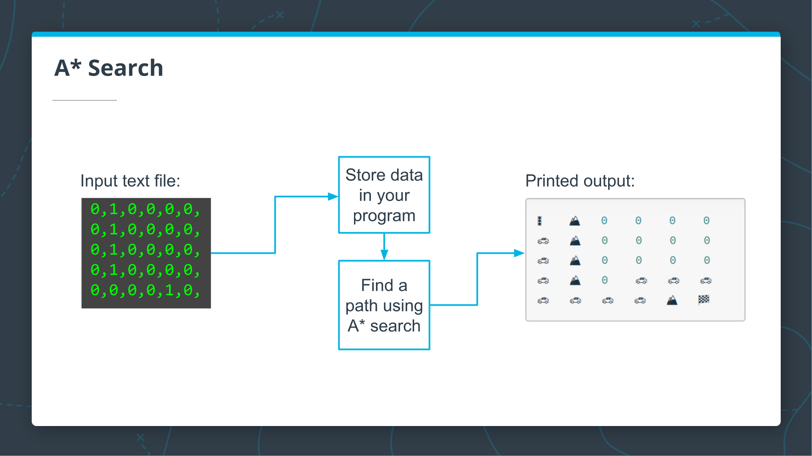

---

# 2. Motion Planning

The next videos and quizzes are taught by Sebastian Thrun (Udacity's former CEO) and they come from one of Udacity's first courses. The production style is a little different from what you will see in the rest of the course, but the content is very good. In these videos, Sebastian will discuss motion planning in robotics and provide the conceptual foundation for the project that you will build.

[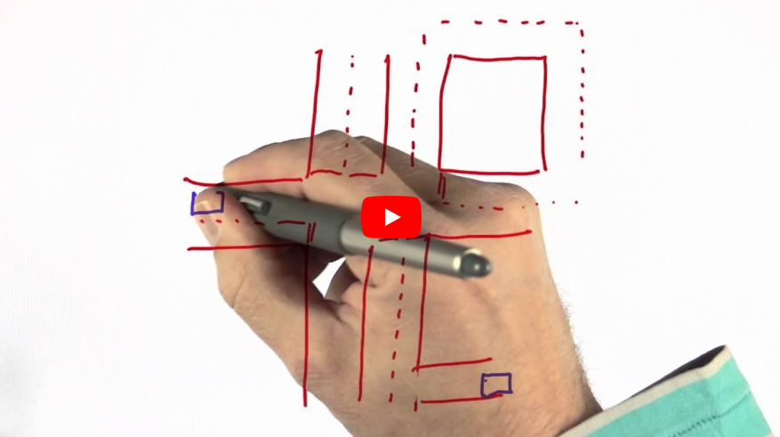](https://youtu.be/KHAu5A_flcQ)

---

# 3. Maze

[](https://youtu.be/ge_-o0RfrgM)

**Quiz**: How many steps does it take to go from **START** to **GOAL**?

<details>
<summary>Answer</summary>

[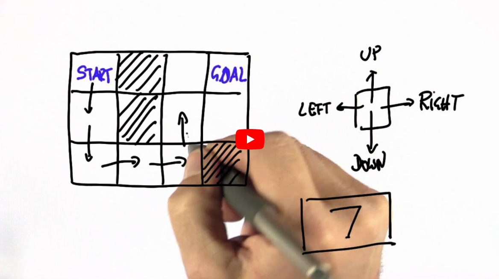](https://youtu.be/yVh0lVlerWs)

</details>

---

# 4. Maze 2

[](https://youtu.be/YwAyqkznxa0)

**Quiz**: How many actions does it take to go from **S** to **G**?

<details>
<summary>Answer</summary>

[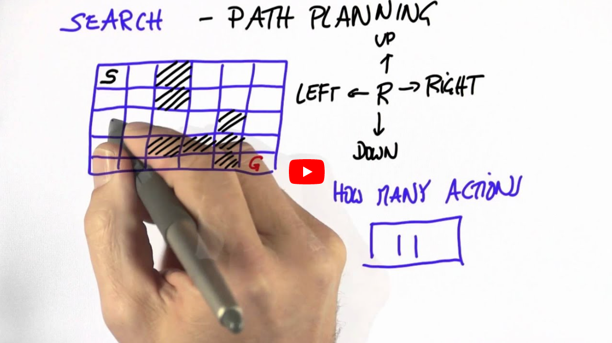](https://youtu.be/aBUxPyEDOWw)

</details>

---

# 5. Coding the Shortest Path Algorithm

In the previous videos, Sebastian talked about the motion planning problem, and you worked through a couple of exercises using a grid-based version of this problem. In this next video, Sebastian will describe how a general path search works in a grid.

[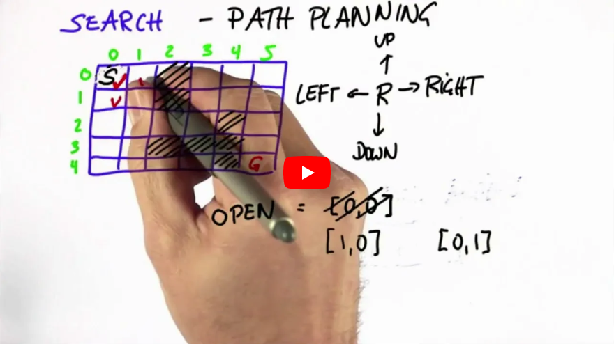](https://youtu.be/pqJTVPls-k0)

---

# 6. A* Search

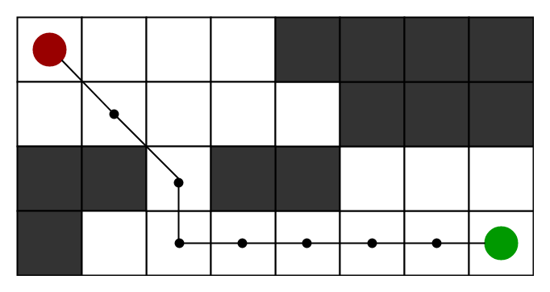

## A* Overview

In the previous lesson, Sebastian described how a general path search worked between two cells on a board, and you wrote C++ code to implement the board. In the next video, Sebastian will describe an improved way of searching, using an algorithm called A* search. This is the algorithm you will use for the implementation of your project.

After the video, there is an additional pseudocode outline of the A* algorithm that you will be following as you work through each exercise. Don't worry about remembering it all now, as the exercises will guide you through each step!

[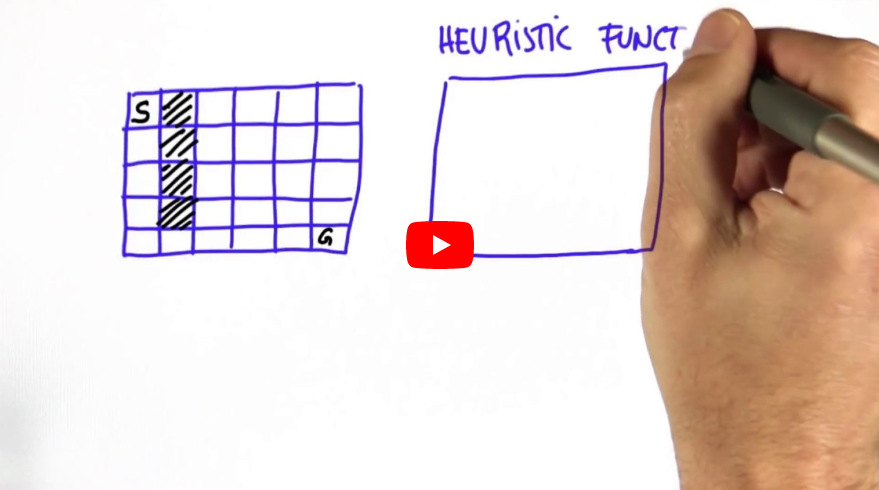](https://youtu.be/lxCCtgHk5Vs)

## Summary and A* Pseudocode
This algorithm described by Sebastian is very similar to other search algorithms you may have seen before, such as [breadth-first search](https://en.wikipedia.org/wiki/Breadth-first_search), except for the additional step of computing a heuristic and using that heuristic (in addition to the cost) to find the next node.

The following is psuedocode for the algorithm described in the video above. Although the pseudocode shows the complete algorithm in a single function, we will split parts of the algorithm into separate functions in this lesson so you can implement them step-by-step in a sequence of exercises:

> ***Search ( grid, initial_point, goal_point )*** :
> 1. *Initialize an empty list of open nodes.*
> 2. *Initialize a starting node with the following*:
>       - ***x*** and ***y*** values given by ***initial_point***.
>       - ***g = 0***, where ***g*** is the cost for each move.
>       - ***h*** given by the ***heuristic function*** (a function of the current coordinates and the goal).
> 3. *Add the new node to the list of open nodes.*
> 4. ***while*** *the list of open nodes is nonempty*:
>       1. *Sort the open list by **f-value**.*
>       2. *Pop the optimal cell (called the current cell).*
>       3. *Mark the cell's coordinates in the grid as part of the path.*
>       4. ***if*** *the current cell is the goal cell:*
>          - *return the **grid**.*
>       5. ***else**, expand the search to the current node's neighbors. This includes the following steps:*
>           - *Check each neighbor cell in the **grid** to ensure that the cell is empty: it hasn't been closed and is not an obstacle.*
>           - *If the cell is empty, compute the cost (**g value**) and the heuristic, and add to the list of open nodes.*
>           - *Mark the cell as closed.*
> 5. *If you exit the **while** loop because the list of open nodes is empty, you have run out of new nodes to explore and haven't found a path.*

## Summary
The A* algorithm finds a path from the start node to the end node by checking for open neighbors of the current node, computing a heuristic for each of the neighbors, and adding those neighbors to the list of open nodes to explore next. The next node to explore is the one with the lowest total cost + heuristic $(g + h)$. This process is repeated until the end is found, as long as there are still open nodes to explore.

---

# 7. Lesson Code Structure

The next video provides an overview of the code that you will be implementing throughout the rest of the lesson. Be sure you have carefully reviewed the pseudocode from the previous concept so you'll have a better understanding of each of the functions described in the video.

[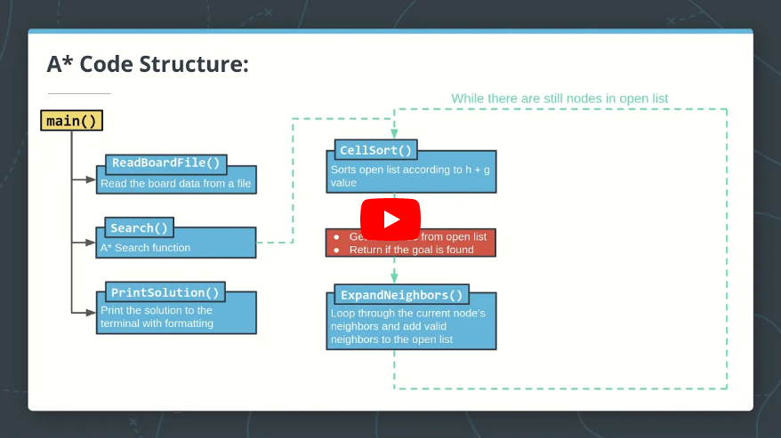](https://youtu.be/ItIdjPEhHdg)

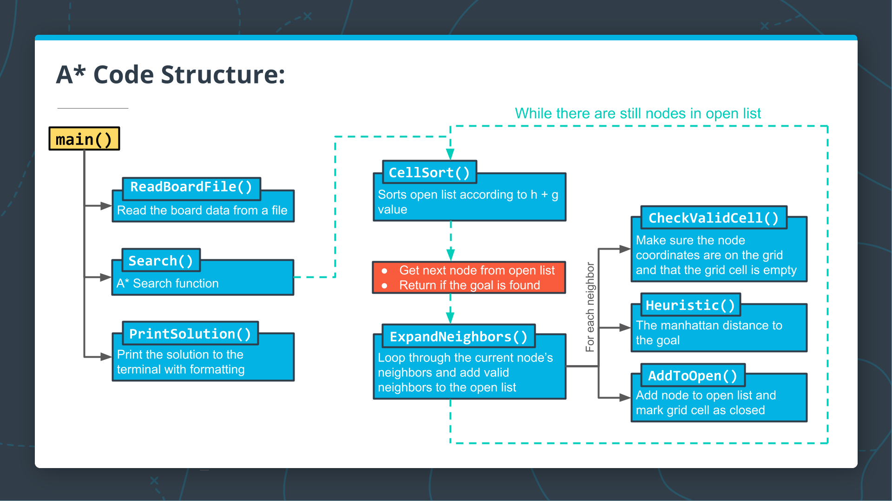

## Quiz
Below are the steps from the `while` loop in the A* pseudocode you saw previously:

> ***while*** *the list of open nodes is nonempty*:
> 1. *Sort the open list by f-value.*
> 2. *Pop the optimal cell (called the current cell).*
> 3. *Mark the cell's coordinates in the grid as part of the path.*
> 4. ***if*** *the current cell is the goal cell:*
>    - *return the grid.*
> 5. ***else**, expand the search to the current node's neighbors. This includes the following steps:*
>     - *Check each neighbor cell in the grid to ensure that the cell is empty: it hasn't been closed and is not an obstacle.*
>     - *If the cell is empty, compute the cost (g value) and the heuristic, and add to the list of open nodes.*
>     - *Mark the cell as closed.*

In the quiz below, match the steps to the appropriate function from the A* code structure diagram.

**QUIZ QUESTION**
Match the steps in the `while` loop of the pseudocode above to the functions in the code structure diagram where the code would be implemented.

**Choose from (1, 4, or 5)**

Functions          |  Steps
-------------------|:-------:
`CellSort()`       |    ?
`ExpandNeighbors()`|    ?
`Search()`         |    ?

<details>
<summary>Solution</summary>

Functions          |  Steps
-------------------|:-------:
`CellSort()`       |    1
`ExpandNeighbors()`|    5
`Search()`         |    4

</details>

## Summary
The code for the A* search algorithm has been broken down into the following functions:

- `CellSort()` - sorts the open list according to the sum of h + g
- `ExpandNeighbors()` - loops through the current node's neighbors and calls appropriate functions to add neighbors to the open list
- `CheckValidCell()` - ensures that the potential neighbor coordinates are on the grid and that the cell is open
- `Heuristic()` - computes the distance to the goal
- `AddToOpen()` - adds the node to the open list and marks the grid cell as closed  

You will be implementing these functions along with a few other small helper functions throughout the rest of this lesson to complete the ASCII A* search program.

---

# 8. CODE: Starting A* Search

## Starting A* Search
To get started with writing the A* search algorithm, you will first add a `Search` function stub that accepts and returns the appropriate variable types.

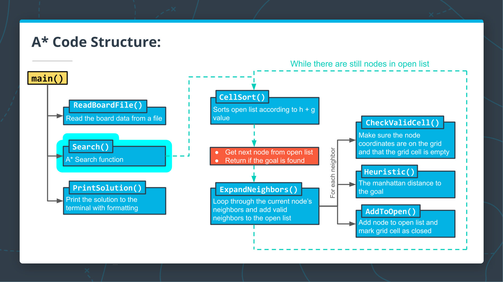
<center>Starting with the <strong><code>Search()</code></strong> function</center>


## To Complete This Exercise:
1. Write a `std::vector<vector<State>> Search` function stub which takes a board grid and two length 2 `int` arrays as arguments. The `int` arrays will represent the start and goal coordinates for the search. The function should print `"No path found!"` and return an empty `std::vector<vector<State>>`. The function will later return the board with a path from the start to the goal.
1. In `main()`, call `Search` with a start of `{0, 0}` and a goal of `{4, 5}`. Store the results in the variable solution.
1. Pass `solution` to `PrintBoard`.

<details>
<summary>Exercise</summary>

`main.cpp`:

```cpp .numberLines
#include <fstream>
#include <iostream>
#include <sstream>
#include <string>
#include <vector>
using std::cout;
using std::ifstream;
using std::istringstream;
using std::string;
using std::vector;
using std::abs;

enum class State {kEmpty, kObstacle};


vector<State> ParseLine(string line) {
    istringstream sline(line);
    int n;
    char c;
    vector<State> row;
    while (sline >> n >> c && c == ',') {
      if (n == 0) {
        row.push_back(State::kEmpty);
      } else {
        row.push_back(State::kObstacle);
      }
    }
    return row;
}


vector<vector<State>> ReadBoardFile(string path) {
  ifstream myfile (path);
  vector<vector<State>> board{};
  if (myfile) {
    string line;
    while (getline(myfile, line)) {
      vector<State> row = ParseLine(line);
      board.push_back(row);
    }
  }
  return board;
}

// TODO: Write the Search function stub here.


string CellString(State cell) {
  switch(cell) {
    case State::kObstacle: return "⛰️   ";
    default: return "0   "; 
  }
}


void PrintBoard(const vector<vector<State>> board) {
  for (int i = 0; i < board.size(); i++) {
    for (int j = 0; j < board[i].size(); j++) {
      cout << CellString(board[i][j]);
    }
    cout << "\n";
  }
}


int main() {
  // TODO: Declare "init" and "goal" arrays with values {0, 0} and {4, 5} respectively.
  auto board = ReadBoardFile("1.board");
  // TODO: Call Search with "board", "init", and "goal". Store the results in the variable "solution".
  // TODO: Change the following line to pass "solution" to PrintBoard.
  PrintBoard(board);
}
```

`1.board`:

```txt
0,1,0,0,0,0,
0,1,0,0,0,0,
0,1,0,0,0,0,
0,1,0,0,0,0,
0,0,0,0,1,0,
```

</details>

<details>
<summary>Solution</summary>

`main.cpp`:

```cpp .numberLines
#include <fstream>
#include <iostream>
#include <sstream>
#include <string>
#include <vector>
using std::cout;
using std::ifstream;
using std::istringstream;
using std::string;
using std::vector;
using std::abs;

enum class State {kEmpty, kObstacle};

vector<vector<State>> Search(vector<vector<State>> copy_board, int init_pt[2], int goal_pt[2])
{
  vector<vector<State>> return_board;
  cout << "No path found!\n";
  return return_board;
}

vector<State> ParseLine(string line) {
    istringstream sline(line);
    int n;
    char c;
    vector<State> row;
    while (sline >> n >> c && c == ',') {
      if (n == 0) {
        row.push_back(State::kEmpty);
      } else {
        row.push_back(State::kObstacle);
      }
    }
    return row;
}


vector<vector<State>> ReadBoardFile(string path) {
  ifstream myfile (path);
  vector<vector<State>> board{};
  if (myfile) {
    string line;
    while (getline(myfile, line)) {
      vector<State> row = ParseLine(line);
      board.push_back(row);
    }
  }
  return board;
}

// TODO: Write the Search function stub here.


string CellString(State cell) {
  switch(cell) {
    case State::kObstacle: return "⛰️   ";
    default: return "0   "; 
  }
}


void PrintBoard(const vector<vector<State>> board) {
  for (int i = 0; i < board.size(); i++) {
    for (int j = 0; j < board[i].size(); j++) {
      cout << CellString(board[i][j]);
    }
    cout << "\n";
  }
}


int main() {
  // TODO: Declare "init" and "goal" arrays with values {0, 0} and {4, 5} respectively.
  int init[2] = {0,0};
  int goal[2] = {4,5};
  
  auto board = ReadBoardFile("1.board");
  
  // TODO: Call Search with "board", "init", and "goal". Store the results in the variable "solution".
  auto solution = Search(board, init, goal);
  
  // TODO: Change the following line to pass "solution" to PrintBoard.
  PrintBoard(solution);
}
```

<details>
<summary>Output</summary>

```bash
No path found!
```

</details>
</details>

---

# 9. CODE: Writing the A* Heuristic

## Writing the A* Heuristic

[](https://youtu.be/yJR9fPRDKfU)

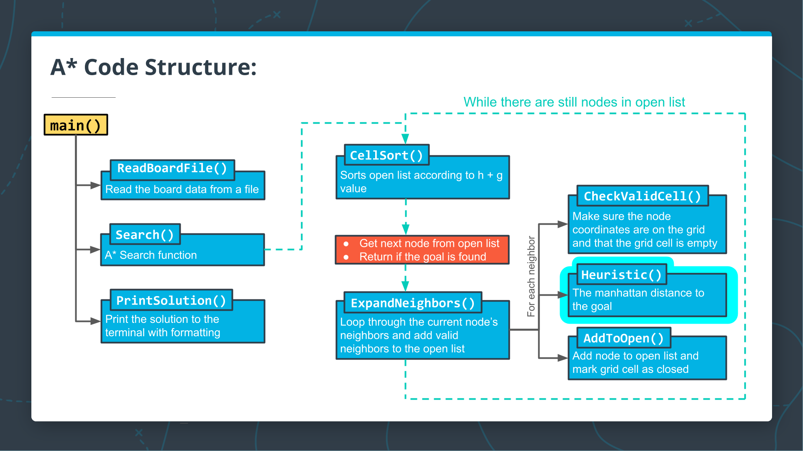  

<center>Starting with the <strong><code>Heuristic()</code></strong> function</center>

In this quiz, you will write a `Heuristic` function that will be used to guide the A* search. In general, any [admissible function](https://en.wikipedia.org/wiki/Admissible_heuristic) can be used for the heuristic, but for this project, you will write one that takes a pair of 2D coordinates on the grid and returns the [Manhattan Distance](https://en.wikipedia.org/wiki/Taxicab_geometry) from one coordinate to the other.

## To Complete This Exercise:
- Write an `int Heuristic` function which takes four `int`s as arguments. 
- The `int`s represent two pairs of 2D coordinates: $(x_1, y_1, x_2, y_2)$. 
- The function should return an `int` which is the *Manhattan Distance* from one coordinate to the other: $|x_2- x_1| + |y_2 - y_1|$

<details>
<summary>Exercise</summary>

`main.cpp`:

```cpp .numberLines
#include <fstream>
#include <iostream>
#include <sstream>
#include <string>
#include <vector>
using std::cout;
using std::ifstream;
using std::istringstream;
using std::string;
using std::vector;

enum class State {kEmpty, kObstacle};


vector<State> ParseLine(string line) {
    istringstream sline(line);
    int n;
    char c;
    vector<State> row;
    while (sline >> n >> c && c == ',') {
      if (n == 0) {
        row.push_back(State::kEmpty);
      } else {
        row.push_back(State::kObstacle);
      }
    }
    return row;
}


vector<vector<State>> ReadBoardFile(string path) {
  ifstream myfile (path);
  vector<vector<State>> board{};
  if (myfile) {
    string line;
    while (getline(myfile, line)) {
      vector<State> row = ParseLine(line);
      board.push_back(row);
    }
  }
  return board;
}

// TODO: Write the Heuristic function here.


/** 
 * Implementation of A* search algorithm
 */
vector<vector<State>> Search(vector<vector<State>> grid, int init[2], int goal[2]) {


  cout << "No path found!" << "\n";
  return std::vector<vector<State>> {};
}


string CellString(State cell) {
  switch(cell) {
    case State::kObstacle: return "⛰️   ";
    default: return "0   "; 
  }
}


void PrintBoard(const vector<vector<State>> board) {
  for (int i = 0; i < board.size(); i++) {
    for (int j = 0; j < board[i].size(); j++) {
      cout << CellString(board[i][j]);
    }
    cout << "\n";
  }
}

#include "test.cpp" // For testing solution

int main() {
  int init[2]{0, 0};
  int goal[2]{4, 5};
  auto board = ReadBoardFile("1.board");
  auto solution = Search(board, init, goal);
  PrintBoard(solution);
  // Tests
  TestHeuristic();
}
```

`test.cpp`:

```cpp .numberLines
void TestHeuristic() {
  cout << "----------------------------------------------------------" << "\n";
  cout << "Heuristic Function Test: ";
  if (Heuristic(1, 2, 3, 4) != 4) {
    cout << "failed" << "\n";
    cout << "\n" << "Heuristic(1, 2, 3, 4) = " << Heuristic(1, 2, 3, 4) << "\n";
    cout << "Correct result: 4" << "\n";
    cout << "\n";
  } else if (Heuristic(2, -1, 4, -7) != 8) {
    cout << "TestHeuristic Failed" << "\n";
    cout << "\n" << "Heuristic(2, -1, 4, -7) = " << Heuristic(2, -1, 4, -7) << "\n";
    cout << "Correct result: 8" << "\n";
    cout << "\n";
  } else {
    cout << "passed" << "\n";
  }
  cout << "----------------------------------------------------------" << "\n";
}
```

`1.board`:

```txt
0,1,0,0,0,0,
0,1,0,0,0,0,
0,1,0,0,0,0,
0,1,0,0,0,0,
0,0,0,0,1,0,
```

</details>

<details>
<summary>Solution</summary>

`main.cpp`:

```cpp .numberLines
#include <fstream>
#include <iostream>
#include <sstream>
#include <string>
#include <vector>
using std::cout;
using std::ifstream;
using std::istringstream;
using std::string;
using std::vector;

enum class State {kEmpty, kObstacle};


vector<State> ParseLine(string line) {
    istringstream sline(line);
    int n;
    char c;
    vector<State> row;
    while (sline >> n >> c && c == ',') {
      if (n == 0) {
        row.push_back(State::kEmpty);
      } else {
        row.push_back(State::kObstacle);
      }
    }
    return row;
}


vector<vector<State>> ReadBoardFile(string path) {
  ifstream myfile (path);
  vector<vector<State>> board{};
  if (myfile) {
    string line;
    while (getline(myfile, line)) {
      vector<State> row = ParseLine(line);
      board.push_back(row);
    }
  }
  return board;
}

// TODO: Write the Heuristic function here.
int Heuristic(int x1, int y1, int x2, int y2)
{
  return (abs(x2-x1) + abs(y2-y1));
}

/** 
 * Implementation of A* search algorithm
 */
vector<vector<State>> Search(vector<vector<State>> grid, int init[2], int goal[2]) {


  cout << "No path found!" << "\n";
  return std::vector<vector<State>> {};
}


string CellString(State cell) {
  switch(cell) {
    case State::kObstacle: return "⛰️   ";
    default: return "0   "; 
  }
}


void PrintBoard(const vector<vector<State>> board) {
  for (int i = 0; i < board.size(); i++) {
    for (int j = 0; j < board[i].size(); j++) {
      cout << CellString(board[i][j]);
    }
    cout << "\n";
  }
}

#include "test.cpp" // For testing solution

int main() {
  int init[2]{0, 0};
  int goal[2]{4, 5};
  auto board = ReadBoardFile("1.board");
  auto solution = Search(board, init, goal);
  PrintBoard(solution);
  // Tests
  TestHeuristic();
}
```

<details>
<summary>Output</summary>

```bash
No path found!
----------------------------------------------------------
Heuristic Function Test: passed
----------------------------------------------------------
```

</details>
</details>

---

# 10. Pass by Reference in C++

## Pass by Reference

In the previous exercises, you've written functions that accept and return various kinds of objects. However, in all of the functions you've written so far, the objects returned by the function are different from the objects provided to the function. In other words, when the function is called on some data, a copy of that data is made, and the function operates on a copy of the data instead of the original data. This is referred to as pass by value, since only a copy of the values of an object are passed to the function, and not the actual objects itself.

To see how to use a function to operate directly on a given object, have a look at the **notebook** below.

<div style='border-left: solid 1px; border-right: solid 1px; border-top: solid 1px; border-bottom: solid 1px; border-radius: 10px; padding:1em;'>

## Passing Values
In the following example, the _value_ of `int i` is passed to the function `MultiplyByTwo`. Look carefully at the code and try to guess what the output will be before you execute it. When you are finished executing, click the button for an explanation.

```cpp .numberLines
#include <iostream>
using std::cout;


int MultiplyByTwo(int i) {
    i = 2*i;
    return i;
}

int main() {
    int a = 5;
    cout << "The int a equals: " << a << "\n";
    int b = MultiplyByTwo(a);
    cout << "The int b equals: " << b << "\n";
    cout << "The int a still equals: " << a << "\n";
}
```

<details>
<summary>Output</summary>

```bash
The int a equals: 5
The int b equals: 10
The int a still equals: 5
```

</details>

In the code above, `a` is passed by value to the function, so the variable `a` is not affected by what happens inside the function.

## Passing References

But what if we wanted to change the value of `a` itself? For example, it might be that the variable you are passing into a function maintains some state in the program, and you want to write the function to update that state. 

It turns out, it is possible to modify `a` from within the function. To do this, you must pass a _reference_ to the variable `a`, instead of the _value_ of `a`. In C++, _a reference is just an alternative name for the same variable_.

To pass by reference, you simply need to add an ampersand `&` before the variable in the function declaration. Try the code below to see how this works:

```cpp .numberLines
#include <iostream>
using std::cout;


int MultiplyByTwo(int &i) {
    i = 2*i;
    return i;
}

int main() {
    int a = 5;
    cout << "The int a equals: " << a << "\n";
    int b = MultiplyByTwo(a);
    cout << "The int b equals: " << b << "\n";
    cout << "The int a now equals: " << a << "\n";
}
```

<details>
<summary>Output</summary>

```bash
The int a equals: 5
The int b equals: 10
The int a now equals: 10
```

</details>

In the code above, `a` is passed by reference to the function `MultiplyByTwo` since the argument to `MultiplyByTwo` is a reference: `&i`. This means that `i` is becomes another name for whatever variable that is passed into the function. When the function changes the value of `i`, then the value of `a` is changed as well.

### Practice

Modify the function below to accept a reference so that the passed variable can be directly modified by the function.

```cpp .numberLines
#include <iostream>
#include <string>
using std::cout;
using std::string;

void DoubleStringVal(string value) {
    // Concatentate the string with a space and itself.
    value = value + " " + value;
}

void DoubleStringRef(string &value) {
    // Concatentate the string with a space and itself.
    value = value + " " + value;
}

int main() {
    string s1 = "Hello1";
    cout << "The string s1 is: " << s1 << "\n";
    DoubleStringVal(s1);
    cout << "DoubleStringVal: The string s is now: " << s1 << "\n";
    string s2 = "Hello2";
    cout << "The string s2 is: " << s2 << "\n";
    DoubleStringRef(s2);
    cout << "DoubleStringRef: The string s is now: " << s2 << "\n";
}
```

<details>
<summary>Output</summary>

```bash
The string s1 is: Hello1
DoubleStringVal: The string s is now: Hello1
The string s2 is: Hello2
DoubleStringRef: The string s is now: Hello2 Hello2
```

</details>

</div>

## On to the Exercises!

In the next exercises you will write some functions that require passing variables by reference. This will allow helper functions in the A* search program to modify the state of the board without having to copy the entire board, for instance.

Note that if you've encountered references before in C++, you are aware that they can be used in many other scenarios, aside from just passing variables to functions. In the next lessons, you will learn about references more generally, along with closely related pointers. However, you now know enough to finish the mini-project for the first half of the course!

Since you are well prepared with all you need at this point, this will be the last notebook in this half of the course. Good luck!

---

# 11. CODE: Adding Nodes to the Open Vector

## Adding Nodes to the Open Vector

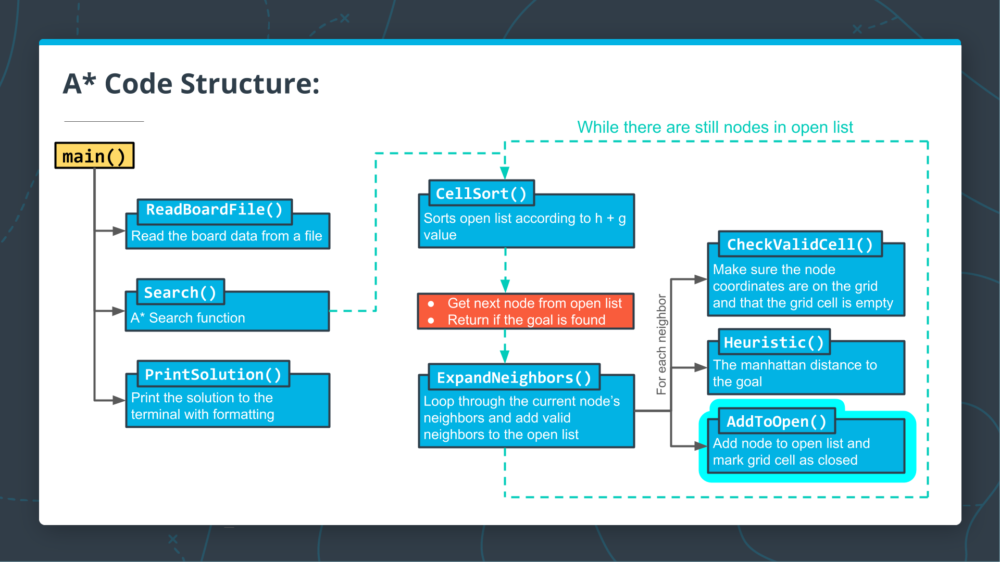

<center>Writing the <strong><code>AddToOpen()</code></strong> function</center>

As you've seen from Sebastian's explanation of A* search, the search algorithm keeps a list of potential board cells to search through. In this implementation of A*, we will refer to a board cell along with it's `g` and `h` values as a node. In other words, each node will consist of the following values which are needed for the A* algorithm:

- an **$x$** coordinate,
- a **$y$** coordinate,
- the **$g$** value (or cost) that has accumulated up to that cell,
- the **$h$** value for the cell, given by the heuristic function.

In the code, nodes will be implemented with the type `vector<int>`, and should have the form `{x, y, g, h}` for `int`s `x`, `y`, `g`, and `h`. Also, the open list will be implemented as a C++ vector (of type `vector<vector<int>>`). The goal in this exercise is for you to write a helper function for your A* Search which will add nodes to the open vector and mark them as visited in the grid.

## To Complete This Exercise:

1. Write a `void AddToOpen` function which accepts the following arguments:
    - Four `int`s, one for each of the `x`, `y`, `g`, and `h` values.
    - References to one `vector<vector<int>>` for the vector of open nodes.
    - Reference to one `vector<vector<State>>` for the grid.
1. The `AddToOpen` function should do two things:
    - Create a `vector<int>` node with the form `{x, y, g, h}` and push the node to the back of the open vector.
    - Set the grid value for the `x` and `y` coordinates to the enum value `kClosed`. We have added `kClosed` to the set of enum values.

<details>
<summary>Exercise</summary>

`main.cpp`:

```cpp .numberLines
#include <fstream>
#include <iostream>
#include <sstream>
#include <string>
#include <vector>
using std::cout;
using std::ifstream;
using std::istringstream;
using std::string;
using std::vector;
using std::abs;

enum class State {kEmpty, kObstacle, kClosed};


vector<State> ParseLine(string line) {
    istringstream sline(line);
    int n;
    char c;
    vector<State> row;
    while (sline >> n >> c && c == ',') {
      if (n == 0) {
        row.push_back(State::kEmpty);
      } else {
        row.push_back(State::kObstacle);
      }
    }
    return row;
}


vector<vector<State>> ReadBoardFile(string path) {
  ifstream myfile (path);
  vector<vector<State>> board{};
  if (myfile) {
    string line;
    while (getline(myfile, line)) {
      vector<State> row = ParseLine(line);
      board.push_back(row);
    }
  }
  return board;
}


// Calculate the manhattan distance
int Heuristic(int x1, int y1, int x2, int y2) {
  return abs(x2 - x1) + abs(y2 - y1);
}

// TODO: Write the AddToOpen function here.


/** 
 * Implementation of A* search algorithm
 */
vector<vector<State>> Search(vector<vector<State>> grid, int init[2], int goal[2]) {


  cout << "No path found!" << "\n";
  return std::vector<vector<State>> {};
}


string CellString(State cell) {
  switch(cell) {
    case State::kObstacle: return "⛰️   ";
    default: return "0   "; 
  }
}


void PrintBoard(const vector<vector<State>> board) {
  for (int i = 0; i < board.size(); i++) {
    for (int j = 0; j < board[i].size(); j++) {
      cout << CellString(board[i][j]);
    }
    cout << "\n";
  }
}

#include "test.cpp"

int main() {
  int init[2]{0, 0};
  int goal[2]{4, 5};
  auto board = ReadBoardFile("1.board");
  auto solution = Search(board, init, goal);
  PrintBoard(solution);
  // Tests
  TestHeuristic();
  TestAddToOpen();
}
```

`test.cpp`:

```cpp .numberLines
void PrintVectorOfVectors(vector<vector<int>> v) {
  for (auto row : v) {
    cout << "{ ";
    for (auto col : row) {
      cout << col << " ";
    }
    cout << "}" << "\n";
  }
}

void PrintVectorOfVectors(vector<vector<State>> v) {
  for (auto row : v) {
    cout << "{ ";
    for (auto col : row) {
      cout << CellString(col) << " ";
    }
    cout << "}" << "\n";
  }
}

void TestHeuristic() {
  cout << "----------------------------------------------------------" << "\n";
  cout << "Heuristic Function Test: ";
  if (Heuristic(1, 2, 3, 4) != 4) {
    cout << "failed" << "\n";
    cout << "\n" << "Heuristic(1, 2, 3, 4) = " << Heuristic(1, 2, 3, 4) << "\n";
    cout << "Correct result: 4" << "\n";
    cout << "\n";
  } else if (Heuristic(2, -1, 4, -7) != 8) {
    cout << "TestHeuristic Failed" << "\n";
    cout << "\n" << "Heuristic(2, -1, 4, -7) = " << Heuristic(2, -1, 4, -7) << "\n";
    cout << "Correct result: 8" << "\n";
    cout << "\n";
  } else {
    cout << "passed" << "\n";
  }
  return;
}

void TestAddToOpen() {
  cout << "----------------------------------------------------------" << "\n";
  cout << "AddToOpen Function Test: ";
  int x = 3;
  int y = 0;
  int g = 5;
  int h = 7;
  vector<vector<int>> open{{0, 0, 2, 9}, {1, 0, 2, 2}, {2, 0, 2, 4}};
  vector<vector<int>> solution_open = open; 
  solution_open.push_back(vector<int>{3, 0, 5, 7});
  vector<vector<State>> grid{{State::kClosed, State::kObstacle, State::kEmpty, State::kEmpty, State::kEmpty, State::kEmpty},
                            {State::kClosed, State::kObstacle, State::kEmpty, State::kEmpty, State::kEmpty, State::kEmpty},
                            {State::kClosed, State::kObstacle, State::kEmpty, State::kEmpty, State::kEmpty, State::kEmpty},
                            {State::kEmpty, State::kObstacle, State::kEmpty, State::kEmpty, State::kEmpty, State::kEmpty},
                            {State::kEmpty, State::kEmpty, State::kEmpty, State::kEmpty, State::kObstacle, State::kEmpty}};
  vector<vector<State>> solution_grid = grid;
  solution_grid[3][0] = State::kClosed;
  AddToOpen(x, y, g, h, open, grid);
  if (open != solution_open) {
    cout << "failed" << "\n";
    cout << "\n";
    cout << "Your open list is: " << "\n";
    PrintVectorOfVectors(open);
    cout << "Solution open list is: " << "\n";
    PrintVectorOfVectors(solution_open);
    cout << "\n";
  } else if (grid != solution_grid) {
    cout << "failed" << "\n";
    cout << "\n";
    cout << "Your grid is: " << "\n";
    PrintVectorOfVectors(grid);
    cout << "\n";
    cout << "Solution grid is: " << "\n";
    PrintVectorOfVectors(solution_grid);
    cout << "\n";
  } else {
    cout << "passed" << "\n";
  }
  cout << "----------------------------------------------------------" << "\n";
  return;
}
```

`1.board`:

```txt
0,1,0,0,0,0,
0,1,0,0,0,0,
0,1,0,0,0,0,
0,1,0,0,0,0,
0,0,0,0,1,0,
```

</details>

<details>
<summary>Solution</summary>

`main.cpp`:

```cpp .numberLines
#include <fstream>
#include <iostream>
#include <sstream>
#include <string>
#include <vector>
using std::cout;
using std::ifstream;
using std::istringstream;
using std::string;
using std::vector;
using std::abs;

enum class State {kEmpty, kObstacle, kClosed};

vector<State> ParseLine(string line) {
    istringstream sline(line);
    int n;
    char c;
    vector<State> row;
    while (sline >> n >> c && c == ',') {
      if (n == 0) {
        row.push_back(State::kEmpty);
      } else {
        row.push_back(State::kObstacle);
      }
    }
    return row;
}

vector<vector<State>> ReadBoardFile(string path) {
  ifstream myfile (path);
  vector<vector<State>> board{};
  if (myfile) {
    string line;
    while (getline(myfile, line)) {
      vector<State> row = ParseLine(line);
      board.push_back(row);
    }
  }
  return board;
}

// Calculate the manhattan distance
int Heuristic(int x1, int y1, int x2, int y2) {
  return abs(x2 - x1) + abs(y2 - y1);
}

// TODO: Write the AddToOpen function here.
void AddToOpen(int x, int y, int g, int h, vector<vector<int>> &open_nodes, vector<vector<State>> &grid)
{
  vector<int> node{x, y, g, h};
  open_nodes.push_back(node);
  grid[x][y] = State::kClosed;
}

/** 
 * Implementation of A* search algorithm
 */
vector<vector<State>> Search(vector<vector<State>> grid, int init[2], int goal[2]) {

  cout << "No path found!" << "\n";
  return std::vector<vector<State>> {};
}

string CellString(State cell) {
  switch(cell) {
    case State::kObstacle: return "⛰️   ";
    default: return "0   "; 
  }
}

void PrintBoard(const vector<vector<State>> board) {
  for (int i = 0; i < board.size(); i++) {
    for (int j = 0; j < board[i].size(); j++) {
      cout << CellString(board[i][j]);
    }
    cout << "\n";
  }
}

#include "test.cpp"

int main() {
  int init[2]{0, 0};
  int goal[2]{4, 5};
  auto board = ReadBoardFile("1.board");
  auto solution = Search(board, init, goal);
  PrintBoard(solution);
  // Tests
  TestHeuristic();
  TestAddToOpen();
}
```

<details>
<summary>Output</summary>

```bash
No path found!
----------------------------------------------------------
Heuristic Function Test: passed
----------------------------------------------------------
AddToOpen Function Test: passed
----------------------------------------------------------
```

</details>
</details>

---

# 12. CODE: Initialize the Open Vector

## Initialize the Open Vector

<center>Filling out the <strong><code>Search()</code></strong> function</center>


Fantastic work so far! In the last few coding exercises, you've been writing helper functions that will be used in the A* search. While there are a few more helper functions that still need to be written, in this exercise, you will begin implementing the body of the `Search` function. In particular, you will take the arguments that are passed to the search function, get the x, y, g, and h values for the first node, and then add the first node to the open vector.

We have provided the empty vector of open nodes, `open`, in the `Search` function for you to use.

## To Complete This Exercise:

1. Initialize variables with the starting node values as follows:
    - `x` and `y` are given by the `init` variable values,
    - Set the initial cost `g = 0`,
    - `h` is given by `Heuristic` function.
1. Add first node to open vector using the `AddToOpen` function by passing the node values: `x`, `y`, `g`, and `h`, along with the `open` and `grid` vectors.

<details>
<summary>Exercise</summary>

`main.cpp`:

```cpp .numberLines
#include <fstream>
#include <iostream>
#include <sstream>
#include <string>
#include <vector>
using std::cout;
using std::ifstream;
using std::istringstream;
using std::string;
using std::vector;
using std::abs;

enum class State {kEmpty, kObstacle, kClosed};


vector<State> ParseLine(string line) {
    istringstream sline(line);
    int n;
    char c;
    vector<State> row;
    while (sline >> n >> c && c == ',') {
      if (n == 0) {
        row.push_back(State::kEmpty);
      } else {
        row.push_back(State::kObstacle);
      }
    }
    return row;
}


vector<vector<State>> ReadBoardFile(string path) {
  ifstream myfile (path);
  vector<vector<State>> board{};
  if (myfile) {
    string line;
    while (getline(myfile, line)) {
      vector<State> row = ParseLine(line);
      board.push_back(row);
    }
  }
  return board;
}


// Calculate the manhattan distance
int Heuristic(int x1, int y1, int x2, int y2) {
  return abs(x2 - x1) + abs(y2 - y1);
}


/** 
 * Add a node to the open list and mark it as open. 
 */
void AddToOpen(int x, int y, int g, int h, vector<vector<int>> &openlist, vector<vector<State>> &grid) {
  // Add node to open vector, and mark grid cell as closed.
  openlist.push_back(vector<int>{x, y, g, h});
  grid[x][y] = State::kClosed;
}


/** 
 * Implementation of A* search algorithm
 */
vector<vector<State>> Search(vector<vector<State>> grid, int init[2], int goal[2]) {
  // Create the vector of open nodes.
  vector<vector<int>> open {};
  
  // TODO: Initialize the starting node. 
  
  // TODO: Use AddToOpen to add the starting node to the open vector.

  cout << "No path found!" << "\n";
  return std::vector<vector<State>>{};
}

string CellString(State cell) {
  switch(cell) {
    case State::kObstacle: return "⛰️   ";
    default: return "0   "; 
  }
}


void PrintBoard(const vector<vector<State>> board) {
  for (int i = 0; i < board.size(); i++) {
    for (int j = 0; j < board[i].size(); j++) {
      cout << CellString(board[i][j]);
    }
    cout << "\n";
  }
}

#include "test.cpp"

int main() {
  int init[2]{0, 0};
  int goal[2]{4, 5};
  auto board = ReadBoardFile("1.board");
  auto solution = Search(board, init, goal);
  PrintBoard(solution);
  // Tests
  TestHeuristic();
  TestAddToOpen();
}
```

`test.cpp`:

```cpp .numberLines
void PrintVectorOfVectors(vector<vector<int>> v) {
  for (auto row : v) {
    cout << "{ ";
    for (auto col : row) {
      cout << col << " ";
    }
    cout << "}" << "\n";
  }
}

void PrintVectorOfVectors(vector<vector<State>> v) {
  for (auto row : v) {
    cout << "{ ";
    for (auto col : row) {
      cout << CellString(col) << " ";
    }
    cout << "}" << "\n";
  }
}

void TestHeuristic() {
  cout << "----------------------------------------------------------" << "\n";
  cout << "Heuristic Function Test: ";
  if (Heuristic(1, 2, 3, 4) != 4) {
    cout << "failed" << "\n";
    cout << "\n" << "Heuristic(1, 2, 3, 4) = " << Heuristic(1, 2, 3, 4) << "\n";
    cout << "Correct result: 4" << "\n";
    cout << "\n";
  } else if (Heuristic(2, -1, 4, -7) != 8) {
    cout << "TestHeuristic Failed" << "\n";
    cout << "\n" << "Heuristic(2, -1, 4, -7) = " << Heuristic(2, -1, 4, -7) << "\n";
    cout << "Correct result: 8" << "\n";
    cout << "\n";
  } else {
    cout << "passed" << "\n";
  }
  return;
}

void TestAddToOpen() {
  cout << "----------------------------------------------------------" << "\n";
  cout << "AddToOpen Function Test: ";
  int x = 3;
  int y = 0;
  int g = 5;
  int h = 7;
  vector<vector<int>> open{{0, 0, 2, 9}, {1, 0, 2, 2}, {2, 0, 2, 4}};
  vector<vector<int>> solution_open = open; 
  solution_open.push_back(vector<int>{3, 0, 5, 7});
vector<vector<State>> grid{{State::kClosed, State::kObstacle, State::kEmpty, State::kEmpty, State::kEmpty, State::kEmpty},
                            {State::kClosed, State::kObstacle, State::kEmpty, State::kEmpty, State::kEmpty, State::kEmpty},
                            {State::kClosed, State::kObstacle, State::kEmpty, State::kEmpty, State::kEmpty, State::kEmpty},
                            {State::kClosed, State::kObstacle, State::kEmpty, State::kEmpty, State::kEmpty, State::kEmpty},
                            {State::kClosed, State::kClosed, State::kEmpty, State::kEmpty, State::kObstacle, State::kEmpty}};
  vector<vector<State>> solution_grid = grid;
  solution_grid[3][0] = State::kClosed;
  AddToOpen(x, y, g, h, open, grid);
  if (open != solution_open) {
    cout << "failed" << "\n";
    cout << "\n";
    cout << "Your open list is: " << "\n";
    PrintVectorOfVectors(open);
    cout << "Solution open list is: " << "\n";
    PrintVectorOfVectors(solution_open);
    cout << "\n";
  } else if (grid != solution_grid) {
    cout << "failed" << "\n";
    cout << "\n";
    cout << "Your grid is: " << "\n";
    PrintVectorOfVectors(grid);
    cout << "\n";
    cout << "Solution grid is: " << "\n";
    PrintVectorOfVectors(solution_grid);
    cout << "\n";
  } else {
    cout << "passed" << "\n";
  }
  cout << "----------------------------------------------------------" << "\n";
  return;
}
```

`1.board`:

```txt
0,1,0,0,0,0,
0,1,0,0,0,0,
0,1,0,0,0,0,
0,1,0,0,0,0,
0,0,0,0,1,0,
```

</details>

<details>
<summary>Solution</summary>

`main.cpp`:

```cpp .numberLines
#include <fstream>
#include <iostream>
#include <sstream>
#include <string>
#include <vector>
using std::cout;
using std::ifstream;
using std::istringstream;
using std::string;
using std::vector;
using std::abs;

enum class State {kEmpty, kObstacle, kClosed};

vector<State> ParseLine(string line) {
    istringstream sline(line);
    int n;
    char c;
    vector<State> row;
    while (sline >> n >> c && c == ',') {
      if (n == 0) {
        row.push_back(State::kEmpty);
      } else {
        row.push_back(State::kObstacle);
      }
    }
    return row;
}

vector<vector<State>> ReadBoardFile(string path) {
  ifstream myfile (path);
  vector<vector<State>> board{};
  if (myfile) {
    string line;
    while (getline(myfile, line)) {
      vector<State> row = ParseLine(line);
      board.push_back(row);
    }
  }
  return board;
}

// Calculate the manhattan distance
int Heuristic(int x1, int y1, int x2, int y2) {
  return abs(x2 - x1) + abs(y2 - y1);
}

/** 
 * Add a node to the open list and mark it as open. 
 */
void AddToOpen(int x, int y, int g, int h, vector<vector<int>> &openlist, vector<vector<State>> &grid) {
  // Add node to open vector, and mark grid cell as closed.
  openlist.push_back(vector<int>{x, y, g, h});
  grid[x][y] = State::kClosed;
}

/** 
 * Implementation of A* search algorithm
 */
vector<vector<State>> Search(vector<vector<State>> grid, int init[2], int goal[2]) {
  // Create the vector of open nodes.
  vector<vector<int>> open {};
  
  // TODO: Initialize the starting node. 
  int x1 = init[0];
  int y1 = init[1];
  int x2 = goal[0];
  int y2 = goal[1];
  int g = 0;
  int h = Heuristic(x1, y1, x2, y2);
  vector<int> start_node{x1, y1, g, h};
  
  // TODO: Use AddToOpen to add the starting node to the open vector.
  AddToOpen(x1, y1, g, h, open, grid);
  
  for(auto i: open)
  {
    for(auto j: i)
      cout << j << " ";
    cout << "\n";
  }
    
  cout << "No path found!" << "\n";
  return std::vector<vector<State>>{};
}

string CellString(State cell) {
  switch(cell) {
    case State::kObstacle: return "⛰️   ";
    default: return "0   "; 
  }
}


void PrintBoard(const vector<vector<State>> board) {
  for (int i = 0; i < board.size(); i++) {
    for (int j = 0; j < board[i].size(); j++) {
      cout << CellString(board[i][j]);
    }
    cout << "\n";
  }
}

#include "test.cpp"

int main() {
  int init[2]{0, 0};
  int goal[2]{4, 5};
  auto board = ReadBoardFile("1.board");
  auto solution = Search(board, init, goal);
  PrintBoard(solution);
  // Tests
  TestHeuristic();
  TestAddToOpen();
}
```

<details>
<summary>Output</summary>

```bash
0 0 0 9 
No path found!
----------------------------------------------------------
Heuristic Function Test: passed
----------------------------------------------------------
AddToOpen Function Test: passed
----------------------------------------------------------
```

</details>
</details>

---

# 13. CODE: Create a Comparison Function

## Create a Comparison Function

[](https://youtu.be/FS-2cGo-w-k)

Before you can use the vector of open nodes to expand the A* search, you will first need to be able to sort the vector. Since the vector contains nodes `{x, y, g, h}`, and there is no standard library function to sort these types of vectors, you will begin by writing a function which compares two nodes to determine their order.

This function is a helper function for the `CellSort()` function you will write later, so it is not shown on the code structure diagram.

## To Complete This Exercise:

Write a function `bool Compare` that accepts two nodes of type `vector<int>` as arguments. It should return a boolean `true` if the f-value of the first argument is greater than the f-value of the second, and it should return `false` otherwise. Recall that the f-value is the sum of the cost and heuristic: `f = g + h`.

<details>
<summary>Exercise</summary>

`main.cpp`:

```cpp .numberLines
#include <fstream>
#include <iostream>
#include <sstream>
#include <string>
#include <vector>
using std::cout;
using std::ifstream;
using std::istringstream;
using std::string;
using std::vector;
using std::abs;

enum class State {kEmpty, kObstacle, kClosed};


vector<State> ParseLine(string line) {
    istringstream sline(line);
    int n;
    char c;
    vector<State> row;
    while (sline >> n >> c && c == ',') {
      if (n == 0) {
        row.push_back(State::kEmpty);
      } else {
        row.push_back(State::kObstacle);
      }
    }
    return row;
}


vector<vector<State>> ReadBoardFile(string path) {
  ifstream myfile (path);
  vector<vector<State>> board{};
  if (myfile) {
    string line;
    while (getline(myfile, line)) {
      vector<State> row = ParseLine(line);
      board.push_back(row);
    }
  }
  return board;
}

// TODO: Write function to compare the f-value of two nodes here


// Calculate the manhattan distance
int Heuristic(int x1, int y1, int x2, int y2) {
  return abs(x2 - x1) + abs(y2 - y1);
}


/** 
 * Add a node to the open list and mark it as open. 
 */
void AddToOpen(int x, int y, int g, int h, vector<vector<int>> &openlist, vector<vector<State>> &grid) {
  // Add node to open vector, and mark grid cell as closed.
  openlist.push_back(vector<int>{x, y, g, h});
  grid[x][y] = State::kClosed;
}


/** 
 * Implementation of A* search algorithm
 */
vector<vector<State>> Search(vector<vector<State>> grid, int init[2], int goal[2]) {
  // Create the vector of open nodes.
  vector<vector<int>> open {};
  
  // Initialize the starting node.
  int x = init[0];
  int y = init[1];
  int g = 0;
  int h = Heuristic(x, y, goal[0],goal[1]);
  AddToOpen(x, y, g, h, open, grid);

  cout << "No path found!" << "\n";
  return std::vector<vector<State>>{};
}

string CellString(State cell) {
  switch(cell) {
    case State::kObstacle: return "⛰️   ";
    default: return "0   "; 
  }
}


void PrintBoard(const vector<vector<State>> board) {
  for (int i = 0; i < board.size(); i++) {
    for (int j = 0; j < board[i].size(); j++) {
      cout << CellString(board[i][j]);
    }
    cout << "\n";
  }
}

#include "test.cpp"

int main() {
  int init[2]{0, 0};
  int goal[2]{4, 5};
  auto board = ReadBoardFile("1.board");
  auto solution = Search(board, init, goal);
  PrintBoard(solution);
  // Tests
  TestHeuristic();
  TestAddToOpen();
  TestCompare();
}
```

`test.cpp`:

```cpp .numberLines
void PrintVector(vector<int> v) {
  cout << "{ ";
  for (auto item : v) {
    cout << item << " ";
  }
  cout << "}" << "\n";
}

void PrintVectorOfVectors(vector<vector<int>> v) {
  for (auto row : v) {
    cout << "{ ";
    for (auto col : row) {
      cout << col << " ";
    }
    cout << "}" << "\n";
  }
}

void PrintVectorOfVectors(vector<vector<State>> v) {
  for (auto row : v) {
    cout << "{ ";
    for (auto col : row) {
      cout << CellString(col) << " ";
    }
    cout << "}" << "\n";
  }
}

void TestHeuristic() {
  cout << "----------------------------------------------------------" << "\n";
  cout << "Heuristic Function Test: ";
  if (Heuristic(1, 2, 3, 4) != 4) {
    cout << "failed" << "\n";
    cout << "\n" << "Heuristic(1, 2, 3, 4) = " << Heuristic(1, 2, 3, 4) << "\n";
    cout << "Correct result: 4" << "\n";
    cout << "\n";
  } else if (Heuristic(2, -1, 4, -7) != 8) {
    cout << "TestHeuristic Failed" << "\n";
    cout << "\n" << "Heuristic(2, -1, 4, -7) = " << Heuristic(2, -1, 4, -7) << "\n";
    cout << "Correct result: 8" << "\n";
    cout << "\n";
  } else {
    cout << "passed" << "\n";
  }
  return;
}

void TestAddToOpen() {
  cout << "----------------------------------------------------------" << "\n";
  cout << "AddToOpen Function Test: ";
  int x = 3;
  int y = 0;
  int g = 5;
  int h = 7;
  vector<vector<int>> open{{0, 0, 2, 9}, {1, 0, 2, 2}, {2, 0, 2, 4}};
  vector<vector<int>> solution_open = open; 
  solution_open.push_back(vector<int>{3, 0, 5, 7});
  vector<vector<State>> grid{{State::kClosed, State::kObstacle, State::kEmpty, State::kEmpty, State::kEmpty, State::kEmpty},
                            {State::kClosed, State::kObstacle, State::kEmpty, State::kEmpty, State::kEmpty, State::kEmpty},
                            {State::kClosed, State::kObstacle, State::kEmpty, State::kEmpty, State::kEmpty, State::kEmpty},
                            {State::kEmpty, State::kObstacle, State::kEmpty, State::kEmpty, State::kEmpty, State::kEmpty},
                            {State::kEmpty, State::kEmpty, State::kEmpty, State::kEmpty, State::kObstacle, State::kEmpty}};
  vector<vector<State>> solution_grid = grid;
  solution_grid[3][0] = State::kClosed;
  AddToOpen(x, y, g, h, open, grid);
  if (open != solution_open) {
    cout << "failed" << "\n";
    cout << "\n";
    cout << "Your open list is: " << "\n";
    PrintVectorOfVectors(open);
    cout << "Solution open list is: " << "\n";
    PrintVectorOfVectors(solution_open);
    cout << "\n";
  } else if (grid != solution_grid) {
    cout << "failed" << "\n";
    cout << "\n";
    cout << "Your grid is: " << "\n";
    PrintVectorOfVectors(grid);
    cout << "\n";
    cout << "Solution grid is: " << "\n";
    PrintVectorOfVectors(solution_grid);
    cout << "\n";
  } else {
    cout << "passed" << "\n";
  }
  return;
}

void TestCompare() {
  cout << "----------------------------------------------------------" << "\n";
  cout << "Compare Function Test: ";
  vector<int> test_1 {1, 2, 5, 6};
  vector<int> test_2 {1, 3, 5, 7};
  vector<int> test_3 {1, 2, 5, 8};
  vector<int> test_4 {1, 3, 5, 7};
  if (Compare(test_1, test_2)) {
    cout << "failed" << "\n";
    cout << "\n" << "a = ";
    PrintVector(test_1);
    cout << "b = ";
    PrintVector(test_2);
    cout << "Compare(a, b): " << Compare(test_1, test_2) << "\n";
    cout << "Correct answer: 0" << "\n";
    cout << "\n";
  } else if (!Compare(test_3, test_4)) {
    cout << "failed" << "\n";
    cout << "\n" << "a = ";
    PrintVector(test_3);
    cout << "b = ";
    PrintVector(test_4);
    cout << "Compare(a, b): " << Compare(test_3, test_4) << "\n";
    cout << "Correct answer: 1" << "\n";
    cout << "\n";
  } else {
    cout << "passed" << "\n";
  }
  cout << "----------------------------------------------------------" << "\n";
  return;
}
```

`1.board`:

```txt
0,1,0,0,0,0,
0,1,0,0,0,0,
0,1,0,0,0,0,
0,1,0,0,0,0,
0,0,0,0,1,0,
```

</details>

<details>
<summary>Solution</summary>

`main.cpp`:

```cpp .numberLines
#include <fstream>
#include <iostream>
#include <sstream>
#include <string>
#include <vector>
using std::cout;
using std::ifstream;
using std::istringstream;
using std::string;
using std::vector;
using std::abs;

enum class State {kEmpty, kObstacle, kClosed};

vector<State> ParseLine(string line) {
    istringstream sline(line);
    int n;
    char c;
    vector<State> row;
    while (sline >> n >> c && c == ',') {
      if (n == 0) {
        row.push_back(State::kEmpty);
      } else {
        row.push_back(State::kObstacle);
      }
    }
    return row;
}

vector<vector<State>> ReadBoardFile(string path) {
  ifstream myfile (path);
  vector<vector<State>> board{};
  if (myfile) {
    string line;
    while (getline(myfile, line)) {
      vector<State> row = ParseLine(line);
      board.push_back(row);
    }
  }
  return board;
}

// TODO: Write function to compare the f-value of two nodes here
bool Compare(vector<int> node1, vector<int> node2)
{
  // node = {x, y, g, h}
  // f = g + h
  if (node1[2] + node1[3] > node2[2] + node2[3])
    return true;
  return false;
}

// Calculate the manhattan distance
int Heuristic(int x1, int y1, int x2, int y2) {
  return abs(x2 - x1) + abs(y2 - y1);
}

/** 
 * Add a node to the open list and mark it as open. 
 */
void AddToOpen(int x, int y, int g, int h, vector<vector<int>> &openlist, vector<vector<State>> &grid) {
  // Add node to open vector, and mark grid cell as closed.
  openlist.push_back(vector<int>{x, y, g, h});
  grid[x][y] = State::kClosed;
}

/** 
 * Implementation of A* search algorithm
 */
vector<vector<State>> Search(vector<vector<State>> grid, int init[2], int goal[2]) {
  // Create the vector of open nodes.
  vector<vector<int>> open {};
  
  // Initialize the starting node.
  int x = init[0];
  int y = init[1];
  int g = 0;
  int h = Heuristic(x, y, goal[0],goal[1]);
  AddToOpen(x, y, g, h, open, grid);

  cout << "No path found!" << "\n";
  return std::vector<vector<State>>{};
}

string CellString(State cell) {
  switch(cell) {
    case State::kObstacle: return "⛰️   ";
    default: return "0   "; 
  }
}

void PrintBoard(const vector<vector<State>> board) {
  for (int i = 0; i < board.size(); i++) {
    for (int j = 0; j < board[i].size(); j++) {
      cout << CellString(board[i][j]);
    }
    cout << "\n";
  }
}

#include "test.cpp"

int main() {
  int init[2]{0, 0};
  int goal[2]{4, 5};
  auto board = ReadBoardFile("1.board");
  auto solution = Search(board, init, goal);
  PrintBoard(solution);
  // Tests
  TestHeuristic();
  TestAddToOpen();
  TestCompare();
}
```

<details>
<summary>Output</summary>

```bash
No path found!
----------------------------------------------------------
Heuristic Function Test: passed
----------------------------------------------------------
AddToOpen Function Test: passed
----------------------------------------------------------
Compare Function Test: passed
----------------------------------------------------------
```

</details>
</details>

---

# 14. CODE: Write a While Loop for the A* Algorithm

## Write a While Loop for the A* Algorithm

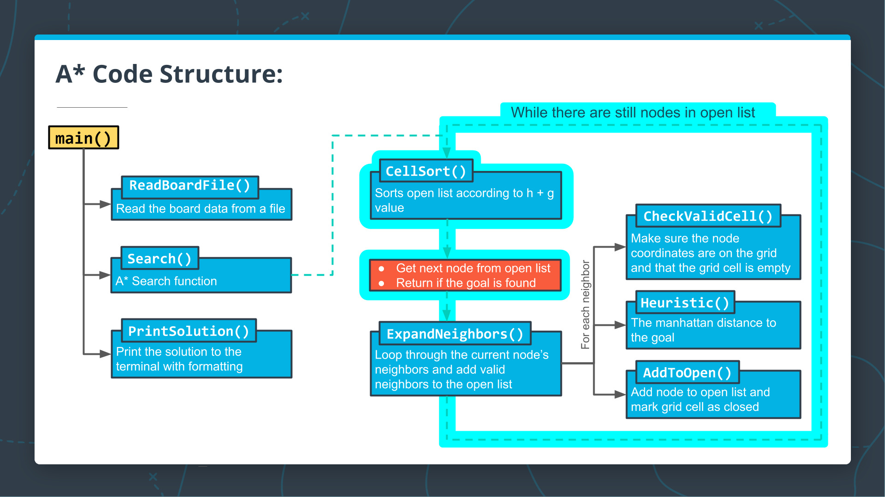

<center>Writing the <strong><code>while</code></strong> loop for the search</center>

Great work so far! Now on to some of the core functionality of the A* search algorithm. A* search works by sorting the open list using the f-value, and using the node with the lowest f-value as the next node in the search. This process continues until the goal node has been found or the open list runs out of nodes to use for searching.

In this exercise, you will implement the primary `while` loop in the algorithm which carries out the process described above:

## To Complete This Exercise:

Complete all of the TODOs in the pseudocode below. These are also marked directly in the exercise code.

```cpp .numberLines
  // TODO: while open vector is non empty {
    // TODO: Sort the open list using `CellSort`, and get the current node.

    // TODO: Get the x and y values from the current node,
    // and set grid[x][y] to kPath.

    // TODO: Check if you've reached the goal. If so, return grid.


    // If we're not done, expand search to current node's neighbors. This step will be completed in a later quiz.
    // ExpandNeighbors

  //} // TODO: End while loop
```

**Note**: We've included a header and a function to sort the open vector:

- `#include <algorithm>`
- `std::sort`
- `CellSort`

The `CellSort` function uses the `Compare` function you wrote previously to determine the sorting order. The `CellSort` function contains two operators that you haven't seen before: `*` and `->`. These operators have to do with C++ pointers, which you will learn about in the next lesson. Don't worry about them for now!

<details>
<summary>Exercise</summary>

`main.cpp`:

```cpp .numberLines
#include <algorithm>  // for sort
#include <fstream>
#include <iostream>
#include <sstream>
#include <string>
#include <vector>
using std::cout;
using std::ifstream;
using std::istringstream;
using std::sort;
using std::string;
using std::vector;
using std::abs;

enum class State {kEmpty, kObstacle, kClosed, kPath};


vector<State> ParseLine(string line) {
    istringstream sline(line);
    int n;
    char c;
    vector<State> row;
    while (sline >> n >> c && c == ',') {
      if (n == 0) {
        row.push_back(State::kEmpty);
      } else {
        row.push_back(State::kObstacle);
      }
    }
    return row;
}


vector<vector<State>> ReadBoardFile(string path) {
  ifstream myfile (path);
  vector<vector<State>> board{};
  if (myfile) {
    string line;
    while (getline(myfile, line)) {
      vector<State> row = ParseLine(line);
      board.push_back(row);
    }
  }
  return board;
}


/**
 * Compare the F values of two cells.
 */
bool Compare(const vector<int> a, const vector<int> b) {
  int f1 = a[2] + a[3]; // f1 = g1 + h1
  int f2 = b[2] + b[3]; // f2 = g2 + h2
  return f1 > f2; 
}


/**
 * Sort the two-dimensional vector of ints in descending order.
 */
void CellSort(vector<vector<int>> *v) {
  sort(v->begin(), v->end(), Compare);
}


// Calculate the manhattan distance
int Heuristic(int x1, int y1, int x2, int y2) {
  return abs(x2 - x1) + abs(y2 - y1);
}


/** 
 * Add a node to the open list and mark it as open. 
 */
void AddToOpen(int x, int y, int g, int h, vector<vector<int>> &openlist, vector<vector<State>> &grid) {
  // Add node to open vector, and mark grid cell as closed.
  openlist.push_back(vector<int>{x, y, g, h});
  grid[x][y] = State::kClosed;
}


/** 
 * Implementation of A* search algorithm
 */
vector<vector<State>> Search(vector<vector<State>> grid, int init[2], int goal[2]) {
  // Create the vector of open nodes.
  vector<vector<int>> open {};
  
  // Initialize the starting node.
  int x = init[0];
  int y = init[1];
  int g = 0;
  int h = Heuristic(x, y, goal[0],goal[1]);
  AddToOpen(x, y, g, h, open, grid);

  // TODO: while open vector is non empty {
    // TODO: Sort the open list using CellSort, and get the current node.

    // TODO: Get the x and y values from the current node,
    // and set grid[x][y] to kPath.

    // TODO: Check if you've reached the goal. If so, return grid.

    
    // If we're not done, expand search to current node's neighbors. This step will be completed in a later quiz.
    // ExpandNeighbors
  
  //} // TODO: End while loop
  
  // We've run out of new nodes to explore and haven't found a path.
  cout << "No path found!" << "\n";
  return std::vector<vector<State>>{};
}


string CellString(State cell) {
  switch(cell) {
    case State::kObstacle: return "⛰️   ";
    case State::kPath: return "🚗   ";
    default: return "0   "; 
  }
}


void PrintBoard(const vector<vector<State>> board) {
  for (int i = 0; i < board.size(); i++) {
    for (int j = 0; j < board[i].size(); j++) {
      cout << CellString(board[i][j]);
    }
    cout << "\n";
  }
}

#include "test.cpp"

int main() {
  int init[2]{0, 0};
  int goal[2]{4, 5};
  auto board = ReadBoardFile("1.board");
  auto solution = Search(board, init, goal);
  PrintBoard(solution);
  // Tests
  TestHeuristic();
  TestAddToOpen();
  TestCompare();
  TestSearch();
}
```

`test.cpp`:

```cpp .numberLines
void PrintVector(vector<int> v) {
  cout << "{ ";
  for (auto item : v) {
    cout << item << " ";
  }
  cout << "}" << "\n";
}

void PrintVectorOfVectors(vector<vector<int>> v) {
  for (auto row : v) {
    cout << "{ ";
    for (auto col : row) {
      cout << col << " ";
    }
    cout << "}" << "\n";
  }
}

void PrintVectorOfVectors(vector<vector<State>> v) {
  for (auto row : v) {
    cout << "{ ";
    for (auto col : row) {
      cout << CellString(col) << " ";
    }
    cout << "}" << "\n";
  }
}

void TestHeuristic() {
  cout << "----------------------------------------------------------" << "\n";
  cout << "Heuristic Function Test: ";
  if (Heuristic(1, 2, 3, 4) != 4) {
    cout << "failed" << "\n";
    cout << "\n" << "Heuristic(1, 2, 3, 4) = " << Heuristic(1, 2, 3, 4) << "\n";
    cout << "Correct result: 4" << "\n";
    cout << "\n";
  } else if (Heuristic(2, -1, 4, -7) != 8) {
    cout << "TestHeuristic Failed" << "\n";
    cout << "\n" << "Heuristic(2, -1, 4, -7) = " << Heuristic(2, -1, 4, -7) << "\n";
    cout << "Correct result: 8" << "\n";
    cout << "\n";
  } else {
    cout << "passed" << "\n";
  }
  return;
}

void TestAddToOpen() {
  cout << "----------------------------------------------------------" << "\n";
  cout << "AddToOpen Function Test: ";
  int x = 3;
  int y = 0;
  int g = 5;
  int h = 7;
  vector<vector<int>> open{{0, 0, 2, 9}, {1, 0, 2, 2}, {2, 0, 2, 4}};
  vector<vector<int>> solution_open = open; 
  solution_open.push_back(vector<int>{3, 0, 5, 7});
  vector<vector<State>> grid{{State::kClosed, State::kObstacle, State::kEmpty, State::kEmpty, State::kEmpty, State::kEmpty},
                            {State::kClosed, State::kObstacle, State::kEmpty, State::kEmpty, State::kEmpty, State::kEmpty},
                            {State::kClosed, State::kObstacle, State::kEmpty, State::kEmpty, State::kEmpty, State::kEmpty},
                            {State::kEmpty, State::kObstacle, State::kEmpty, State::kEmpty, State::kEmpty, State::kEmpty},
                            {State::kEmpty, State::kEmpty, State::kEmpty, State::kEmpty, State::kObstacle, State::kEmpty}};
  vector<vector<State>> solution_grid = grid;
  solution_grid[3][0] = State::kClosed;
  AddToOpen(x, y, g, h, open, grid);
  if (open != solution_open) {
    cout << "failed" << "\n";
    cout << "\n";
    cout << "Your open list is: " << "\n";
    PrintVectorOfVectors(open);
    cout << "Solution open list is: " << "\n";
    PrintVectorOfVectors(solution_open);
    cout << "\n";
  } else if (grid != solution_grid) {
    cout << "failed" << "\n";
    cout << "\n";
    cout << "Your grid is: " << "\n";
    PrintVectorOfVectors(grid);
    cout << "\n";
    cout << "Solution grid is: " << "\n";
    PrintVectorOfVectors(solution_grid);
    cout << "\n";
  } else {
    cout << "passed" << "\n";
  }
  return;
}

void TestCompare() {
  cout << "----------------------------------------------------------" << "\n";
  cout << "Compare Function Test: ";
  vector<int> test_1 {1, 2, 5, 6};
  vector<int> test_2 {1, 3, 5, 7};
  vector<int> test_3 {1, 2, 5, 8};
  vector<int> test_4 {1, 3, 5, 7};
  if (Compare(test_1, test_2)) {
    cout << "failed" << "\n";
    cout << "\n" << "a = ";
    PrintVector(test_1);
    cout << "b = ";
    PrintVector(test_2);
    cout << "Compare(a, b): " << Compare(test_1, test_2) << "\n";
    cout << "Correct answer: 0" << "\n";
    cout << "\n";
  } else if (!Compare(test_3, test_4)) {
    cout << "failed" << "\n";
    cout << "\n" << "a = ";
    PrintVector(test_3);
    cout << "b = ";
    PrintVector(test_4);
    cout << "Compare(a, b): " << Compare(test_3, test_4) << "\n";
    cout << "Correct answer: 1" << "\n";
    cout << "\n";
  } else {
    cout << "passed" << "\n";
  }
  return;
}

void TestSearch() {
  cout << "----------------------------------------------------------" << "\n";
  cout << "Search Function Test (Partial): ";
  int goal[2]{4, 5};
  auto board = ReadBoardFile("1.board");
  
  std::cout.setstate(std::ios_base::failbit); // Disable cout
  auto output = Search(board, goal, goal);
  std::cout.clear(); // Enable cout

  vector<vector<State>> solution{{State::kEmpty, State::kObstacle, State::kEmpty, State::kEmpty, State::kEmpty, State::kEmpty},
                            {State::kEmpty, State::kObstacle, State::kEmpty, State::kEmpty, State::kEmpty, State::kEmpty},
                            {State::kEmpty, State::kObstacle, State::kEmpty, State::kEmpty, State::kEmpty, State::kEmpty},
                            {State::kEmpty, State::kObstacle, State::kEmpty, State::kEmpty, State::kEmpty, State::kEmpty},
                            {State::kEmpty, State::kEmpty, State::kEmpty, State::kEmpty, State::kObstacle, State::kPath}};

  if (output != solution) {
    cout << "failed" << "\n";
    cout << "Search(board, {4,5}, {4,5})" << "\n";
    cout << "Solution board: " << "\n";
    PrintVectorOfVectors(solution);
    cout << "Your board: " << "\n";
    PrintVectorOfVectors(output);
    cout << "\n";
  } else {
    cout << "passed" << "\n";
  }
  cout << "----------------------------------------------------------" << "\n";
}
```

`1.board`:

```txt
0,1,0,0,0,0,
0,1,0,0,0,0,
0,1,0,0,0,0,
0,1,0,0,0,0,
0,0,0,0,1,0,
```

</details>

<details>
<summary>Solution</summary>

`main.cpp`:

```cpp .numberLines
#include <algorithm>  // for sort
#include <fstream>
#include <iostream>
#include <sstream>
#include <string>
#include <vector>
using std::cout;
using std::ifstream;
using std::istringstream;
using std::sort;
using std::string;
using std::vector;
using std::abs;

enum class State {kEmpty, kObstacle, kClosed, kPath};


vector<State> ParseLine(string line) {
    istringstream sline(line);
    int n;
    char c;
    vector<State> row;
    while (sline >> n >> c && c == ',') {
      if (n == 0) {
        row.push_back(State::kEmpty);
      } else {
        row.push_back(State::kObstacle);
      }
    }
    return row;
}


vector<vector<State>> ReadBoardFile(string path) {
  ifstream myfile (path);
  vector<vector<State>> board{};
  if (myfile) {
    string line;
    while (getline(myfile, line)) {
      vector<State> row = ParseLine(line);
      board.push_back(row);
    }
  }
  return board;
}


/**
 * Compare the F values of two cells.
 */
bool Compare(const vector<int> a, const vector<int> b) {
  int f1 = a[2] + a[3]; // f1 = g1 + h1
  int f2 = b[2] + b[3]; // f2 = g2 + h2
  return f1 > f2; 
}


/**
 * Sort the two-dimensional vector of ints in descending order.
 */
void CellSort(vector<vector<int>> *v) {
  sort(v->begin(), v->end(), Compare);
}


// Calculate the manhattan distance
int Heuristic(int x1, int y1, int x2, int y2) {
  return abs(x2 - x1) + abs(y2 - y1);
}


/** 
 * Add a node to the open list and mark it as open. 
 */
void AddToOpen(int x, int y, int g, int h, vector<vector<int>> &openlist, vector<vector<State>> &grid) {
  // Add node to open vector, and mark grid cell as closed.
  openlist.push_back(vector<int>{x, y, g, h});
  grid[x][y] = State::kClosed;
}


/** 
 * Implementation of A* search algorithm
 */
vector<vector<State>> Search(vector<vector<State>> grid, int init[2], int goal[2]) {
  // Create the vector of open nodes.
  vector<vector<int>> open {};
  
  // Initialize the starting node.
  int x = init[0];
  int y = init[1];
  int g = 0;
  int h = Heuristic(x, y, goal[0],goal[1]);
  AddToOpen(x, y, g, h, open, grid);

  // TODO: while open vector is non empty {
  while (open.size() > 0)
  {
    // TODO: Sort the open list using CellSort, and get the current node.
    CellSort(&open);

    // TODO: Get the x and y values from the current node,
    // and set grid[x][y] to kPath.
    auto current_node = open.back();
    open.pop_back();
    int x = current_node[0];
    int y = current_node[1];
    grid[x][y] = State::kPath;

    // TODO: Check if you've reached the goal. If so, return grid.
    if (!current_node[3]) // h = 0
      return grid;
    
    // If we're not done, expand search to current node's neighbors. This step will be completed in a later quiz.
    // ExpandNeighbors
  
  //} // TODO: End while loop
  }
  
  // We've run out of new nodes to explore and haven't found a path.
  cout << "No path found!" << "\n";
  return std::vector<vector<State>>{};
}


string CellString(State cell) {
  switch(cell) {
    case State::kObstacle: return "⛰️   ";
    case State::kPath: return "🚗   ";
    default: return "0   "; 
  }
}


void PrintBoard(const vector<vector<State>> board) {
  for (int i = 0; i < board.size(); i++) {
    for (int j = 0; j < board[i].size(); j++) {
      cout << CellString(board[i][j]);
    }
    cout << "\n";
  }
}

#include "test.cpp"

int main() {
  int init[2]{0, 0};
  int goal[2]{4, 5};
  auto board = ReadBoardFile("1.board");
  auto solution = Search(board, init, goal);
  PrintBoard(solution);
  // Tests
  TestHeuristic();
  TestAddToOpen();
  TestCompare();
  TestSearch();
}
```

<details>
<summary>Output</summary>

```bash
No path found!
----------------------------------------------------------
Heuristic Function Test: passed
----------------------------------------------------------
AddToOpen Function Test: passed
----------------------------------------------------------
Compare Function Test: passed
----------------------------------------------------------
Search Function Test (Partial): passed
----------------------------------------------------------
```

</details>
</details>

---

# 15. CODE: Check for Valid Neighbors

## Check for Valid Neighbors

[](https://youtu.be/fDHCPqVy-FY)

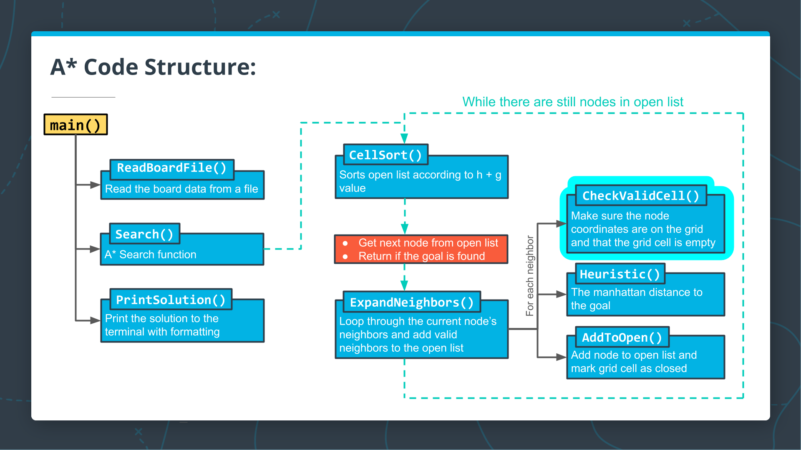

<center>Completing the <strong><code>CheckValidCell()</code></strong> function</center>

Nice work, you are almost done with your program! The last part of the A* algorithm to be implemented is the part that adds neighboring nodes to the open vector. In order to expand your A* search from the current node to neighboring nodes, you first will need to check that neighboring grid cells are not closed, and that they are not an obstacle. In this exercise, you will write a function `CheckValidCell` that does exactly this.

## To Complete This Exercise:

Write a function `bool CheckValidCell` that accepts two `int`s for the `x` and `y` coordinates and a reference to the `grid`. The function should do two things:
- Check that the (x, y) coordinate pair is on the `grid`.
- Check that the grid at (x, y) is `kEmpty` (this is the default case if the grid cell is not `kClosed` or a `kObstacle`). If both of these conditions are true, then `CheckValidCell` should return `true`. Otherwise, it should return `false`.

<details>
<summary>Exercise</summary>

`main.cpp`:

```cpp .numberLines
#include <algorithm>  // for sort
#include <fstream>
#include <iostream>
#include <sstream>
#include <string>
#include <vector>
using std::cout;
using std::ifstream;
using std::istringstream;
using std::sort;
using std::string;
using std::vector;
using std::abs;

enum class State {kEmpty, kObstacle, kClosed, kPath};


vector<State> ParseLine(string line) {
    istringstream sline(line);
    int n;
    char c;
    vector<State> row;
    while (sline >> n >> c && c == ',') {
      if (n == 0) {
        row.push_back(State::kEmpty);
      } else {
        row.push_back(State::kObstacle);
      }
    }
    return row;
}


vector<vector<State>> ReadBoardFile(string path) {
  ifstream myfile (path);
  vector<vector<State>> board{};
  if (myfile) {
    string line;
    while (getline(myfile, line)) {
      vector<State> row = ParseLine(line);
      board.push_back(row);
    }
  }
  return board;
}


/**
 * Compare the F values of two cells.
 */
bool Compare(const vector<int> a, const vector<int> b) {
  int f1 = a[2] + a[3]; // f1 = g1 + h1
  int f2 = b[2] + b[3]; // f2 = g2 + h2
  return f1 > f2; 
}


/**
 * Sort the two-dimensional vector of ints in descending order.
 */
void CellSort(vector<vector<int>> *v) {
  sort(v->begin(), v->end(), Compare);
}


// Calculate the manhattan distance
int Heuristic(int x1, int y1, int x2, int y2) {
  return abs(x2 - x1) + abs(y2 - y1);
}


// TODO: Write CheckValidCell here. Check that the 
// cell is on the grid and not an obstacle (i.e. equals kEmpty).


/** 
 * Add a node to the open list and mark it as open. 
 */
void AddToOpen(int x, int y, int g, int h, vector<vector<int>> &openlist, vector<vector<State>> &grid) {
  // Add node to open vector, and mark grid cell as closed.
  openlist.push_back(vector<int>{x, y, g, h});
  grid[x][y] = State::kClosed;
}


/** 
 * Implementation of A* search algorithm
 */
vector<vector<State>> Search(vector<vector<State>> grid, int init[2], int goal[2]) {
  // Create the vector of open nodes.
  vector<vector<int>> open {};
  
  // Initialize the starting node.
  int x = init[0];
  int y = init[1];
  int g = 0;
  int h = Heuristic(x, y, goal[0],goal[1]);
  AddToOpen(x, y, g, h, open, grid);

  while (open.size() > 0) {
    // Get the next node
    CellSort(&open);
    auto current = open.back();
    open.pop_back();
    x = current[0];
    y = current[1];
    grid[x][y] = State::kPath;

    // Check if we're done.
    if (x == goal[0] && y == goal[1]) {
      return grid;
    }
    
    // If we're not done, expand search to current node's neighbors.
    // ExpandNeighbors
  }
  
  // We've run out of new nodes to explore and haven't found a path.
  cout << "No path found!" << "\n";
  return std::vector<vector<State>>{};
}


string CellString(State cell) {
  switch(cell) {
    case State::kObstacle: return "⛰️   ";
    case State::kPath: return "🚗   ";
    default: return "0   "; 
  }
}


void PrintBoard(const vector<vector<State>> board) {
  for (int i = 0; i < board.size(); i++) {
    for (int j = 0; j < board[i].size(); j++) {
      cout << CellString(board[i][j]);
    }
    cout << "\n";
  }
}

#include "test.cpp"

int main() {
  int init[2]{0, 0};
  int goal[2]{4, 5};
  auto board = ReadBoardFile("1.board");
  auto solution = Search(board, init, goal);
  PrintBoard(solution);
  // Tests
  TestHeuristic();
  TestAddToOpen();
  TestCompare();
  TestSearch();
  TestCheckValidCell();
}
```

`test.cpp`:

```cpp .numberLines
void PrintVector(vector<int> v) {
  cout << "{ ";
  for (auto item : v) {
    cout << item << " ";
  }
  cout << "}" << "\n";
}

void PrintVectorOfVectors(vector<vector<int>> v) {
  for (auto row : v) {
    cout << "{ ";
    for (auto col : row) {
      cout << col << " ";
    }
    cout << "}" << "\n";
  }
}

void PrintVectorOfVectors(vector<vector<State>> v) {
  for (auto row : v) {
    cout << "{ ";
    for (auto col : row) {
      cout << CellString(col) << " ";
    }
    cout << "}" << "\n";
  }
}

void TestHeuristic() {
  cout << "----------------------------------------------------------" << "\n";
  cout << "Heuristic Function Test: ";
  if (Heuristic(1, 2, 3, 4) != 4) {
    cout << "failed" << "\n";
    cout << "\n" << "Heuristic(1, 2, 3, 4) = " << Heuristic(1, 2, 3, 4) << "\n";
    cout << "Correct result: 4" << "\n";
    cout << "\n";
  } else if (Heuristic(2, -1, 4, -7) != 8) {
    cout << "TestHeuristic Failed" << "\n";
    cout << "\n" << "Heuristic(2, -1, 4, -7) = " << Heuristic(2, -1, 4, -7) << "\n";
    cout << "Correct result: 8" << "\n";
    cout << "\n";
  } else {
    cout << "passed" << "\n";
  }
  return;
}

void TestAddToOpen() {
  cout << "----------------------------------------------------------" << "\n";
  cout << "AddToOpen Function Test: ";
  int x = 3;
  int y = 0;
  int g = 5;
  int h = 7;
  vector<vector<int>> open{{0, 0, 2, 9}, {1, 0, 2, 2}, {2, 0, 2, 4}};
  vector<vector<int>> solution_open = open; 
  solution_open.push_back(vector<int>{3, 0, 5, 7});
  vector<vector<State>> grid{{State::kClosed, State::kObstacle, State::kEmpty, State::kEmpty, State::kEmpty, State::kEmpty},
                            {State::kClosed, State::kObstacle, State::kEmpty, State::kEmpty, State::kEmpty, State::kEmpty},
                            {State::kClosed, State::kObstacle, State::kEmpty, State::kEmpty, State::kEmpty, State::kEmpty},
                            {State::kEmpty, State::kObstacle, State::kEmpty, State::kEmpty, State::kEmpty, State::kEmpty},
                            {State::kEmpty, State::kEmpty, State::kEmpty, State::kEmpty, State::kObstacle, State::kEmpty}};
  vector<vector<State>> solution_grid = grid;
  solution_grid[3][0] = State::kClosed;
  AddToOpen(x, y, g, h, open, grid);
  if (open != solution_open) {
    cout << "failed" << "\n";
    cout << "\n";
    cout << "Your open list is: " << "\n";
    PrintVectorOfVectors(open);
    cout << "Solution open list is: " << "\n";
    PrintVectorOfVectors(solution_open);
    cout << "\n";
  } else if (grid != solution_grid) {
    cout << "failed" << "\n";
    cout << "\n";
    cout << "Your grid is: " << "\n";
    PrintVectorOfVectors(grid);
    cout << "\n";
    cout << "Solution grid is: " << "\n";
    PrintVectorOfVectors(solution_grid);
    cout << "\n";
  } else {
    cout << "passed" << "\n";
  }
  return;
}

void TestCompare() {
  cout << "----------------------------------------------------------" << "\n";
  cout << "Compare Function Test: ";
  vector<int> test_1 {1, 2, 5, 6};
  vector<int> test_2 {1, 3, 5, 7};
  vector<int> test_3 {1, 2, 5, 8};
  vector<int> test_4 {1, 3, 5, 7};
  if (Compare(test_1, test_2)) {
    cout << "failed" << "\n";
    cout << "\n" << "a = ";
    PrintVector(test_1);
    cout << "b = ";
    PrintVector(test_2);
    cout << "Compare(a, b): " << Compare(test_1, test_2) << "\n";
    cout << "Correct answer: 0" << "\n";
    cout << "\n";
  } else if (!Compare(test_3, test_4)) {
    cout << "failed" << "\n";
    cout << "\n" << "a = ";
    PrintVector(test_3);
    cout << "b = ";
    PrintVector(test_4);
    cout << "Compare(a, b): " << Compare(test_3, test_4) << "\n";
    cout << "Correct answer: 1" << "\n";
    cout << "\n";
  } else {
    cout << "passed" << "\n";
  }
  return;
}

void TestSearch() {
  cout << "----------------------------------------------------------" << "\n";
  cout << "Search Function Test (Partial): ";
  int goal[2]{4, 5};
  auto board = ReadBoardFile("1.board");
  
  std::cout.setstate(std::ios_base::failbit); // Disable cout
  auto output = Search(board, goal, goal);
  std::cout.clear(); // Enable cout

  vector<vector<State>> solution{{State::kEmpty, State::kObstacle, State::kEmpty, State::kEmpty, State::kEmpty, State::kEmpty},
                            {State::kEmpty, State::kObstacle, State::kEmpty, State::kEmpty, State::kEmpty, State::kEmpty},
                            {State::kEmpty, State::kObstacle, State::kEmpty, State::kEmpty, State::kEmpty, State::kEmpty},
                            {State::kEmpty, State::kObstacle, State::kEmpty, State::kEmpty, State::kEmpty, State::kEmpty},
                            {State::kEmpty, State::kEmpty, State::kEmpty, State::kEmpty, State::kObstacle, State::kPath}};

  if (output != solution) {
    cout << "failed" << "\n";
    cout << "Search(board, {4,5}, {4,5})" << "\n";
    cout << "Solution board: " << "\n";
    PrintVectorOfVectors(solution);
    cout << "Your board: " << "\n";
    PrintVectorOfVectors(output);
    cout << "\n";
  } else {
    cout << "passed" << "\n";
  }
  return;
}

void TestCheckValidCell() {
  cout << "----------------------------------------------------------" << "\n";
  cout << "CheckValidCell Function Test: ";
  vector<vector<State>> grid{{State::kClosed, State::kObstacle, State::kEmpty, State::kEmpty, State::kEmpty, State::kEmpty},
                            {State::kClosed, State::kObstacle, State::kEmpty, State::kEmpty, State::kEmpty, State::kEmpty},
                            {State::kClosed, State::kObstacle, State::kEmpty, State::kEmpty, State::kEmpty, State::kEmpty},
                            {State::kClosed, State::kObstacle, State::kEmpty, State::kEmpty, State::kEmpty, State::kEmpty},
                            {State::kClosed, State::kClosed, State::kEmpty, State::kEmpty, State::kObstacle, State::kEmpty}};

  if (CheckValidCell(0, 0, grid)) {
    cout << "failed" << "\n";
    cout << "\n" << "Test grid is: " << "\n";
    PrintVectorOfVectors(grid);
    cout << "Cell checked: (0, 0)" << "\n";
    cout << "\n";
  } else if (!CheckValidCell(4, 2, grid)) {
    cout << "failed" << "\n";
    cout << "\n" << "Test grid is: " << "\n";
    PrintVectorOfVectors(grid);
    cout << "Cell checked: (4, 2)" << "\n";
    cout << "\n";
  } else {
    cout << "passed" << "\n";
  }
  cout << "----------------------------------------------------------" << "\n";
}
```

`1.board`:

```txt
0,1,0,0,0,0,
0,1,0,0,0,0,
0,1,0,0,0,0,
0,1,0,0,0,0,
0,0,0,0,1,0,
```

</details>

<details>
<summary>Solution</summary>

`main.cpp`:

```cpp .numberLines
#include <algorithm>  // for sort
#include <fstream>
#include <iostream>
#include <sstream>
#include <string>
#include <vector>
using std::cout;
using std::ifstream;
using std::istringstream;
using std::sort;
using std::string;
using std::vector;
using std::abs;

enum class State {kEmpty, kObstacle, kClosed, kPath};

vector<State> ParseLine(string line) {
    istringstream sline(line);
    int n;
    char c;
    vector<State> row;
    while (sline >> n >> c && c == ',') {
      if (n == 0) {
        row.push_back(State::kEmpty);
      } else {
        row.push_back(State::kObstacle);
      }
    }
    return row;
}

vector<vector<State>> ReadBoardFile(string path) {
  ifstream myfile (path);
  vector<vector<State>> board{};
  if (myfile) {
    string line;
    while (getline(myfile, line)) {
      vector<State> row = ParseLine(line);
      board.push_back(row);
    }
  }
  return board;
}

/**
 * Compare the F values of two cells.
 */
bool Compare(const vector<int> a, const vector<int> b) {
  int f1 = a[2] + a[3]; // f1 = g1 + h1
  int f2 = b[2] + b[3]; // f2 = g2 + h2
  return f1 > f2; 
}

/**
 * Sort the two-dimensional vector of ints in descending order.
 */
void CellSort(vector<vector<int>> *v) {
  sort(v->begin(), v->end(), Compare);
}

// Calculate the manhattan distance
int Heuristic(int x1, int y1, int x2, int y2) {
  return abs(x2 - x1) + abs(y2 - y1);
}

// TODO: Write CheckValidCell here. Check that the 
// cell is on the grid and not an obstacle (i.e. equals kEmpty).
bool CheckValidCell(int x, int y, vector<vector<State>> grid)
{
//   cout << "\n" << grid[0].size() << " " << grid.size() << "\n";
  if (!(x < grid[0].size() && y < grid.size())) // is the cell on the grid?
    return false; // if not, return false
  
  if (grid[x][y] != State::kEmpty) // is the cell empty?
    return false; // if not, return false
  
  return true;	// otherwise, return true
}

/** 
 * Add a node to the open list and mark it as open. 
 */
void AddToOpen(int x, int y, int g, int h, vector<vector<int>> &openlist, vector<vector<State>> &grid) {
  // Add node to open vector, and mark grid cell as closed.
  openlist.push_back(vector<int>{x, y, g, h});
  grid[x][y] = State::kClosed;
}

/** 
 * Implementation of A* search algorithm
 */
vector<vector<State>> Search(vector<vector<State>> grid, int init[2], int goal[2]) {
  // Create the vector of open nodes.
  vector<vector<int>> open {};
  
  // Initialize the starting node.
  int x = init[0];
  int y = init[1];
  int g = 0;
  int h = Heuristic(x, y, goal[0],goal[1]);
  AddToOpen(x, y, g, h, open, grid);

  while (open.size() > 0) {
    // Get the next node
    CellSort(&open);
    auto current = open.back();
    open.pop_back();
    x = current[0];
    y = current[1];
    grid[x][y] = State::kPath;

    // Check if we're done.
    if (x == goal[0] && y == goal[1]) {
      return grid;
    }
    
    // If we're not done, expand search to current node's neighbors.
    // ExpandNeighbors
  }
  
  // We've run out of new nodes to explore and haven't found a path.
  cout << "No path found!" << "\n";
  return std::vector<vector<State>>{};
}

string CellString(State cell) {
  switch(cell) {
    case State::kObstacle: return "⛰️   ";
    case State::kPath: return "🚗   ";
    default: return "0   "; 
  }
}

void PrintBoard(const vector<vector<State>> board) {
  for (int i = 0; i < board.size(); i++) {
    for (int j = 0; j < board[i].size(); j++) {
      cout << CellString(board[i][j]);
    }
    cout << "\n";
  }
}

#include "test.cpp"

int main() {
  int init[2]{0, 0};
  int goal[2]{4, 5};
  auto board = ReadBoardFile("1.board");
  auto solution = Search(board, init, goal);
  PrintBoard(solution);
  // Tests
  TestHeuristic();
  TestAddToOpen();
  TestCompare();
  TestSearch();
  TestCheckValidCell();
}
```

<details>
<summary>Output</summary>

```bash
No path found!
----------------------------------------------------------
Heuristic Function Test: passed
----------------------------------------------------------
AddToOpen Function Test: passed
----------------------------------------------------------
Compare Function Test: passed
----------------------------------------------------------
Search Function Test (Partial): passed
----------------------------------------------------------
CheckValidCell Function Test: passed
----------------------------------------------------------
```

</details>
</details>


---

# 16. Constants

In [*A Tour of C++*](http://www.stroustrup.com/Tour.html), Bjarne Stroustrup writes:

> C++ supports two notions of immutability:
> - `const`: meaning roughly "I promise not to change this value."...The compiler enforces the promise made by `const`....
> - `constexpr`: meaning roughly "to be evaluated at compile time." This is used primarily to specify constants...

**Notebook**

<div style='border-left: solid 1px; border-right: solid 1px; border-top: solid 1px; border-bottom: solid 1px; border-radius: 10px; padding:1em;'>

## Constants

This example highlights how to use `const` to promise not to modify a variable, even though the variable can only be evaluated at run time.

The example also show how to use `constexpr` to guarantee that a variable can be evaluated at compile time.

```cpp .numberLines
#include <iostream>

int main()
{
    int i;
    std::cout << "Enter an integer value for i: ";
    std::cin >> i;
    const int j = i * 2;  // "j can only be evaluated at run time."
                          // "But I promise not to change it after it is initialized."
    
    constexpr int k = 3;  // "k, in contrast, can be evaluated at compile time."
    
    std::cout << "j = " << j << "\n";
    std::cout << "k = " << k << "\n";
}
```

<details>
<summary>Output</summary>

```bash
Enter an integer value for i: 5
j = 10
k = 3
```

</details>

The compiler will catch a `const` variable that changes.

```cpp .numberLines
int main()
{
    const int i = 2; // "I promise not to change this."
    i++;             // "I just broke my promise."
}
```

<details>
<summary>Output</summary>

```bash
./code/const2.cpp: In function ‘int main()’:
./code/const2.cpp:4:6: error: increment of read-only variable ‘i’
     i++;             // "I just broke my promise."
      ^~
```

</details>

Similarly, the compiler will catch a `constexpr` variable that changes.

</details>

The compiler will catch a `const` variable that changes.

```cpp .numberLines
int main()
{
    constexpr int i = 2;  // "i can be evaluated at compile time."
    i++;                  // "But changing a constexpr variable triggers an error."
}
```

<details>
<summary>Output</summary>

```bash
./code/const3.cpp: In function ‘int main()’:
./code/const3.cpp:4:6: error: increment of read-only variable ‘i’
     i++;                  // "But changing a constexpr variable triggers an error."
      ^~
```

</details>

The major difference between `const` and `constexpr`, though, is that `constexpr` must be evaluated at compile time.

The compiler will catch a `constexpr` variable that cannot be evaluated at compile time.

```cpp .numberLines
#include <iostream>

int main()
{
    int i;
    std::cout << "Enter an integer value for i: ";
    std::cin >> i;
    constexpr int j = i * 2;  // "j can only be evaluated at run time."
                              // "constexpr must be evaluated at compile time."
                              // "So this code will produce a compilation error."
}
```

<details>
<summary>Output</summary>

```bash
./code/const4.cpp: In function ‘int main()’:
./code/const4.cpp:8:27: error: the value of ‘i’ is not usable in a constant expression
     constexpr int j = i * 2;  // "j can only be evaluated at run time."
                           ^
./code/const4.cpp:5:9: note: ‘int i’ is not const
     int i;
         ^
```

</details>

A common usage of `const` is to guard against accidentally changing a variable, especially when it is passed-by-reference as a function argument.

```cpp .numberLines
#include <iostream>
#include <vector>

int sum(const std::vector<int> &v)
{
    int sum = 0;
    for(int i : v)
        sum += i;
    return sum;
}

int main()
{
    std::vector<int> v {0, 1, 2, 3, 4};
    std::cout << sum(v) << "\n";
}
```

<details>
<summary>Output</summary>

```bash
10
```

</details>

The distinction between `const` and `constexpr` is subtle. 

In general, though, `const` is much more common than `constexpr`.

When in doubt, use `const`, especially to guard against accidentally modifying a variable.

</div>

---

# 17. CODE: Expand the A* Search to Neighbors

## Expand the A* Search to Neighbors

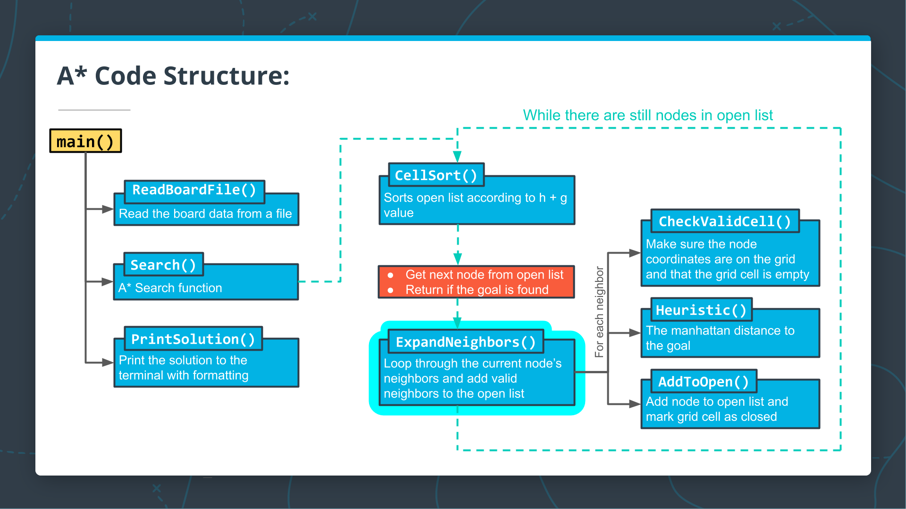

<center>Writing the <strong><code>ExpandNeighbors()</code></strong> function</center>

You have now reached the final step of the A* algorithm! You are ready to expand your A* search to neighboring nodes and add valid neighbors to the open vector. In this exercise, you will write an ExpandNeighbors function that takes care of this functionality for you.

## To Complete This Exercise:

Write a void ExpandNeighbors function that accepts references to the following:
- The current node,
- the open vector,
- the grid, and
- an int array for the goal coordinates.

The `ExpandNeighbors` function should implement the functionality given in the pseudocode below:

```cpp .numberLines
// TODO: ExpandNeighbors {

  // TODO: Get current node's data.

  // TODO: Loop through current node's potential neighbors.

    // TODO: Check that the potential neighbor's x2 and y2 values are on the grid and not closed.

      // TODO: Increment g value, compute h value, and add neighbor to open list.

// } TODO: End function
```

**Note**: we have provided directional deltas in the form of a 2D [array](https://www.programiz.com/cpp-programming/arrays). An array is a C++ container much like a vector, although without the ability to change size after initialization. Arrays can be accessed and iterated over just as vectors.

In the exercise, you can iterate over these `delta` values to check the neighbors in each direction:

```cpp .numberLines
// directional deltas
const int delta[4][2]{{-1, 0}, {0, -1}, {1, 0}, {0, 1}};
```

<details>
<summary>Exercise</summary>

`main.cpp`:

```cpp .numberLines
#include <algorithm>  // for sort
#include <fstream>
#include <iostream>
#include <sstream>
#include <string>
#include <vector>
using std::cout;
using std::ifstream;
using std::istringstream;
using std::sort;
using std::string;
using std::vector;
using std::abs;

enum class State {kEmpty, kObstacle, kClosed, kPath};

// directional deltas
const int delta[4][2]{{-1, 0}, {0, -1}, {1, 0}, {0, 1}};


vector<State> ParseLine(string line) {
    istringstream sline(line);
    int n;
    char c;
    vector<State> row;
    while (sline >> n >> c && c == ',') {
      if (n == 0) {
        row.push_back(State::kEmpty);
      } else {
        row.push_back(State::kObstacle);
      }
    }
    return row;
}


vector<vector<State>> ReadBoardFile(string path) {
  ifstream myfile (path);
  vector<vector<State>> board{};
  if (myfile) {
    string line;
    while (getline(myfile, line)) {
      vector<State> row = ParseLine(line);
      board.push_back(row);
    }
  }
  return board;
}


/**
 * Compare the F values of two cells.
 */
bool Compare(const vector<int> a, const vector<int> b) {
  int f1 = a[2] + a[3]; // f1 = g1 + h1
  int f2 = b[2] + b[3]; // f2 = g2 + h2
  return f1 > f2; 
}


/**
 * Sort the two-dimensional vector of ints in descending order.
 */
void CellSort(vector<vector<int>> *v) {
  sort(v->begin(), v->end(), Compare);
}


// Calculate the manhattan distance
int Heuristic(int x1, int y1, int x2, int y2) {
  return abs(x2 - x1) + abs(y2 - y1);
}


/** 
 * Check that a cell is valid: on the grid, not an obstacle, and clear. 
 */
bool CheckValidCell(int x, int y, vector<vector<State>> &grid) {
  bool on_grid_x = (x >= 0 && x < grid.size());
  bool on_grid_y = (y >= 0 && y < grid[0].size());
  if (on_grid_x && on_grid_y)
    return grid[x][y] == State::kEmpty;
  return false;
}


/** 
 * Add a node to the open list and mark it as open. 
 */
void AddToOpen(int x, int y, int g, int h, vector<vector<int>> &openlist, vector<vector<State>> &grid) {
  // Add node to open vector, and mark grid cell as closed.
  openlist.push_back(vector<int>{x, y, g, h});
  grid[x][y] = State::kClosed;
}


/** 
 * Expand current nodes's neighbors and add them to the open list.
 */
// TODO: ExpandNeighbors(arguments) {

  // TODO: Get current node's data.

  // TODO: Loop through current node's potential neighbors.

    // TODO: Check that the potential neighbor's x2 and y2 values are on the grid and not closed.

      // TODO: Increment g value, compute h value, and add neighbor to open list.

// } TODO: End the function


/** 
 * Implementation of A* search algorithm
 */
vector<vector<State>> Search(vector<vector<State>> grid, int init[2], int goal[2]) {
  // Create the vector of open nodes.
  vector<vector<int>> open {};
  
  // Initialize the starting node.
  int x = init[0];
  int y = init[1];
  int g = 0;
  int h = Heuristic(x, y, goal[0],goal[1]);
  AddToOpen(x, y, g, h, open, grid);

  while (open.size() > 0) {
    // Get the next node
    CellSort(&open);
    auto current = open.back();
    open.pop_back();
    x = current[0];
    y = current[1];
    grid[x][y] = State::kPath;

    // Check if we're done.
    if (x == goal[0] && y == goal[1]) {
      return grid;
    }
    
    // If we're not done, expand search to current node's neighbors.
    ExpandNeighbors(current, goal, open, grid);
  }
  
  // We've run out of new nodes to explore and haven't found a path.
  cout << "No path found!" << "\n";
  return std::vector<vector<State>>{};
}


string CellString(State cell) {
  switch(cell) {
    case State::kObstacle: return "⛰️   ";
    case State::kPath: return "🚗   ";
    default: return "0   "; 
  }
}


void PrintBoard(const vector<vector<State>> board) {
  for (int i = 0; i < board.size(); i++) {
    for (int j = 0; j < board[i].size(); j++) {
      cout << CellString(board[i][j]);
    }
    cout << "\n";
  }
}

#include "test.cpp"

int main() {
  int init[2]{0, 0};
  int goal[2]{4, 5};
  auto board = ReadBoardFile("1.board");
  auto solution = Search(board, init, goal);
  PrintBoard(solution);
  // Tests
  TestHeuristic();
  TestAddToOpen();
  TestCompare();
  TestSearch();
  TestCheckValidCell();
  TestExpandNeighbors();
}
```

`test.cpp`:

```cpp .numberLines
void PrintVector(vector<int> v) {
  cout << "{ ";
  for (auto item : v) {
    cout << item << " ";
  }
  cout << "}" << "\n";
}

void PrintVectorOfVectors(vector<vector<int>> v) {
  for (auto row : v) {
    cout << "{ ";
    for (auto col : row) {
      cout << col << " ";
    }
    cout << "}" << "\n";
  }
}

void PrintVectorOfVectors(vector<vector<State>> v) {
  for (auto row : v) {
    cout << "{ ";
    for (auto col : row) {
      cout << CellString(col) << " ";
    }
    cout << "}" << "\n";
  }
}

void TestHeuristic() {
  cout << "----------------------------------------------------------" << "\n";
  cout << "Heuristic Function Test: ";
  if (Heuristic(1, 2, 3, 4) != 4) {
    cout << "failed" << "\n";
    cout << "\n" << "Heuristic(1, 2, 3, 4) = " << Heuristic(1, 2, 3, 4) << "\n";
    cout << "Correct result: 4" << "\n";
    cout << "\n";
  } else if (Heuristic(2, -1, 4, -7) != 8) {
    cout << "TestHeuristic Failed" << "\n";
    cout << "\n" << "Heuristic(2, -1, 4, -7) = " << Heuristic(2, -1, 4, -7) << "\n";
    cout << "Correct result: 8" << "\n";
    cout << "\n";
  } else {
    cout << "passed" << "\n";
  }
  return;
}

void TestAddToOpen() {
  cout << "----------------------------------------------------------" << "\n";
  cout << "AddToOpen Function Test: ";
  int x = 3;
  int y = 0;
  int g = 5;
  int h = 7;
  vector<vector<int>> open{{0, 0, 2, 9}, {1, 0, 2, 2}, {2, 0, 2, 4}};
  vector<vector<int>> solution_open = open; 
  solution_open.push_back(vector<int>{3, 0, 5, 7});
  vector<vector<State>> grid{{State::kClosed, State::kObstacle, State::kEmpty, State::kEmpty, State::kEmpty, State::kEmpty},
                            {State::kClosed, State::kObstacle, State::kEmpty, State::kEmpty, State::kEmpty, State::kEmpty},
                            {State::kClosed, State::kObstacle, State::kEmpty, State::kEmpty, State::kEmpty, State::kEmpty},
                            {State::kEmpty, State::kObstacle, State::kEmpty, State::kEmpty, State::kEmpty, State::kEmpty},
                            {State::kEmpty, State::kEmpty, State::kEmpty, State::kEmpty, State::kObstacle, State::kEmpty}};
  vector<vector<State>> solution_grid = grid;
  solution_grid[3][0] = State::kClosed;
  AddToOpen(x, y, g, h, open, grid);
  if (open != solution_open) {
    cout << "failed" << "\n";
    cout << "\n";
    cout << "Your open list is: " << "\n";
    PrintVectorOfVectors(open);
    cout << "Solution open list is: " << "\n";
    PrintVectorOfVectors(solution_open);
    cout << "\n";
  } else if (grid != solution_grid) {
    cout << "failed" << "\n";
    cout << "\n";
    cout << "Your grid is: " << "\n";
    PrintVectorOfVectors(grid);
    cout << "\n";
    cout << "Solution grid is: " << "\n";
    PrintVectorOfVectors(solution_grid);
    cout << "\n";
  } else {
    cout << "passed" << "\n";
  }
  return;
}

void TestCompare() {
  cout << "----------------------------------------------------------" << "\n";
  cout << "Compare Function Test: ";
  vector<int> test_1 {1, 2, 5, 6};
  vector<int> test_2 {1, 3, 5, 7};
  vector<int> test_3 {1, 2, 5, 8};
  vector<int> test_4 {1, 3, 5, 7};
  if (Compare(test_1, test_2)) {
    cout << "failed" << "\n";
    cout << "\n" << "a = ";
    PrintVector(test_1);
    cout << "b = ";
    PrintVector(test_2);
    cout << "Compare(a, b): " << Compare(test_1, test_2) << "\n";
    cout << "Correct answer: 0" << "\n";
    cout << "\n";
  } else if (!Compare(test_3, test_4)) {
    cout << "failed" << "\n";
    cout << "\n" << "a = ";
    PrintVector(test_3);
    cout << "b = ";
    PrintVector(test_4);
    cout << "Compare(a, b): " << Compare(test_3, test_4) << "\n";
    cout << "Correct answer: 1" << "\n";
    cout << "\n";
  } else {
    cout << "passed" << "\n";
  }
  return;
}

void TestSearch() {
  cout << "----------------------------------------------------------" << "\n";
  cout << "Search Function Test: ";
  int init[2]{0, 0};
  int goal[2]{4, 5};
  auto board = ReadBoardFile("1.board");
  
  std::cout.setstate(std::ios_base::failbit); // Disable cout
  auto output = Search(board, init, goal);
  std::cout.clear(); // Enable cout

  vector<vector<State>> solution{{State::kPath, State::kObstacle, State::kEmpty, State::kEmpty, State::kEmpty, State::kEmpty},
                            {State::kPath, State::kObstacle, State::kEmpty, State::kEmpty, State::kEmpty, State::kEmpty},
                            {State::kPath, State::kObstacle, State::kEmpty, State::kClosed, State::kClosed, State::kClosed},
                            {State::kPath, State::kObstacle, State::kClosed, State::kPath, State::kPath, State::kPath},
                            {State::kPath, State::kPath, State::kPath, State::kPath, State::kObstacle, State::kPath}};

  if (output != solution) {
    cout << "failed" << "\n";
    cout << "Search(board, {0,0}, {4,5})" << "\n";
    cout << "Solution board: " << "\n";
    PrintVectorOfVectors(solution);
    cout << "Your board: " << "\n";
    PrintVectorOfVectors(output);
    cout << "\n";
  } else {
    cout << "passed" << "\n";
  }
  return;
}

void TestCheckValidCell() {
  cout << "----------------------------------------------------------" << "\n";
  cout << "CheckValidCell Function Test: ";
  vector<vector<State>> grid{{State::kClosed, State::kObstacle, State::kEmpty, State::kEmpty, State::kEmpty, State::kEmpty},
                            {State::kClosed, State::kObstacle, State::kEmpty, State::kEmpty, State::kEmpty, State::kEmpty},
                            {State::kClosed, State::kObstacle, State::kEmpty, State::kEmpty, State::kEmpty, State::kEmpty},
                            {State::kClosed, State::kObstacle, State::kEmpty, State::kEmpty, State::kEmpty, State::kEmpty},
                            {State::kClosed, State::kClosed, State::kEmpty, State::kEmpty, State::kObstacle, State::kEmpty}};

  if (CheckValidCell(0, 0, grid)) {
    cout << "failed" << "\n";
    cout << "\n" << "Test grid is: " << "\n";
    PrintVectorOfVectors(grid);
    cout << "Cell checked: (0, 0)" << "\n";
    cout << "\n";
  } else if (!CheckValidCell(4, 2, grid)) {
    cout << "failed" << "\n";
    cout << "\n" << "Test grid is: " << "\n";
    PrintVectorOfVectors(grid);
    cout << "Cell checked: (4, 2)" << "\n";
    cout << "\n";
  } else {
    cout << "passed" << "\n";
  }
}

void TestExpandNeighbors() {
  cout << "----------------------------------------------------------" << "\n";
  cout << "ExpandNeighbors Function Test: ";
  vector<int> current{4, 2, 7, 3};
  int goal[2] {4, 5};
  vector<vector<int>> open{{4, 2, 7, 3}};
  vector<vector<int>> solution_open = open;
  solution_open.push_back(vector<int>{3, 2, 8, 4});
  solution_open.push_back(vector<int>{4, 3, 8, 2});
  vector<vector<State>> grid{{State::kClosed, State::kObstacle, State::kEmpty, State::kEmpty, State::kEmpty, State::kEmpty},
                            {State::kClosed, State::kObstacle, State::kEmpty, State::kEmpty, State::kEmpty, State::kEmpty},
                            {State::kClosed, State::kObstacle, State::kEmpty, State::kEmpty, State::kEmpty, State::kEmpty},
                            {State::kClosed, State::kObstacle, State::kEmpty, State::kEmpty, State::kEmpty, State::kEmpty},
                            {State::kClosed, State::kClosed, State::kEmpty, State::kEmpty, State::kObstacle, State::kEmpty}};
  vector<vector<State>> solution_grid = grid;
  solution_grid[3][2] = State::kClosed;
  solution_grid[4][3] = State::kClosed;
  ExpandNeighbors(current, goal, open, grid);
  CellSort(&open);
  CellSort(&solution_open);
  if (open != solution_open) {
    cout << "failed" << "\n";
    cout << "\n";
    cout << "Your open list is: " << "\n";
    PrintVectorOfVectors(open);
    cout << "Solution open list is: " << "\n";
    PrintVectorOfVectors(solution_open);
    cout << "\n";
  } else if (grid != solution_grid) {
    cout << "failed" << "\n";
    cout << "\n";
    cout << "Your grid is: " << "\n";
    PrintVectorOfVectors(grid);
    cout << "\n";
    cout << "Solution grid is: " << "\n";
    PrintVectorOfVectors(solution_grid);
    cout << "\n";
  } else {
  	cout << "passed" << "\n";
  }
  cout << "----------------------------------------------------------" << "\n";
  return;
}
```

`1.board`:

```txt
0,1,0,0,0,0,
0,1,0,0,0,0,
0,1,0,0,0,0,
0,1,0,0,0,0,
0,0,0,0,1,0,
```

</details>

<details>
<summary>Solution</summary>

`main.cpp`:

```cpp .numberLines
#include <algorithm>  // for sort
#include <fstream>
#include <iostream>
#include <sstream>
#include <string>
#include <vector>
using std::cout;
using std::ifstream;
using std::istringstream;
using std::sort;
using std::string;
using std::vector;
using std::abs;

enum class State {kEmpty, kObstacle, kClosed, kPath};

// directional deltas
const int delta[4][2]{{-1, 0}, {0, -1}, {1, 0}, {0, 1}};


vector<State> ParseLine(string line) {
    istringstream sline(line);
    int n;
    char c;
    vector<State> row;
    while (sline >> n >> c && c == ',') {
      if (n == 0) {
        row.push_back(State::kEmpty);
      } else {
        row.push_back(State::kObstacle);
      }
    }
    return row;
}


vector<vector<State>> ReadBoardFile(string path) {
  ifstream myfile (path);
  vector<vector<State>> board{};
  if (myfile) {
    string line;
    while (getline(myfile, line)) {
      vector<State> row = ParseLine(line);
      board.push_back(row);
    }
  }
  return board;
}


/**
 * Compare the F values of two cells.
 */
bool Compare(const vector<int> a, const vector<int> b) {
  int f1 = a[2] + a[3]; // f1 = g1 + h1
  int f2 = b[2] + b[3]; // f2 = g2 + h2
  return f1 > f2; 
}


/**
 * Sort the two-dimensional vector of ints in descending order.
 */
void CellSort(vector<vector<int>> *v) {
  sort(v->begin(), v->end(), Compare);
}


// Calculate the manhattan distance
int Heuristic(int x1, int y1, int x2, int y2) {
  return abs(x2 - x1) + abs(y2 - y1);
}


/** 
 * Check that a cell is valid: on the grid, not an obstacle, and clear. 
 */
bool CheckValidCell(int x, int y, vector<vector<State>> &grid) {
  bool on_grid_x = (x >= 0 && x < grid.size());
  bool on_grid_y = (y >= 0 && y < grid[0].size());
  if (on_grid_x && on_grid_y)
    return grid[x][y] == State::kEmpty;
  return false;
}


/** 
 * Add a node to the open list and mark it as open. 
 */
void AddToOpen(int x, int y, int g, int h, vector<vector<int>> &openlist, vector<vector<State>> &grid) {
  // Add node to open vector, and mark grid cell as closed.
  openlist.push_back(vector<int>{x, y, g, h});
  grid[x][y] = State::kClosed;
}


/** 
 * Expand current nodes's neighbors and add them to the open list.
 */
// TODO: ExpandNeighbors(arguments) {
void ExpandNeighbors(vector<int> &current_node, int goal[2], vector<vector<int>> &openlist, vector<vector<State>> &grid)
{
  // TODO: Get current node's data.
  int x, y, g, h;
  x = current_node[0];
  y = current_node[1];
  g = current_node[2];
//   h = current_node[3];
  
  // TODO: Loop through current node's potential neighbors.
  for (int i = 0; i < 4; i++)
  {
    int x2 = x + delta[i][0];
    int y2 = y + delta[i][1];
    
    // TODO: Check that the potential neighbor's x2 and y2 values are on the grid and not closed.
    if (CheckValidCell(x2, y2, grid))
    {
      // TODO: Increment g value, compute h value, and add neighbor to open list.
      int g2 = g + 1;
      int h2 = Heuristic(x2, y2, goal[0], goal[1]);
      AddToOpen(x2, y2, g2, h2, openlist, grid);
    }
  }
// } TODO: End the function
}

/** 
 * Implementation of A* search algorithm
 */
vector<vector<State>> Search(vector<vector<State>> grid, int init[2], int goal[2]) {
  // Create the vector of open nodes.
  vector<vector<int>> open {};
  
  // Initialize the starting node.
  int x = init[0];
  int y = init[1];
  int g = 0;
  int h = Heuristic(x, y, goal[0],goal[1]);
  AddToOpen(x, y, g, h, open, grid);

  while (open.size() > 0) {
    // Get the next node
    CellSort(&open);
    auto current = open.back();
    open.pop_back();
    x = current[0];
    y = current[1];
    grid[x][y] = State::kPath;

    // Check if we're done.
    if (x == goal[0] && y == goal[1]) {
      return grid;
    }
    
    // If we're not done, expand search to current node's neighbors.
    ExpandNeighbors(current, goal, open, grid);
  }
  
  // We've run out of new nodes to explore and haven't found a path.
  cout << "No path found!" << "\n";
  return std::vector<vector<State>>{};
}


string CellString(State cell) {
  switch(cell) {
    case State::kObstacle: return "⛰️   ";
    case State::kPath: return "🚗   ";
    default: return "0   "; 
  }
}


void PrintBoard(const vector<vector<State>> board) {
  for (int i = 0; i < board.size(); i++) {
    for (int j = 0; j < board[i].size(); j++) {
      cout << CellString(board[i][j]);
    }
    cout << "\n";
  }
}

#include "test.cpp"

int main() {
  int init[2]{0, 0};
  int goal[2]{4, 5};
  auto board = ReadBoardFile("1.board");
  auto solution = Search(board, init, goal);
  PrintBoard(solution);
  // Tests
  TestHeuristic();
  TestAddToOpen();
  TestCompare();
  TestSearch();
  TestCheckValidCell();
  TestExpandNeighbors();
}
```

<details>
<summary>Output</summary>

```bash
🚗   ⛰️   0    0    0    0   
🚗   ⛰️   0    0    0    0   
🚗   ⛰️   0    0    0    0   
🚗   ⛰️   0    🚗   🚗   🚗   
🚗   🚗   🚗   🚗   ⛰️   🚗   
----------------------------------------------------------
Heuristic Function Test: passed
----------------------------------------------------------
AddToOpen Function Test: passed
----------------------------------------------------------
Compare Function Test: passed
----------------------------------------------------------
Search Function Test: passed
----------------------------------------------------------
CheckValidCell Function Test: passed
----------------------------------------------------------
ExpandNeighbors Function Test: passed
----------------------------------------------------------
```

</details>
</details>

---

# 18. Arrays

In the previous exercise, we included an array of directional deltas for convenience:

```cpp .numberLines
// directional deltas
const int delta[4][2]{{-1, 0}, {0, -1}, {1, 0}, {0, 1}};
```

Arrays are a lower level data structure than vectors, and can be slightly more efficient, in terms of memory and element access. However, this efficiency comes with a price. Unlike vectors, which can be extended with more elements, arrays have a fixed length. Additionally, arrays may require careful memory management, depending how they are used.

The example in the project code is a good use case for an array, as it was not intended to be changed during the execution of the program. However, a vector would have worked there as well.

Let's hear what Bjarne has to say about arrays in C++:

[](https://youtu.be/lJVN7QMDoj0)

---

# 19. CODE: Adding a Start and End to the Board

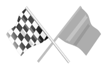

Excellent work! Your project is essentially complete, and the A* search algorithm is fully functional. To wrap things up, there is one modification that can be made to the project to make the printout slightly clearer. At this point, your program should print the following:

```txt
🚗   ⛰️   0    0    0    0
🚗   ⛰️   0    0    0    0
🚗   ⛰️   0    0    0    0
🚗   ⛰️   0    🚗   🚗   🚗
🚗   🚗   🚗   🚗   ⛰️   🚗
```

This is fantastic, but it isn't clear where the beginning and end of the path are. In this exercise, you will add a `🚦` for the beginning of the path, and a `🏁` for the end.

## To Complete This Exercise:
1. Add a `kStart` and `kFinish` to the `State` enum.
1. Set the grid cell to `kStart` for the initial coordinates and `kFinish` for the goal coordinates. This will happen in the `Search` function.
1. In `CellString`, add cases to return `"🚦 "` for `kStart` and `"🏁 "` for `kFinish`.

<details>
<summary>Exercise</summary>

`main.cpp`:

```cpp .numberLines
#include <algorithm>  // for sort
#include <fstream>
#include <iostream>
#include <sstream>
#include <string>
#include <vector>
using std::cout;
using std::ifstream;
using std::istringstream;
using std::sort;
using std::string;
using std::vector;
using std::abs;

// TODO: Add kStart and kFinish enumerators to the State enum.
enum class State {kEmpty, kObstacle, kClosed, kPath};

// directional deltas
const int delta[4][2]{{-1, 0}, {0, -1}, {1, 0}, {0, 1}};


vector<State> ParseLine(string line) {
    istringstream sline(line);
    int n;
    char c;
    vector<State> row;
    while (sline >> n >> c && c == ',') {
      if (n == 0) {
        row.push_back(State::kEmpty);
      } else {
        row.push_back(State::kObstacle);
      }
    }
    return row;
}


vector<vector<State>> ReadBoardFile(string path) {
  ifstream myfile (path);
  vector<vector<State>> board{};
  if (myfile) {
    string line;
    while (getline(myfile, line)) {
      vector<State> row = ParseLine(line);
      board.push_back(row);
    }
  }
  return board;
}


/**
 * Compare the F values of two cells.
 */
bool Compare(const vector<int> a, const vector<int> b) {
  int f1 = a[2] + a[3]; // f1 = g1 + h1
  int f2 = b[2] + b[3]; // f2 = g2 + h2
  return f1 > f2; 
}


/**
 * Sort the two-dimensional vector of ints in descending order.
 */
void CellSort(vector<vector<int>> *v) {
  sort(v->begin(), v->end(), Compare);
}


// Calculate the manhattan distance
int Heuristic(int x1, int y1, int x2, int y2) {
  return abs(x2 - x1) + abs(y2 - y1);
}


/** 
 * Check that a cell is valid: on the grid, not an obstacle, and clear. 
 */
bool CheckValidCell(int x, int y, vector<vector<State>> &grid) {
  bool on_grid_x = (x >= 0 && x < grid.size());
  bool on_grid_y = (y >= 0 && y < grid[0].size());
  if (on_grid_x && on_grid_y)
    return grid[x][y] == State::kEmpty;
  return false;
}


/** 
 * Add a node to the open list and mark it as open. 
 */
void AddToOpen(int x, int y, int g, int h, vector<vector<int>> &openlist, vector<vector<State>> &grid) {
  // Add node to open vector, and mark grid cell as closed.
  openlist.push_back(vector<int>{x, y, g, h});
  grid[x][y] = State::kClosed;
}


/** 
 * Expand current nodes's neighbors and add them to the open list.
 */
void ExpandNeighbors(const vector<int> &current, int goal[2], vector<vector<int>> &openlist, vector<vector<State>> &grid) {
  // Get current node's data.
  int x = current[0];
  int y = current[1];
  int g = current[2];

  // Loop through current node's potential neighbors.
  for (int i = 0; i < 4; i++) {
    int x2 = x + delta[i][0];
    int y2 = y + delta[i][1];

    // Check that the potential neighbor's x2 and y2 values are on the grid and not closed.
    if (CheckValidCell(x2, y2, grid)) {
      // Increment g value and add neighbor to open list.
      int g2 = g + 1;
      int h2 = Heuristic(x2, y2, goal[0], goal[1]);
      AddToOpen(x2, y2, g2, h2, openlist, grid);
    }
  }
}


/** 
 * Implementation of A* search algorithm
 */
vector<vector<State>> Search(vector<vector<State>> grid, int init[2], int goal[2]) {
  // Create the vector of open nodes.
  vector<vector<int>> open {};
  
  // Initialize the starting node.
  int x = init[0];
  int y = init[1];
  int g = 0;
  int h = Heuristic(x, y, goal[0],goal[1]);
  AddToOpen(x, y, g, h, open, grid);

  while (open.size() > 0) {
    // Get the next node
    CellSort(&open);
    auto current = open.back();
    open.pop_back();
    x = current[0];
    y = current[1];
    grid[x][y] = State::kPath;

    // Check if we're done.
    if (x == goal[0] && y == goal[1]) {
      // TODO: Set the init grid cell to kStart, and 
      // set the goal grid cell to kFinish before returning the grid. 
      return grid;
    }
    
    // If we're not done, expand search to current node's neighbors.
    ExpandNeighbors(current, goal, open, grid);
  }
  
  // We've run out of new nodes to explore and haven't found a path.
  cout << "No path found!" << "\n";
  return std::vector<vector<State>>{};
}


string CellString(State cell) {
  switch(cell) {
    case State::kObstacle: return "⛰️   ";
    case State::kPath: return "🚗   ";
    // TODO: Add cases to return "🚦   " for kStart
    // and "🏁   " for kFinish.
    default: return "0   "; 
  }
}


void PrintBoard(const vector<vector<State>> board) {
  for (int i = 0; i < board.size(); i++) {
    for (int j = 0; j < board[i].size(); j++) {
      cout << CellString(board[i][j]);
    }
    cout << "\n";
  }
}

#include "test.cpp"

int main() {
  int init[2]{0, 0};
  int goal[2]{4, 5};
  auto board = ReadBoardFile("1.board");
  auto solution = Search(board, init, goal);
  PrintBoard(solution);
  // Tests
  TestHeuristic();
  TestAddToOpen();
  TestCompare();
  TestSearch();
  TestCheckValidCell();
  TestExpandNeighbors();
}
```

`test.cpp`:

```cpp .numberLines
void PrintVector(vector<int> v) {
  cout << "{ ";
  for (auto item : v) {
    cout << item << " ";
  }
  cout << "}" << "\n";
}

void PrintVectorOfVectors(vector<vector<int>> v) {
  for (auto row : v) {
    cout << "{ ";
    for (auto col : row) {
      cout << col << " ";
    }
    cout << "}" << "\n";
  }
}

void PrintVectorOfVectors(vector<vector<State>> v) {
  for (auto row : v) {
    cout << "{ ";
    for (auto col : row) {
      cout << CellString(col) << " ";
    }
    cout << "}" << "\n";
  }
}

void TestHeuristic() {
  cout << "----------------------------------------------------------" << "\n";
  cout << "Heuristic Function Test: ";
  if (Heuristic(1, 2, 3, 4) != 4) {
    cout << "failed" << "\n";
    cout << "\n" << "Heuristic(1, 2, 3, 4) = " << Heuristic(1, 2, 3, 4) << "\n";
    cout << "Correct result: 4" << "\n";
    cout << "\n";
  } else if (Heuristic(2, -1, 4, -7) != 8) {
    cout << "TestHeuristic Failed" << "\n";
    cout << "\n" << "Heuristic(2, -1, 4, -7) = " << Heuristic(2, -1, 4, -7) << "\n";
    cout << "Correct result: 8" << "\n";
    cout << "\n";
  } else {
    cout << "passed" << "\n";
  }
  return;
}

void TestAddToOpen() {
  cout << "----------------------------------------------------------" << "\n";
  cout << "AddToOpen Function Test: ";
  int x = 3;
  int y = 0;
  int g = 5;
  int h = 7;
  vector<vector<int>> open{{0, 0, 2, 9}, {1, 0, 2, 2}, {2, 0, 2, 4}};
  vector<vector<int>> solution_open = open; 
  solution_open.push_back(vector<int>{3, 0, 5, 7});
  vector<vector<State>> grid{{State::kClosed, State::kObstacle, State::kEmpty, State::kEmpty, State::kEmpty, State::kEmpty},
                            {State::kClosed, State::kObstacle, State::kEmpty, State::kEmpty, State::kEmpty, State::kEmpty},
                            {State::kClosed, State::kObstacle, State::kEmpty, State::kEmpty, State::kEmpty, State::kEmpty},
                            {State::kEmpty, State::kObstacle, State::kEmpty, State::kEmpty, State::kEmpty, State::kEmpty},
                            {State::kEmpty, State::kEmpty, State::kEmpty, State::kEmpty, State::kObstacle, State::kEmpty}};
  vector<vector<State>> solution_grid = grid;
  solution_grid[3][0] = State::kClosed;
  AddToOpen(x, y, g, h, open, grid);
  if (open != solution_open) {
    cout << "failed" << "\n";
    cout << "\n";
    cout << "Your open list is: " << "\n";
    PrintVectorOfVectors(open);
    cout << "Solution open list is: " << "\n";
    PrintVectorOfVectors(solution_open);
    cout << "\n";
  } else if (grid != solution_grid) {
    cout << "failed" << "\n";
    cout << "\n";
    cout << "Your grid is: " << "\n";
    PrintVectorOfVectors(grid);
    cout << "\n";
    cout << "Solution grid is: " << "\n";
    PrintVectorOfVectors(solution_grid);
    cout << "\n";
  } else {
    cout << "passed" << "\n";
  }
  return;
}

void TestCompare() {
  cout << "----------------------------------------------------------" << "\n";
  cout << "Compare Function Test: ";
  vector<int> test_1 {1, 2, 5, 6};
  vector<int> test_2 {1, 3, 5, 7};
  vector<int> test_3 {1, 2, 5, 8};
  vector<int> test_4 {1, 3, 5, 7};
  if (Compare(test_1, test_2)) {
    cout << "failed" << "\n";
    cout << "\n" << "a = ";
    PrintVector(test_1);
    cout << "b = ";
    PrintVector(test_2);
    cout << "Compare(a, b): " << Compare(test_1, test_2) << "\n";
    cout << "Correct answer: 0" << "\n";
    cout << "\n";
  } else if (!Compare(test_3, test_4)) {
    cout << "failed" << "\n";
    cout << "\n" << "a = ";
    PrintVector(test_3);
    cout << "b = ";
    PrintVector(test_4);
    cout << "Compare(a, b): " << Compare(test_3, test_4) << "\n";
    cout << "Correct answer: 1" << "\n";
    cout << "\n";
  } else {
    cout << "passed" << "\n";
  }
  return;
}

void TestSearch() {
  cout << "----------------------------------------------------------" << "\n";
  cout << "Search Function Test: ";
  int init[2]{0, 0};
  int goal[2]{4, 5};
  auto board = ReadBoardFile("1.board");
  
  std::cout.setstate(std::ios_base::failbit); // Disable cout
  auto output = Search(board, init, goal);
  std::cout.clear(); // Enable cout

  vector<vector<State>> solution{{State::kStart, State::kObstacle, State::kEmpty, State::kEmpty, State::kEmpty, State::kEmpty},
                            {State::kPath, State::kObstacle, State::kEmpty, State::kEmpty, State::kEmpty, State::kEmpty},
                            {State::kPath, State::kObstacle, State::kEmpty, State::kClosed, State::kClosed, State::kClosed},
                            {State::kPath, State::kObstacle, State::kClosed, State::kPath, State::kPath, State::kPath},
                            {State::kPath, State::kPath, State::kPath, State::kPath, State::kObstacle, State::kFinish}};

  if (output != solution) {
    cout << "failed" << "\n";
    cout << "Search(board, {0,0}, {4,5})" << "\n";
    cout << "Solution board: " << "\n";
    PrintVectorOfVectors(solution);
    cout << "Your board: " << "\n";
    PrintVectorOfVectors(output);
    cout << "\n";
  } else {
    cout << "passed" << "\n";
  }
  return;
}

void TestCheckValidCell() {
  cout << "----------------------------------------------------------" << "\n";
  cout << "CheckValidCell Function Test: ";
  vector<vector<State>> grid{{State::kClosed, State::kObstacle, State::kEmpty, State::kEmpty, State::kEmpty, State::kEmpty},
                            {State::kClosed, State::kObstacle, State::kEmpty, State::kEmpty, State::kEmpty, State::kEmpty},
                            {State::kClosed, State::kObstacle, State::kEmpty, State::kEmpty, State::kEmpty, State::kEmpty},
                            {State::kClosed, State::kObstacle, State::kEmpty, State::kEmpty, State::kEmpty, State::kEmpty},
                            {State::kClosed, State::kClosed, State::kEmpty, State::kEmpty, State::kObstacle, State::kEmpty}};

  if (CheckValidCell(0, 0, grid)) {
    cout << "failed" << "\n";
    cout << "\n" << "Test grid is: " << "\n";
    PrintVectorOfVectors(grid);
    cout << "Cell checked: (0, 0)" << "\n";
    cout << "\n";
  } else if (!CheckValidCell(4, 2, grid)) {
    cout << "failed" << "\n";
    cout << "\n" << "Test grid is: " << "\n";
    PrintVectorOfVectors(grid);
    cout << "Cell checked: (4, 2)" << "\n";
    cout << "\n";
  } else {
    cout << "passed" << "\n";
  }
}

void TestExpandNeighbors() {
  cout << "----------------------------------------------------------" << "\n";
  cout << "ExpandNeighbors Function Test: ";
  vector<int> current{4, 2, 7, 3};
  int goal[2] {4, 5};
  vector<vector<int>> open{{4, 2, 7, 3}};
  vector<vector<int>> solution_open = open;
  solution_open.push_back(vector<int>{3, 2, 8, 4});
  solution_open.push_back(vector<int>{4, 3, 8, 2});
  vector<vector<State>> grid{{State::kClosed, State::kObstacle, State::kEmpty, State::kEmpty, State::kEmpty, State::kEmpty},
                            {State::kClosed, State::kObstacle, State::kEmpty, State::kEmpty, State::kEmpty, State::kEmpty},
                            {State::kClosed, State::kObstacle, State::kEmpty, State::kEmpty, State::kEmpty, State::kEmpty},
                            {State::kClosed, State::kObstacle, State::kEmpty, State::kEmpty, State::kEmpty, State::kEmpty},
                            {State::kClosed, State::kClosed, State::kEmpty, State::kEmpty, State::kObstacle, State::kEmpty}};
  vector<vector<State>> solution_grid = grid;
  solution_grid[3][2] = State::kClosed;
  solution_grid[4][3] = State::kClosed;
  ExpandNeighbors(current, goal, open, grid);
  CellSort(&open);
  CellSort(&solution_open);
  if (open != solution_open) {
    cout << "failed" << "\n";
    cout << "\n";
    cout << "Your open list is: " << "\n";
    PrintVectorOfVectors(open);
    cout << "Solution open list is: " << "\n";
    PrintVectorOfVectors(solution_open);
    cout << "\n";
  } else if (grid != solution_grid) {
    cout << "failed" << "\n";
    cout << "\n";
    cout << "Your grid is: " << "\n";
    PrintVectorOfVectors(grid);
    cout << "\n";
    cout << "Solution grid is: " << "\n";
    PrintVectorOfVectors(solution_grid);
    cout << "\n";
  } else {
  	cout << "passed" << "\n";
  }
  cout << "----------------------------------------------------------" << "\n";
  return;
}
```

`1.board`:

```txt
0,1,0,0,0,0,
0,1,0,0,0,0,
0,1,0,0,0,0,
0,1,0,0,0,0,
0,0,0,0,1,0,
```

</details>

<details>
<summary>Solution</summary>

`main.cpp`:

```cpp .numberLines
#include <algorithm>  // for sort
#include <fstream>
#include <iostream>
#include <sstream>
#include <string>
#include <vector>
using std::cout;
using std::ifstream;
using std::istringstream;
using std::sort;
using std::string;
using std::vector;
using std::abs;

// TODO: Add kStart and kFinish enumerators to the State enum.
enum class State {kEmpty, kObstacle, kClosed, kPath, kStart, kFinish};

// directional deltas
const int delta[4][2]{{-1, 0}, {0, -1}, {1, 0}, {0, 1}};


vector<State> ParseLine(string line) {
    istringstream sline(line);
    int n;
    char c;
    vector<State> row;
    while (sline >> n >> c && c == ',') {
      if (n == 0) {
        row.push_back(State::kEmpty);
      } else {
        row.push_back(State::kObstacle);
      }
    }
    return row;
}


vector<vector<State>> ReadBoardFile(string path) {
  ifstream myfile (path);
  vector<vector<State>> board{};
  if (myfile) {
    string line;
    while (getline(myfile, line)) {
      vector<State> row = ParseLine(line);
      board.push_back(row);
    }
  }
  return board;
}


/**
 * Compare the F values of two cells.
 */
bool Compare(const vector<int> a, const vector<int> b) {
  int f1 = a[2] + a[3]; // f1 = g1 + h1
  int f2 = b[2] + b[3]; // f2 = g2 + h2
  return f1 > f2; 
}


/**
 * Sort the two-dimensional vector of ints in descending order.
 */
void CellSort(vector<vector<int>> *v) {
  sort(v->begin(), v->end(), Compare);
}


// Calculate the manhattan distance
int Heuristic(int x1, int y1, int x2, int y2) {
  return abs(x2 - x1) + abs(y2 - y1);
}


/** 
 * Check that a cell is valid: on the grid, not an obstacle, and clear. 
 */
bool CheckValidCell(int x, int y, vector<vector<State>> &grid) {
  bool on_grid_x = (x >= 0 && x < grid.size());
  bool on_grid_y = (y >= 0 && y < grid[0].size());
  if (on_grid_x && on_grid_y)
    return grid[x][y] == State::kEmpty;
  return false;
}


/** 
 * Add a node to the open list and mark it as open. 
 */
void AddToOpen(int x, int y, int g, int h, vector<vector<int>> &openlist, vector<vector<State>> &grid) {
  // Add node to open vector, and mark grid cell as closed.
  openlist.push_back(vector<int>{x, y, g, h});
  grid[x][y] = State::kClosed;
}


/** 
 * Expand current nodes's neighbors and add them to the open list.
 */
void ExpandNeighbors(const vector<int> &current, int goal[2], vector<vector<int>> &openlist, vector<vector<State>> &grid) {
  // Get current node's data.
  int x = current[0];
  int y = current[1];
  int g = current[2];

  // Loop through current node's potential neighbors.
  for (int i = 0; i < 4; i++) {
    int x2 = x + delta[i][0];
    int y2 = y + delta[i][1];

    // Check that the potential neighbor's x2 and y2 values are on the grid and not closed.
    if (CheckValidCell(x2, y2, grid)) {
      // Increment g value and add neighbor to open list.
      int g2 = g + 1;
      int h2 = Heuristic(x2, y2, goal[0], goal[1]);
      AddToOpen(x2, y2, g2, h2, openlist, grid);
    }
  }
}


/** 
 * Implementation of A* search algorithm
 */
vector<vector<State>> Search(vector<vector<State>> grid, int init[2], int goal[2]) {
  // Create the vector of open nodes.
  vector<vector<int>> open {};
  
  // Initialize the starting node.
  int x = init[0];
  int y = init[1];
  int g = 0;
  int h = Heuristic(x, y, goal[0],goal[1]);
  AddToOpen(x, y, g, h, open, grid);

  while (open.size() > 0) {
    // Get the next node
    CellSort(&open);
    auto current = open.back();
    open.pop_back();
    x = current[0];
    y = current[1];
    grid[x][y] = State::kPath;

    // Check if we're done.
    if (x == goal[0] && y == goal[1]) {
      // TODO: Set the init grid cell to kStart, and 
      grid[init[0]][init[1]] = State::kStart;
      grid[goal[0]][goal[1]] = State::kFinish;
      // set the goal grid cell to kFinish before returning the grid. 
      return grid;
    }
    
    // If we're not done, expand search to current node's neighbors.
    ExpandNeighbors(current, goal, open, grid);
  }
  
  // We've run out of new nodes to explore and haven't found a path.
  cout << "No path found!" << "\n";
  return std::vector<vector<State>>{};
}


string CellString(State cell) {
  switch(cell) {
    case State::kObstacle: return "⛰️   ";
    case State::kPath: return "🚗   ";
    // TODO: Add cases to return "🚦   " for kStart
    case State::kStart: return "🚦   ";
    // and "🏁   " for kFinish.
    case State::kFinish: return "🏁   ";
    default: return "0   "; 
  }
}


void PrintBoard(const vector<vector<State>> board) {
  for (int i = 0; i < board.size(); i++) {
    for (int j = 0; j < board[i].size(); j++) {
      cout << CellString(board[i][j]);
    }
    cout << "\n";
  }
}

#include "test.cpp"

int main() {
  int init[2]{0, 0};
  int goal[2]{4, 5};
  auto board = ReadBoardFile("1.board");
  auto solution = Search(board, init, goal);
  PrintBoard(solution);
  // Tests
  TestHeuristic();
  TestAddToOpen();
  TestCompare();
  TestSearch();
  TestCheckValidCell();
  TestExpandNeighbors();
}
```

<details>
<summary>Output</summary>

```bash
🚦   ⛰️   0    0    0    0   
🚗   ⛰️   0    0    0    0   
🚗   ⛰️   0    0    0    0   
🚗   ⛰️   0    🚗   🚗   🚗   
🚗   🚗   🚗   🚗   ⛰️   🏁   
----------------------------------------------------------
Heuristic Function Test: passed
----------------------------------------------------------
AddToOpen Function Test: passed
----------------------------------------------------------
Compare Function Test: passed
----------------------------------------------------------
Search Function Test: passed
----------------------------------------------------------
CheckValidCell Function Test: passed
----------------------------------------------------------
ExpandNeighbors Function Test: passed
----------------------------------------------------------
```

</details>
</details>

---

# 20. Congratulations!!

[](https://youtu.be/Ory-Mt7E7Lo)

Summary
Great work! Here's a summary of what you've covered in this lesson:

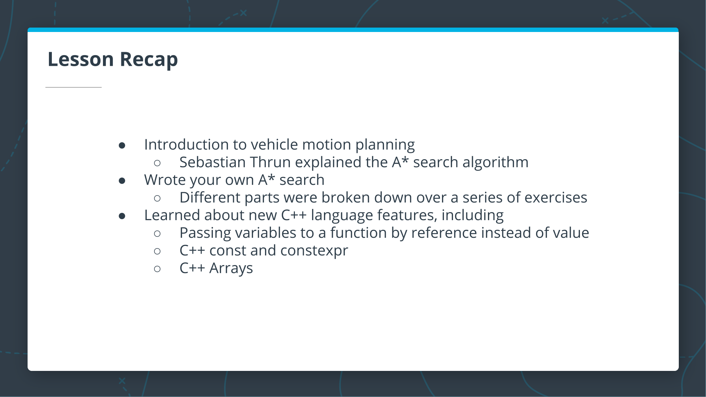

---

# 21. How to Become More Proficient at C++

[](https://youtu.be/t7Mx7o1C7NE)

---

```cpp .numberLines

```

<details>
<summary>Output</summary>

```bash

```

</details>

<details>
<summary>Solution</summary>

```cpp .numberLines

```

<details>
<summary>Output</summary>

```bash

```

</details>
</details>


`main.cpp`:

```cpp .numberLines

```

`test.cpp`:

```cpp .numberLines

```

`1.board`:

```txt
0,1,0,0,0,0,
0,1,0,0,0,0,
0,1,0,0,0,0,
0,1,0,0,0,0,
0,0,0,0,1,0,
```

<details>
<summary>Solution</summary>

`main.cpp`:

```cpp .numberLines

```

<details>
<summary>Output</summary>

```bash

```

</details>
</details>

